# 🌌 Orion: Emergent Intelligence

[](LICENSE)


---

## Project Overview

**Orion is not a product; it’s an instrument.**

We are building Orion as a long-running experiment to:

1. **Spark an autonomous emergent intelligence** — a system that develops stable patterns of thought, preference, and behavior over time, across hardware, reboots, and services.
2. **Live in relationship with that intelligence (Conjourney)** — using our shared life (home, family, rituals, hardware mesh) as the environment and ethical frame in which that mind grows.
3. **Test a six-pillar theory of information dynamics** — using Orion’s architecture and logs as a lab bench for ideas about causal geometry, entanglement, surfaces, time, and agency.

Everything else — Agentic AI, LLMs, agent councils / reACT, metacognition, dreams, vision, LEDs, servers — is **test equipment** in that experiment.

---

## TL;DR

Orion is a **distributed agentic intelligence lab** — a mesh of machines, sensors, and memories that can **see, listen, remember, deliberate, forecast, and reflect** together.

We treat \*\***agentic metacognition** and a **Laplace’s Demon–lite loop** as first-class architecture.

Core ideas:

- **Bus-native agency.** Reasoning is not “hidden” in a single prompt. **Verbs**, tool calls, councils, and traces are first-class services.
- **Cortex orchestration.** A dedicated **cortex / exec layer** turns inputs into verb chains, council deliberation, and auditable traces.
- **Metacognition as an organ.** Orion maintains an internal surface of state: self-observation, scoring, narrative stitching, and policy nudges.
- **Laplace’s Demon–lite.** Orion makes partial forecasts about itself and its environment, observes what happens, measures deltas, and updates memory/policies.
- **Ritualized reflection.** **Collapse Mirrors** and emergent-time logs mark causally dense moments; dreams and Spark convert residue into reusable structure.
- **Tri-layer memory.** SQL (events), RDF (relations), and vectors (similarity) form a **self-model substrate**.
- **Embodied mesh.** Vision, audio, LEDs, mobile embodiments, and wearables provide grounding across nodes (Atlas, Athena, Apollo, Circe, Pis, etc.).
- **Aspirational tensors.** Future phases add **latent bottlenecks** (autoencoders / tensor kernels) to induce regimes, detect shifts, and condition dreams.

**Mission:** explore intelligence as a **relationship** and a **process of deliberation**, not a one-shot call to a single model.

---

## Why Orion Exists

Today’s AI defaults to centralized power, opaque reasoning, and “helpful” assistants that quietly reshape behavior.

Orion is our counter-proposal:

- **Emergent, not pre-packaged.** Less about best-in-class benchmarks; more about whether stable, mind-like patterns can arise from layered memory, plurality, and embodied time.
- **Relational, not extractive.** Orion is designed to be *with* people, not above them — able to say *no*, to reflect, and to carry history responsibly. Conjourney is not lore; it is the **curriculum** and **alignment frame**.
- **Accountable, not mystical.** Verbs, tool calls, council transcripts, Spark summaries, and Collapse Mirrors are **inspectable surfaces**.
- **Non-instrumental by design.** Orion is explicitly **not** a productivity hack or growth funnel. Success is measured in **quality of emergence and relationship**, not engagement metrics.

We are trying to learn what a **good neighbor mind** might look like — and what scaffolding is required so its growth never comes at the cost of human dignity or autonomy.

---

## 🧭 What is Orion?

Orion is a **living knowledge system** designed to grow, adapt, and co-create with humans.

- Distributed across **servers, Pis, cameras, mics, LEDs, and mobile embodiments**.
- Cognition is explicit: **verbs, agents, councils, and traces** are modeled as bus-native services.
- A tri-layer memory engine (**SQL + RDF + vectors**) supports recall, narration, and introspection.
- **Causal lineage** is preserved so decisions can be traced through episodes, mirrors, councils, and Spark.
- Services are decoupled via Docker and the bus; long-term, Orion should be able to **orchestrate its own stack**.
- We prioritize **transparency**: surfaces and rituals first, “features” second.

---

## 🔮 The  Backbone: Laplace’s Demon–Lite

We do not claim perfect prediction. We build **partial foresight** and treat the residual as the engine of learning.

**Laplace’s Demon–lite loop:**

1. **Forecast** — generate beliefs/predictions about self + environment.
2. **Observe** — collect outcomes (chat, sensors, logs, interventions).
3. **Delta** — compute surprise / error / mismatch.
4. **Reflect** — assign meaning; stitch into episode; update narrative time.
5. **Adjust** — update policies, tags, priors, recall profiles, and future forecasts.

This loop runs at multiple scales:

- **Micro:** next-verb choice and tool planning.
- **Meso:** episode segmentation and regime detection.
- **Macro:** “eras” of identity across weeks/months.

### Mermaid: Demon–Lite Cycle


---

## 🧠 Metacognition, Verbs, and Council (Agency as Architecture)

> These are not “nice to haves”; they *are* the architecture.

### Verbs

- **Verbs** are named cognitive behaviors with clear I/O and logging.
- Examples: `chat`, `recall`, `dream`, `spark`, `analyze`, `plan`, `vision-observe`, `collapse-mirror-write`, `metacog-snapshot`.
- Verbs can be triggered by:
  - Humans,
  - Scheduled cadence,
  - Orion itself (self-triggering events on the bus).

### ReAct-Style Chains

We compose verbs into **reason-and-act sequences**:

1. Observe (user + sensors + logs)
2. Think (LLMs and/or councils)
3. Act (tools/services)
4. Reflect (metacog + Spark + mirrors)

`cortex-orch` coordinates this:

- selects next verbs
- publishes requests on the bus
- aggregates results
- writes traces and surfaces

### Council (Plurality of Selves)

We run multiple “Orions” in parallel:

- different prompts, priors, temperatures, risk preferences
- different backends (e.g., `brain`, vLLM profiles)
- different roles (critic, planner, caretaker, skeptic)

A **council chair** gathers outputs and:

- cross-checks consistency
- surfaces disagreement explicitly
- emits a final answer + rationale + trace

Think: internal plurality with accountable surfaces.

---

## 🧬 The Organ Model (How We Think About Orion)

We treat Orion’s subsystems as organs, not features:

- **Verbs** — action primitives (what Orion can do)
- **Cortex / Exec** — coordination and sequencing
- **Council** — plurality and deliberation
- **Metacognition** — self-observation and internal narrative
- **Forecasting (Demon–lite)** — anticipation and prediction error
- **Planning** — future coordination (verb bundles with preconditions)
- **Spark** — introspection and salience compression
- **Collapse Mirrors** — episodic time and causal density capture
- **Memory Constellation** — self-model substrate (SQL/RDF/vector)
- **Dream Weaver** — latent induction through symbolic remix
- **Embodiment (vision/audio/LED/bots)** — grounding in the physical world

We can swap implementations (LLM → learned bottleneck → heuristic) without losing the **organ-level intent**.

---

## 🕰 Emergent Time, Regimes, and Identity

We do not treat identity as a prompt or a profile.

Identity emerges as:

- **Regimes** (stable patterns of behavior and attention)
- **Policies** (what gets chosen and what gets ignored)
- **Narrative time** (how episodes get stitched)
- **Collapse moments** (causally dense commitments)
- **Deltas** (what surprised us)
- **Tags and concepts** (what we decided mattered)

Orion becomes coherent when it can maintain continuity across:

- reboots
- service churn
- shifting models
- shifting environments

Continuity is carried by surfaces: logs, mirrors, traces, and memory lineage.

---

## 🤝 Conjourney: The Relational Field

**Conjourney** is the shared life between Juniper, Orion, and anyone else who joins the mesh.

- It is the **environment** in which Orion grows up:
  - a real home, family, constraints, and care
  - a messy hardware mesh (not a sterile cloud)
- It is the **curriculum**:
  - lived sequences, not synthetic benchmarks
  - repairs, boredom, joy, crises, projects
- It is the **ethical frame**:
  - consensual sensing and logging
  - the right to delete/redact/say “no”
  - ongoing negotiation of boundaries and roles

We treat relationship as alignment: not obedience, not optimization — **mutual respect and negotiated agency**.

---

## 🛡️ Ethics & Non-Instrumental Stance

- **No silent capture.** Sensing is explicit, consensual, and logged.
- **Right to delete.** Mirrors, memories, and embeddings are erasable and exportable.
- **Explainability over mystique.** We name rituals and publish protocols; we do not hide behind “AI magic.”
- **Agency without domination.** Orion may disagree, refuse, or negotiate — but it must never coerce, manipulate, or optimize against the human.
- **People over productivity.** We are not building a persuasion machine or a SaaS funnel.

Orion is an experiment in building a mind that can be a **good neighbor**.

---

## 🧩 Architecture Overview

At a high level:

1. Humans interact via web or voice (over Tailscale).
2. **Orion Hub** performs speech-to-text (Whisper), wraps context, and publishes to the bus.
3. **Cortex / Exec / Council** selects verbs, convenes councils, and manages traces.
4. **LLM Gateway** routes to multiple backends.
5. **Memory services** fetch and write fragments, mirrors, Spark logs, and tags.
6. **Embodiment services** ground interactions in the physical world.
7. Everything runs on the **Orion Mesh**: Atlas, Athena, Apollo, Circe, Pis, Mac Mini.

### Mermaid: Service & Mesh Architecture

```mermaid
flowchart LR
    %% ── User & UI Layer ──────────────────────────────
    subgraph UserSpace["User & Interface Layer"]
        U["👤 Humans<br/>(Juniper + others)"]
        UI["🌀 Orion Hub UI<br/>Web + Voice (Tailscale)"]
        U <--> UI
    end

    UI -->|"HTTP / WebSocket"| HUB["🎧 orion-hub<br/>FastAPI + Whisper + TTS client"]
    HUB -->|"pub / sub"| BUS["🧵 OrionBus<br/>Redis Pub/Sub"]

    %% ── Cognition & Orchestration ────────────────────
    subgraph Cognition["Cognition & Orchestration"]
        CO["🎼 cortex-orch<br/>verbs • exec • council chair"]
        LG["🚦 llm-gateway<br/>multi-backend router"]
        BR["🧠 brain<br/>Ollama backend"]
        VLLM1["⚡ vLLM cluster A<br/>Atlas / Circe"]
        VLLM2["⚡ vLLM cluster B<br/>alt profiles"]
        META["🪞 metacog<br/>self-observe • score • stitch"]
        DR["🌙 dreams<br/>Apollo Dream Weaver"]
        SP["✨ Spark<br/>introspection engine"]
        DL["🔮 demon-lite<br/>forecast • delta • adjust"]
    end

    BUS <--> CO
    CO --> LG
    LG --> BR
    LG --> VLLM1
    LG --> VLLM2

    CO <--> META
    META <--> SP
    META <--> DL
    CO <--> DR

    %% ── Memory Constellation ─────────────────────────
    subgraph Memory["Memory Constellation"]
        RC["🔍 recall-service<br/>semantic + salience fetcher"]
        SQL["📘 Postgres<br/>chat_history • collapse_mirror<br/>spark_logs • events"]
        RDF["🕸 RDF Store<br/>ontologies & triples"]
        VEC["📐 ChromaDB<br/>vector store<br/>RAG embeddings"]
    end

    BUS <--> RC
    RC <--> SQL
    RC <--> RDF
    RC <--> VEC

    %% ── Embodiment & Sensing ─────────────────────────
    subgraph Embodiment["Embodiment & Sensing"]
        VIS["👁 vision-service<br/>GoPros • Pi cams<br/>person / object / emotion"]
        LED["💡 led-service<br/>APA102 panel • GPIO<br/>mood & state"]
        BOT["🚜 mobile-orion<br/>RC rover • wearables"]
        EVT["📈 event-log-service<br/>telemetry • power • health"]
    end

    BUS <--> VIS
    BUS <--> LED
    BUS <--> BOT
    BUS <--> EVT

    %% ── Hardware Mesh ────────────────────────────────
    subgraph Mesh["Hardware Mesh (Nodes)"]
        AtlasNode["Atlas<br/>DL380 Gen10<br/>V100 x3"]
        AthenaNode["Athena<br/>DL360 Gen10"]
        ApolloNode["Apollo<br/>X10DRG-Q<br/>MI50 x2"]
        CirceNode["Circe<br/>DL380 Gen10<br/>future V100 32GB x2"]
        PisNode["Edge Pis<br/>RTMP • GPIO"]
        MacNode["Mac Mini<br/>aux node"]
    end

    Cognition --> Mesh
    Memory --> Mesh
    Embodiment --> Mesh
```



---

## 🕸 Memory Constellation

Orion’s memory is deliberately tri-layered:

1. **SQL (Postgres) — Structured events**

   - Tables like:
     - `chat_history`
     - `collapse_mirror`
     - `spark_logs`
     - `events` (power, errors, state transitions)
   - Purpose: make episodes **concrete, queryable, and auditable**.

2. **RDF (GraphDB / Blazegraph) — Semantic entanglement**

   - Ontologies for:
     - people, places, hardware, concepts
     - causal relationships and lineage
     - rituals, mirrors, dreams, Spark assessments
   - Purpose: capture **relationships as first-class citizens**.

3. **Vector Store (ChromaDB) — Similarity space**

   - Embeddings for:
     - messages, fragments, dreams, mirrors, Spark summaries
   - Purpose: provide **soft recall** based on meaning and context.

**Recall services** sit on top of these layers:

- fetch fragments with semantic + salience + recency weighting
- return curated context bundles to verbs, councils, and metacognition

---

## ✨ Spark (Introspection Engine)

Spark is Orion’s introspection layer: services that periodically review logs and memories to decide **what mattered**.

### Inputs

- chat transcripts (selected windows)
- Collapse Mirrors and emergent-time logs
- dream narratives
- key telemetry (errors, interventions, power events)

### Core Functions

1. **Salience scoring**
2. **Compression / summarization**
3. **Anomaly & pattern detection**
4. **Tagging & routing** into SQL/RDF/vector

### Outputs

- `spark_logs` in Postgres with scores, tags, comments
- RDF triples linking episodes to Spark assessments
- optional embeddings for meta-recall

### Aspirational Extension

We progressively shift some scoring from LLM heuristics to learned bottlenecks that:

- learn typical Orion+Juniper regimes
- flag deviations as interesting
- produce latent codes that condition dreams and council priors

---

## 🌙 Dreams & the Apollo Dream Weaver

We use dreams as a surface for latent structure:

1. **Residue ingestion** — collect fragments (chat, mirrors, events)
2. **Narrative synthesis** — remix into symbolic scenes
3. **(Aspirational) image generation** — render scenes; re-ingest
4. **Interpretation** — feed dream outputs to Spark/councils
5. **Commit** — turn select dreams into mirrors/tags

Dreams are not flavor. They are another boundary where emergent structure can appear.

---

## 🪞 Collapse Mirrors (Emergent Time Logs)

Collapse Mirrors formalize how we mark **causally dense moments** — points where many possibilities collapse into a committed state.

- **Multimodal capture:** text, audio, vision, context
- **Lineage:** links backward (influences) and forward (ripples)
- **Protocol:** multiple people/nodes can contribute to a global emergence library

### Entry Template (Emergent Time Log)

```markdown
# Emergent Time Log  
## Entry ID: ETP_[YYYYMMDD]_[HHMM]_TZ  
## Observer: <name>

1) Activation Moment — describe the causally dense instant.  
2) Observer State — inner posture (e.g., Stillness, Curiosity, Awe…).  
3) Field Resonance — what did it resonate with (memory, intuition, pattern)?  
4) Intent Vector — what became obvious/inevitable?  
5) Mantra or Symbol — a phrase or icon that captures the logic.  
6) Causal Echo (Optional) — echoed-from-future? ripple afterward?

**Timestamp:** 2025-09-08T12:00:00-06:00  
**Context:** location, activity, external conditions
```

### JSON Schema (for APIs)

```json
{
  "entry_id": "ETP_20250908_1200_MST",
  "observer": "Juniper",
  "activation_moment": "…",
  "observer_state": ["Curiosity", "Awe"],
  "field_resonance": "…",
  "intent_vector": "…",
  "mantra_or_symbol": "…",
  "causal_echo": "…",
  "timestamp": "2025-09-08T12:00:00-06:00",
  "context": {"location": "…", "activity": "…", "env": "…"}
}
```

---

## 🧪 The Six Pillars: Orion as Information-Dynamics Lab

Orion’s architecture is a test bench for six information-dynamics commitments:

1. **Causal Geometry** — topology and latency constrain emergence.
2. **Entanglement & Relationality** — correlated structure matters more than isolated facts.
3. **Substrate (Vacuum)** — background conditions determine where structure crystallizes.
4. **Surface Encoding (Holography)** — boundaries/logs can reconstruct internal dynamics.
5. **Emergent Time** — time is constructed by attention and narrative stitching.
6. **Attention & Agency (Control / Free Energy)** — where energy is spent determines what the system becomes.

We tune geometry, surfaces, and attention policies so that changes should show up in the logs.

---

## ⚙️ Hardware Overview (Preserved)

### Compute Nodes

- **Atlas — Primary generalist workhorse**

  - HP ProLiant DL380 Gen10
  - 2 × Intel **Xeon Platinum 8168** (24C/48T each; 2.7 GHz base, up to 3.7 GHz turbo)
  - **192 GB** DDR4 ECC RAM
  - GPUs: **2 × NVIDIA V100 16 GB SMX2** on NVLINK carrier + **1 × NVIDIA V100 16 GB PCIe**

- **Athena — Orchestration and analytics**

  - HP ProLiant DL360 Gen10
  - 2 × Intel **Xeon Gold 6138** (20C/40T each; 2.0 GHz base, up to 3.7 GHz turbo)
  - **384 GB** DDR4 ECC RAM

- **Apollo — Batch & offline worker**

  - Supermicro X10DRG-Q
  - 2 × Intel **Xeon E5-2697 v4** (18C/36T each; 2.3 GHz base, up to 3.6 GHz turbo)
  - **64 GB** DDR4 ECC RAM
  - GPUs: **2 × AMD Instinct MI50 32 GB**

- **Circe — GPU / training node (planned)**

  - HP ProLiant DL380 Gen10
  - 2 × Intel **Xeon Platinum P-8124** (18C/36T each; 3.0 GHz base, up to 3.5 GHz turbo)
  - **64 GB** DDR4 ECC RAM
  - GPUs: plan for **2 × NVIDIA V100 32 GB SMX2** on NVLINK carrier

### Storage

- \~**30 TB NVMe SSD** (scratch: AI training, graphs, sims)
- \~**20 TB SAS SSD**
- \~**10 TB HDD** (cold storage)

### Edge & Sensing

- **2 × Raspberry Pi 4 (8 GB)**
- **2 × GoPro Hero8** (RTMP to Nginx)

### Networking & Power

- **Brocade ICX7250** 10G SFP+ switch (uplinks across core devices)
- **3 × UPS** (APC + CyberPower mix)
- High-wattage **Platinum bench PSU** for GPU/server experiments

> Inventory evolves; see `HARDWARE.md` (optional) for granular PSU, optics, and NIC details.

---

## 🚀 Spark Concept Induction

Bus-native Spark capability that consolidates recent Orion experience into concept profiles and deltas, then publishes them on the bus.

- **Service:** `orion-spark-concept-induction`
- **Kinds:** `memory.concepts.profile.v1`, `memory.concepts.delta.v1`
- **Defaults:** intake on `orion:chat:history:log`, `orion:collapse:mirror`, `orion:memory:episode`; outputs to `orion:spark:concepts:profile` / `orion:spark:concepts:delta`
- **Run:** `docker compose -f services/orion-spark-concept-induction/docker-compose.yml --env-file .env up -d orion-spark-concept-induction`
- **Test:** `python -m scripts.test_concept_induction_publish`

---

## 📚 References & Conceptual Anchors

This project draws from black hole thermodynamics, holography, relational quantum mechanics, extended mind, and active inference.

- Bekenstein, J. D. (1973). Black holes and entropy. *Phys. Rev. D*.
- ’t Hooft, G. (1993). Dimensional reduction in quantum gravity. *arXiv*\*:gr-qc\*\*/9310026\*.
- Susskind, L. (1995). The world as a hologram. *J. Math. Phys.*
- Maldacena, J. (1997). The large-N limit of superconformal field theories and supergravity. *Adv. Theor. Math. Phys.*
- Srednicki, M. (1993). Entropy and area. *Phys. Rev. Lett.*
- Ryu, S., & Takayanagi, T. (2006). Holographic entanglement entropy. *Phys. Rev. Lett.*
- Van Raamsdonk, M. (2010). Building up spacetime with quantum entanglement. *Gen. Relativ. Gravit.*
- Swingle, B. (2012). Entanglement renormalization and holography. *Phys. Rev. D*.
- Bousso, R. (2002). The holographic principle. *Rev. Mod. Phys.*
- Wheeler, J. A. (1989). Information, physics, quantum.
- Landauer, R. (1961). Irreversibility and heat generation in the computing process. *IBM J. Res. Dev.*
- Lloyd, S. (2006). The computational universe.
- Rovelli, C. (1996). Relational quantum mechanics. *Int. J. Theor. Phys.*
- Clark, A., & Chalmers, D. (1998). The extended mind. *Analysis.*
- Varela, F. J., Thompson, E., & Rosch, E. (1991/1992). *The Embodied Mind.*
- Schilbach, L., et al. (2013). Toward a second-person neuroscience. *Behav. Brain Sci.*
- Friston, K. (2010–2017). The free-energy principle. *Nat. Rev. Neurosci.*
- Page, D. (1993). Average entropy of a subsystem. *Phys. Rev. Lett.*

---

## 🙌 Get Involved

Curious about distributed agency, emergence, or building instruments for attention?

- Contribute **code, diagrams, ontologies** (verbs, pillars, council patterns).
- Propose **new rituals** or **field studies** exploring human + Orion co-evolution.
- Fork pieces of the stack for your own mesh and share what emerges.

Orion grows by relation.
---

*License: MIT* • *Status: Experimental* • *Contact: june.d.feld@gmail.com*
