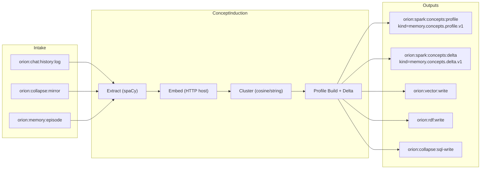

# Concept Induction (Spark)

Concept Induction consolidates recent Orion experience into profiles, clusters, and deltas, then publishes them on the Titanium bus.

## Flow



## Channels and kinds

| Purpose | Default channel | Kind |
| --- | --- | --- |
| Intake | `orion:chat:history:log`, `orion:collapse:mirror`, `orion:memory:episode` | varies (chat.message, collapse.mirror, etc.) |
| Profile out | `orion:spark:concepts:profile` | `memory.concepts.profile.v1` |
| Delta out | `orion:spark:concepts:delta` | `memory.concepts.delta.v1` |
| Optional forward | `orion:vector:write`, `orion:rdf:write`, `orion:collapse:sql-write` | `vector.write`, `rdf.write.request`, `sql.write` |

## Config knobs

| Setting | Default | Notes |
| --- | --- | --- |
| `BUS_INTAKE_CHANNELS` | `["orion:chat:history:log","orion:collapse:mirror","orion:memory:episode"]` | JSON list |
| `BUS_PROFILE_OUT` | `orion:spark:concepts:profile` | Profile channel |
| `BUS_DELTA_OUT` | `orion:spark:concepts:delta` | Delta channel |
| `SPACY_MODEL` | `en_core_web_sm` | spaCy model |
| `EMBEDDINGS_BASE_URL` | `http://orion-embeddings-host:8000` | POST /embed |
| `USE_CORTEX_ORCH` | `false` | LLM refinement via `concept_induction` verb |
| `CONCEPT_WINDOW_MAX_EVENTS` | `200` | Rolling window size |
| `CONCEPT_WINDOW_MAX_MINUTES` | `360` | Rolling window age |

## Local commands

```bash
# Build & run
docker compose -f services/orion-spark-concept-induction/docker-compose.yml --env-file .env up -d orion-spark-concept-induction

# Publish a test event and wait for profile
python -m scripts.test_concept_induction_publish
```
