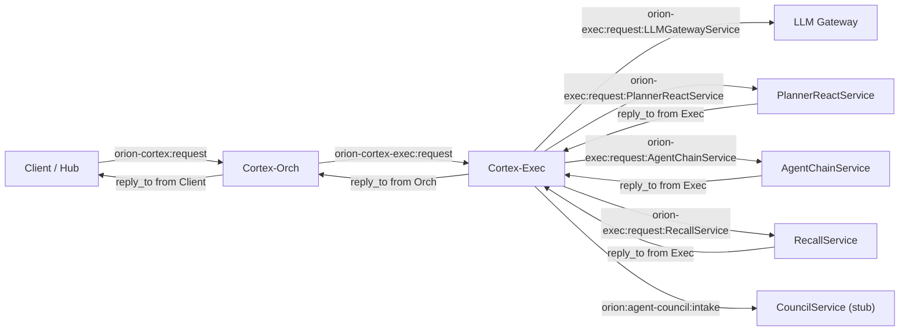

# Orion Bus & Cortex Contracts

Use this page as the front-door index for the Cortex bus and service contracts. The authoritative, versioned details (schema IDs, payload fields, env var names) live in [`bus-contracts.md`](./bus-contracts.md); this file summarizes how to consume that source of truth and where to update things when the topology shifts.

## Quick Reference: Canonical Channels

`bus-contracts.md` contains the full envelope rules. The table below mirrors the canonical request/reply pairs it defines:

| Flow | Request channel | Kind (req → res) | Reply prefix (caller-owned) |
| --- | --- | --- | --- |
| Client → Cortex-Orch | `orion-cortex:request` | `cortex.orch.request` → `cortex.orch.result` | `orion-cortex:result` |
| Orch → Exec | `orion-cortex-exec:request` | `cortex.exec.request` → `cortex.exec.result` | `orion-exec:result` |
| Exec → LLM Gateway | `orion-exec:request:LLMGatewayService` | `llm.chat.request` → `llm.chat.result` | `orion-exec:result:LLMGatewayService` |
| Exec → Recall | `orion-exec:request:RecallService` | `recall.query.request` → `recall.query.result` | `orion-exec:result:RecallService` |
| Exec → Planner-React (direct) | `orion-exec:request:PlannerReactService` | `agent.planner.request` → `agent.planner.result` | `orion-exec:result:PlannerReactService` |
| Exec → Agent Chain (ReAct) | `orion-exec:request:AgentChainService` | `agent.chain.request` → `agent.chain.result` | `orion-exec:result:AgentChainService` |
| Exec → Council (stub) | `orion:agent-council:intake` | `council.request` → `council.result` | `orion:council:reply` |
| Planner LLM hop (internal) | `orion-exec:request:LLMGatewayService` | `llm.chat.request` → `llm.chat.result` | `orion:llm:reply` |

Reply channels are **always caller-owned** (`<prefix>:<uuid>`). No service may invent a new channel outside this matrix.

## High-Level Bus Topology

## Update Checklist

When you change a channel, payload, or envelope rule, update **all** of the following in the same PR:

1. [`docs/bus-contracts.md`](./bus-contracts.md) — the authoritative contract, including schema IDs and field names.
2. Service env defaults (`.env_example` and `settings.py`) for the affected service(s) so the defaults match the contract.
3. [`docs/llm_services.md`](./llm_services.md) — diagrams and mode-specific flow notes.
4. Service READMEs for the workers involved (exec, planner, agent chain, llm gateway, recall, orch) so operators can trace bus traffic.
5. Any mermaid diagrams that hard-code channels (this file, `llm_services`, service READMEs) to avoid drift.

Tip: use `python scripts/bus_harness.py tap` to confirm the `kind` values and channels you expect are actually emitted on the bus during local testing.
