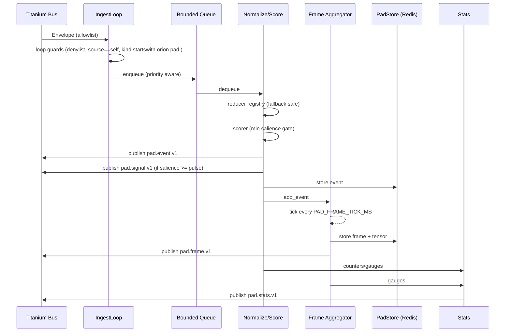

# Orion Landing Pad

The Landing Pad is the ephemeral working-memory ingress surface for Orion. It consumes Titanium envelopes from the bus, normalizes inbound messages into shared schemas, aggregates rolling frames, and republishes normalized events, pulses, and stats.

## Contracts

### Channels
- **Input (psubscribe patterns)**: `PAD_INPUT_ALLOWLIST_PATTERNS` (default: `orion:telemetry:*`, `orion:cortex:*`)
- **Denylist**: `PAD_INPUT_DENYLIST_PATTERNS` (default: `orion:pad:*`)
- **Outputs**
  - Events: `PAD_OUTPUT_EVENT_CHANNEL` (BaseEnvelope + `orion.pad.event.v1`)
  - Frames: `PAD_OUTPUT_FRAME_CHANNEL` (BaseEnvelope + `orion.pad.frame.v1`)
  - Signals: `PAD_OUTPUT_SIGNAL_CHANNEL` (BaseEnvelope + `orion.pad.signal.v1`)
  - Stats: `PAD_OUTPUT_STATS_CHANNEL` (BaseEnvelope + `orion.pad.stats.v1`)
- **RPC intake**: `PAD_RPC_REQUEST_CHANNEL` (BaseEnvelope + `orion.pad.rpc.request.v1`)

### Schemas
Defined in `orion/schemas/pad/v1.py`:
- `PadEventV1`
- `StateFrameV1`
- `TensorBlobV1`
- `PadRpcRequestV1` / `PadRpcResponseV1`
- Kind constants (`KIND_PAD_EVENT_V1`, etc.)

### Loop guards
- Drop any inbound channel matching denylist (always includes `orion:pad:*`).
- Drop if `envelope.source.name == APP_NAME`.
- Drop if `envelope.kind` starts with `orion.pad.` (prevents loops).

### Backpressure
- Bounded queue (`PAD_MAX_QUEUE_SIZE`).
- Drop policy: evict low-priority items first; preserve anomaly/decision/intent when possible.
- Minimum salience (`PAD_MIN_SALIENCE`) before publishing.

## Extensibility

### Reducers
- Registry in `services/orion-landing-pad/app/reducers/registry.py`.
- Map `envelope.kind -> reducer`.
- Unknown kinds fall back to `fallback_reducer` (type `unknown`, payload retains raw + kind).
- Add new reducer with `registry.register("kind.v1", reducer_fn)`.

### Scorers
- Interface: `scoring/interface.py`.
- Default scorer in `scoring/default.py` uses type priors + novelty.
- Swap/extend by injecting a custom scorer into `NormalizationPipeline`.

### Tensorizers
- Interface: `tensor/interface.py`.
- Default hash projection stub in `tensor/hash_projection.py` (deterministic base64 vector).
- Replace with richer encoder as models mature.

## Aggregation + RPC
- Frames built every `PAD_FRAME_TICK_MS`, covering `PAD_FRAME_WINDOW_MS`, capped at `PAD_MAX_EVENTS_PER_TICK`.
- High-salience pulses published when `salience >= PAD_PULSE_SALIENCE`.
- RPC methods: `get_latest_frame`, `get_frames`, `get_salient_events`, `get_latest_tensor`. Replies on caller-provided `reply_channel`.

## Observability
- Counters: ingested, dropped_total, dropped:* reasons, frames_built, rpc_requests, rpc_errors.
- Gauges: queue_depth, last_frame_ts_ms, events_in_window, frame_build_ms.
- Stats published periodically as `orion.pad.stats.v1`.

## Mermaid diagrams

### High-level flow
```mermaid
flowchart LR
    Bus[Orion Bus\n(psub patterns)] -->|BaseEnvelope| Ingest[Ingest Loop\nbounded queue]
    Ingest --> Worker[Normalize + Score]
    Worker -->|PadEventV1| Store[Redis PadStore]
    Worker -->|PadEventV1| PublishEvents[Publish pad.event.v1]
    Worker -->|High salience| Signal[Publish pad.signal.v1]
    Store --> Aggregator[Frame Aggregator]
    Aggregator -->|StateFrameV1| PublishFrames[Publish pad.frame.v1]
    Aggregator -->|StateFrameV1| StoreFrames[Persist frame + tensor]
    Stats[Stats Tracker] -->|pad.stats.v1| PublishStats[Bus Stats]
```

### Detailed pipeline

