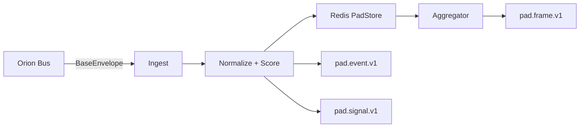
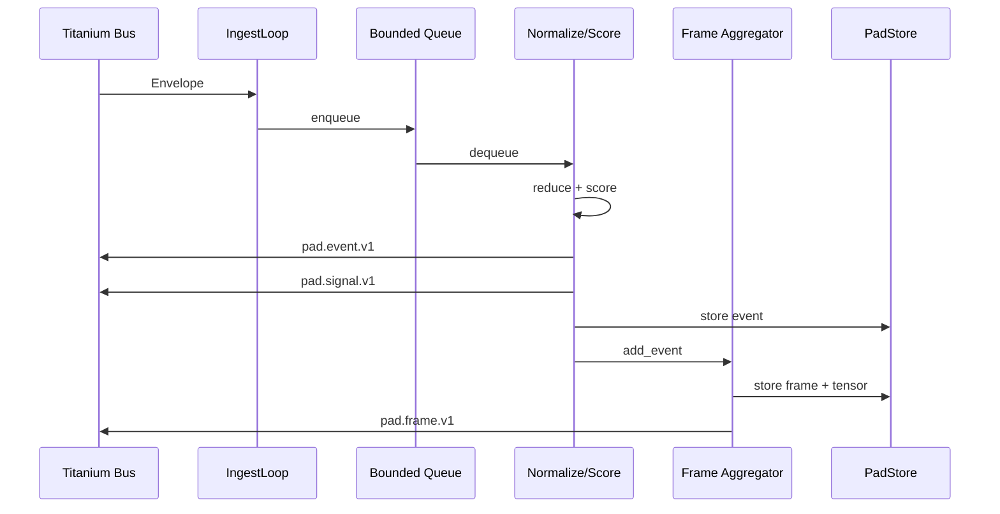

# 🛰️ Orion Landing Pad: Architecture & Developer Guide

The Landing Pad serves as the **ephemeral working-memory ingress surface** for Orion. It acts as the system’s *conscious buffer*, consuming raw Titanium envelopes from the bus, normalizing heterogeneous inbound messages into shared schemas, aggregating them into coherent rolling **frames of experience**, and republishing normalized events, urgent pulses, and system statistics.

This document is the **primary onboarding and extension guide** for developers looking to expand Orion’s perception layer—whether by adding new sensors, introducing new event types, or tuning how the AI pays attention to the world.

---

## 🧠 Core Concepts

To work effectively with the Landing Pad, you must understand three foundational concepts that drive its architecture:

---

### 1. Normalization (Reducers)

The Orion Bus carries a chaotic mix of message types:

- `telemetry.biometrics` from sensors
- `cortex.exec.log` from the brain
- `sensor.audio.segment` from the ears

The Landing Pad acts as a **Universal Translator**.

It uses a registry of **Reducers** to convert these diverse, unstructured inputs into a single standardized format called ``.

A **Reducer** is a function that:

- Accepts a raw `BaseEnvelope`
- Extracts and interprets its payload
- Maps it into the canonical Pad schema

If you introduce a new data source into the mesh, **you must write a Reducer** so the Landing Pad knows how to read and normalize it.

#### The Transformation

- **Input (Raw Envelope)**\
  A complex, service-specific payload (e.g., voltage readings from a UPS).

- **Output (**``**)**\
  A simplified, normalized object with standard fields:

  - `type` (e.g., `observation`, `metric`)
  - `salience` (importance)
  - `novelty`
  - `payload` (what the AI actually reads)

---

### 2. Salience (Scorers)

In any cognitive system, **attention is scarce**.

The hum of a fan is usually noise—but the moment it stops, it becomes critical.

Every normalized event passes through a **Scorer**, which assigns a salience value from `0.0` (pure noise) to `1.0` (critical signal).

- **Low Salience (< 0.05)**\
  Considered noise. These events may be dropped under load to prevent cognitive overload and database bloat.

- **Mid Salience (0.05 – 0.8)**\
  Aggregated into the state frame. These provide background context and texture to Orion’s experience.

- **High Salience (> 0.8)**\
  Trigger an immediate **Pulse** (`pad.signal.v1`). Pulses bypass normal aggregation to alert cognitive agents instantly (e.g., *Battery Critical*, *User Yelling*, *Security Breach*).

---

### 3. State Frames (The “Specious Present”)

Human perception creates continuity by bundling sensory inputs into short windows of *now*.

Orion replicates this using **State Frames** (`StateFrameV1`): time windows (default **5 seconds**) that group events into discrete *moments*.

Instead of processing an infinite stream, cognitive agents reason about **bounded moments of experience**.

#### Frame Structure (`StateFrameV1`)

- **summary**\
  High-level tags and flags (e.g., `high_load`, `user_present`).

- **state**\
  Bucketed context describing the current situation:

  - **Presence:** user identity, proximity, location
  - **Affect:** emotional valence, urgency, tone
  - **System:** hardware health, battery, network
  - **Cognition:** goals, active thoughts, recent memories

- **tensor**\
  A vector embedding representing this moment in latent space

---

## 👩‍💻 Developer Onboarding Guide

The following scenarios walk through common extension patterns.

---

### Scenario A: Handling a New Event Type (Adding a Reducer)

**Goal:** You are publishing a new message kind (`my.custom.sensor.v1`, e.g., a Geiger counter), and you want its readings to appear in Orion’s working memory.

---

#### Step 1: Create the Reducer Function

Navigate to:

```
services/orion-landing-pad/app/reducers/stubs.py
```

Add your reducer (or create `custom.py` for complex logic):

```python
from orion.core.bus.bus_schemas import BaseEnvelope
from orion.schemas.pad import PadEventV1

async def my_geiger_reducer(env: BaseEnvelope, channel: str) -> PadEventV1 | None:
    data = env.payload
    cpm = data.get("counts_per_minute", 0)

    return PadEventV1(
        event_id=str(env.id),
        ts_ms=int(env.timestamp.timestamp() * 1000),
        source_service=env.source.name,
        source_channel=channel,
        type="observation",
        salience=0.5,
        payload={
            "radiation_level": cpm,
            "unit": "CPM",
            "raw_kind": env.kind,
        },
    )
```

---

#### Step 2: Register the Reducer

Edit:

```
services/orion-landing-pad/app/reducers/registry.py
```

```python
from .stubs import my_geiger_reducer

class ReducerRegistry:
    def _install_defaults(self) -> None:
        self.register("my.custom.sensor.v1", my_geiger_reducer)
```

---

#### Step 3: Verify

Restart the Landing Pad and publish a test message.

You should observe:

- Ingest logs
- `pad.event.v1` publications
- Appearance in `/events/salient` or `/frame/latest`

---

### Scenario B: Changing Importance Logic (Custom Scorer)

**Goal:** Treat Geiger counter readings as *critical* if radiation exceeds a safety threshold.

---

#### Step 1: Edit the Scorer

File:

```
services/orion-landing-pad/app/scoring/default.py
```

```python
def score(self, event: PadEventV1) -> ScoreResult:
    if event.payload.get("raw_kind") == "my.custom.sensor.v1":
        level = event.payload.get("radiation_level", 0)

        if level > 9000:
            return ScoreResult(
                salience=1.0,
                novelty=1.0,
                confidence=1.0,
                reason="radiation_hazard",
            )
        elif level > 1000:
            return ScoreResult(
                salience=0.7,
                novelty=0.5,
                confidence=1.0,
                reason="elevated_radiation",
            )

    return self.default_score(event)
```

---

## 📜 Contracts & Configuration

### Environment Variables

| Variable                       | Default                            | Description            |
| ------------------------------ | ---------------------------------- | ---------------------- |
| `PAD_INPUT_ALLOWLIST_PATTERNS` | `orion:telemetry:*,orion:cortex:*` | Bus channels to ingest |
| `PAD_INPUT_DENYLIST_PATTERNS`  | `orion:pad:*`                      | Prevent feedback loops |
| `PAD_FRAME_TICK_MS`            | `5000`                             | Duration of a moment   |
| `PAD_MIN_SALIENCE`             | `0.05`                             | Noise floor            |
| `PAD_PULSE_SALIENCE`           | `0.8`                              | Interrupt threshold    |

---

### Bus Channels

- **Input:** dynamic via allowlist
- **Events:** `orion:pad:event`
- **Frames:** `orion:pad:frame`
- **Signals:** `orion:pad:signal`
- **RPC Intake:** `orion:pad:rpc:request`

---

### Schemas

Defined in `` (single source of truth):

- `PadEventV1`
- `StateFrameV1`
- `TensorBlobV1`
- `PadRpcRequestV1`

---

## 📊 Pipeline Diagrams

### High-Level Flow



### Detailed Sequence


