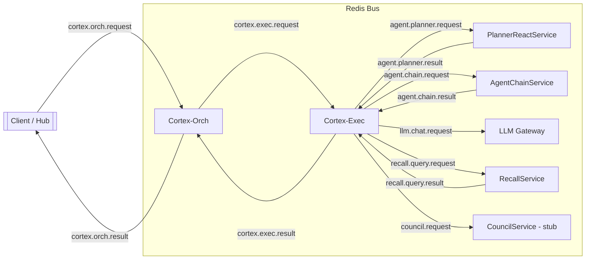
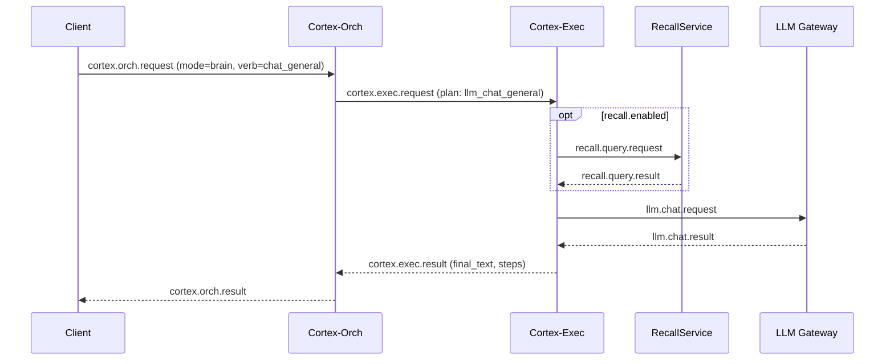
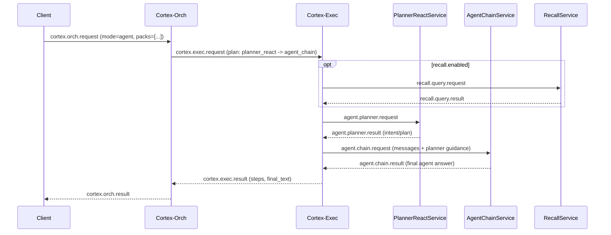
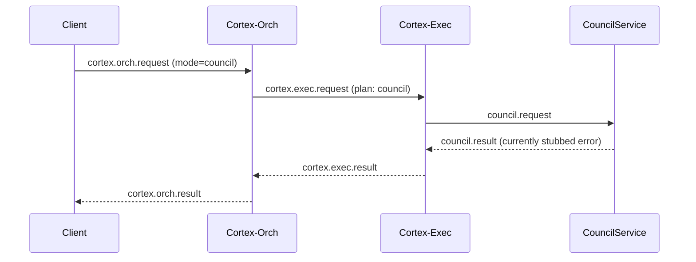

# LLM Services and Agentic Flow

This note summarizes how Orion routes language-model work across brain, agent, and council modes. It focuses on the bus-mediated hops, who owns each step, and how recall and planning interplay before the LLM gateway is invoked.

## Service Roles

| Service | Role | Notes |
| --- | --- | --- |
| Cortex-Orch | Validates client envelopes, builds a mode-specific plan, forwards to Cortex-Exec. | The only entry point for clients. |
| Cortex-Exec | Executes plans step-by-step, invoking workers over the bus and aggregating results. | Owns recall gating and step ordering. |
| PlannerReactService | Produces a short plan/intent for agent mode. | Runs before the agent chain. |
| AgentChainService | Executes the agentic step (tool use, ReAct reasoning) and produces the agent answer. | Second step in agent plans. |
| LLM Gateway | Performs direct chat/completion for brain mode, or tools inside the agent chain. | Receives `llm.chat.request`. |
| RecallService | Supplies retrieved context when enabled. | Skipped when recall is disabled. |
| CouncilService (stub) | Reserved for supervisor-style flows. | Not used by brain/agent today. |

## High-Level Flow (All Modes)

## Mode-Specific Sequences

### Brain Mode (single LLM step)

### Agent Mode (planner + agent chain)

### Council Mode (stubbed)

## How the Chain Hangs Together

* **Orch builds the plan** based on `mode` + `verb` + `packs`; it never calls workers directly.
* **Exec enforces ordering** and passes correlation IDs, reply channels, and recall directives to every worker.
* **Recall is optional**: when disabled, exec skips the recall hop entirely; when required, failures surface as structured errors instead of silent fallback.
* **Planner → AgentChain** is the agentic path: PlannerReact produces intent, AgentChain executes it (tool use, ReAct reasoning), and only AgentChain’s result becomes the agent reply.
* **LLM Gateway is shared**: brain mode calls it directly; agent mode may call it indirectly within AgentChain/tool steps.
* **Council remains isolated** behind its own `council.request`/`council.result` channel, so future supervisor flows do not contaminate brain/agent traffic.

## Common Observability Hooks

* Every hop logs the intake channel, reply channel, correlation ID, and elapsed time.
* Exec surfaces per-step `logs` (RPC emits/returns) and `latency_ms` in `StepExecutionResult`.
* Tap the bus with `python scripts/bus_harness.py tap --bus-url redis://...` to watch:
  * `cortex.orch.request`, `cortex.exec.request`
  * `recall.query.request` (if enabled)
  * `agent.planner.request`, `agent.chain.request`
  * `llm.chat.request`
