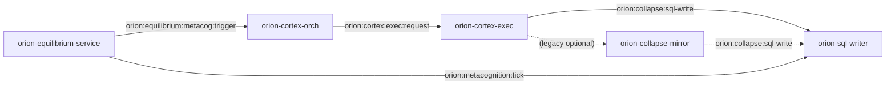

# Metacognition Pipeline Audit (Titanium Bus)

## Scope

This audit traces the metacog pipeline end-to-end through the Orion Titanium bus:
**triggers → bus publish → cortex-orch intake → orch routing → cortex-exec intake → exec output → persistence**.

It explicitly documents **active vs legacy** paths, **env-first wiring**, **channels + schemas**, and **control-flow anchors**.

---

## A1) Mermaid Diagrams

### Level 1 — Services + Channels (high-level)



### Level 2 — Envelope + Schema IDs per Channel

```mermaid
flowchart TD
  subgraph Trigger
    EQ2[Equilibrium publish]
    EQ2 -->|channel: orion:equilibrium:metacog:trigger\nschema_id: MetacogTriggerV1\nkind: orion.metacog.trigger.v1| ORCH2[Cortex-Orch Hunter]
  end

  subgraph OrchToExec
    ORCH2 -->|channel: orion:cortex:exec:request\nschema_id: GenericPayloadV1\nkind: cortex.exec.request (PlanExecutionRequest payload)| EXEC2[Cortex-Exec Rabbit]
  end

  subgraph ExecOutput
    EXEC2 -->|channel: orion:collapse:sql-write\nschema_id: CollapseMirrorEntryV2\nkind: collapse.mirror.entry.v2| SQL2[SQL Writer]
  end

  subgraph Tick
    EQ3[Equilibrium tick]
    EQ3 -->|channel: orion:metacognition:tick\nschema_id: MetacognitionTickV1\nkind: metacognition.tick.v1| SQL3[SQL Writer]
  end
```

### Level 3 — Control-Flow (handlers/functions with file:line anchors)

```mermaid
flowchart TD
  subgraph Equilibrium
    EQA[_metacog_baseline_loop\nservices/orion-equilibrium-service/app/service.py:L374-L392]
    EQB[_publish_metacog_trigger\nservices/orion-equilibrium-service/app/service.py:L310-L356]
    EQC[_publish_metacognition_tick\nservices/orion-equilibrium-service/app/service.py:L254-L308]
    EQA --> EQB
    EQA --> EQC
  end

  subgraph CortexOrch
    ORA[_handle_equilibrium_envelope\nservices/orion-cortex-orch/app/main.py:L217-L231]
    ORB[dispatch_metacog_trigger\nservices/orion-cortex-orch/app/orchestrator.py:L491-L581]
    ORA --> ORB
  end

  subgraph CortexExec
    EXA[handle\nservices/orion-cortex-exec/app/main.py:L98-L148]
    EXB[PlanRouter.run_plan\nservices/orion-cortex-exec/app/router.py]
    EXC[MetacogPublishService\nservices/orion-cortex-exec/app/executor.py:L618-L657]
    EXD[VerbRequestService (legacy)\nservices/orion-cortex-exec/app/executor.py:L919-L971]
    EXA --> EXB --> EXC
    EXA --> EXD
  end

  EQB --> ORA --> ORB --> EXA
```

---

## A2) What happens when metacog triggers (step-by-step)

### Trigger sources

1) **Equilibrium cadence (baseline)**
   - Loop: `_metacog_baseline_loop` constructs a `MetacogTriggerV1` on a cadence. Uses `EQUILIBRIUM_METACOG_BASELINE_INTERVAL_SEC`. (env-first)  
2) **Causally-dense triggers (manual collapse)**
   - `channel_collapse_mirror_user_event` (default `orion:collapse:intake`) is subscribed in equilibrium; if a **user** collapse mirror entry is seen, it emits a metacog trigger.  
3) **Pulse triggers (landing pad salience)**
   - `channel_pad_signal` (default `orion:pad:signal`) ingested; `salience >= EQUILIBRIUM_METACOG_PAD_PULSE_THRESHOLD` generates a trigger.  

### Hop-by-hop channels + schemas + models

| Hop | Channel | Envelope kind | Schema ID (channels.yaml) | Model (registry.py) | Producer → Consumer |
| --- | --- | --- | --- | --- | --- |
| 1 | `orion:equilibrium:metacog:trigger` | `orion.metacog.trigger.v1` | `MetacogTriggerV1` | `MetacogTriggerV1` | `orion-equilibrium-service` → `orion-cortex-orch` (+ `orion-sql-writer`) |
| 2 | `orion:cortex:exec:request` | `cortex.exec.request` | `GenericPayloadV1` | `GenericPayloadV1` | `orion-cortex-orch` → `orion-cortex-exec` |
| 3 | `orion:collapse:sql-write` | `collapse.mirror.entry.v2` | `CollapseMirrorEntryV2` | `CollapseMirrorEntryV2` | `orion-cortex-exec` → `orion-sql-writer` |
| 4 | `orion:metacognition:tick` | `metacognition.tick.v1` | `MetacognitionTickV1` | `MetacognitionTickV1` | `orion-equilibrium-service` → `orion-sql-writer` |

### Schema registry resolution

Schema IDs resolve through `orion/schemas/registry.py`, e.g. `MetacogTriggerV1`, `MetacognitionTickV1`, `CollapseMirrorEntryV2`, and `GenericPayloadV1`.  

### Subscription configuration (patterns)

- **Cortex-Orch** subscribes to `channel_metacog_trigger` (default `orion:equilibrium:metacog:trigger`) using a `Hunter` subscriber.  
- **Cortex-Exec** listens for `channel_exec_request` (default `orion:cortex:exec:request`) using a `Rabbit` RPC subscriber.  
- **SQL Writer** subscribes via `SQL_WRITER_SUBSCRIBE_CHANNELS` which includes `orion:metacognition:tick` and `orion:equilibrium:metacog:trigger` (and `orion:collapse:sql-write`).  

---

## A3) Choke Point Table

| Symptom | Likely Cause | Where to verify (command/log/file) | Fix recommendation |
| --- | --- | --- | --- |
| No metacog trigger events seen | `EQUILIBRIUM_METACOG_ENABLE=false` or wrong channel env | `services/orion-equilibrium-service/app/settings.py` + `.env`; `docker logs <equilibrium>` | Enable env + ensure `CHANNEL_EQUILIBRIUM_METACOG_TRIGGER` matches `cortex-orch` subscribe pattern |
| Trigger published but orch silent | cortex-orch not running or wrong bus URL | `services/orion-cortex-orch/docker-compose.yml`, `.env`, logs | Align `ORION_BUS_URL` / Redis DB index; start orch |
| Orch receives trigger but no exec request | Plan dispatch error or routing drop | `services/orion-cortex-orch/app/orchestrator.py` logs for `Dispatched log_orion_metacognition` | Verify `channel_exec_request` + `EXEC_RESULT_PREFIX` env values |
| Exec receives request but no SQL output | Exec plan error or MetacogPublishService failure | `services/orion-cortex-exec/app/executor.py` logs for `MetacogPublishService` | Inspect downstream LLM services + ensure `orion:collapse:sql-write` subscriber exists |
| SQL writer missing rows | SQL writer not subscribed or route map mismatch | `services/orion-sql-writer/app/settings.py` + logs | Ensure `orion:collapse:sql-write` in `SQL_WRITER_SUBSCRIBE_CHANNELS` and route map includes `collapse.mirror.entry.v2` |
| Validation errors on bus | Envelope schema mismatch | `orion/core/bus/bus_service_chassis.py` logs; `scripts/trace_metacog.py` output | Align payload schemas with `orion/bus/channels.yaml` + registry entries |

---

## D) Channel + Schema Validation

### channels.yaml mappings

- **Metacog Trigger** → `orion:equilibrium:metacog:trigger` (`MetacogTriggerV1`)  
- **Metacognition Tick** → `orion:metacognition:tick` (`MetacognitionTickV1`)  
- **Cortex-Orch Intake** → `orion:cortex:exec:request` (`GenericPayloadV1`)  
- **Exec Output** → `orion:collapse:sql-write` (`CollapseMirrorEntryV2`)  

### Schema registry

`orion/schemas/registry.py` resolves the above schema IDs to the Pydantic models used for validation.

### Legacy paths (explicitly flagged)

- **Legacy direct verb request**: `EQUILIBRIUM_METACOG_PUBLISH_VERB_REQUEST` previously allowed publishing `VerbRequestV1` directly to `orion:verb:request`. This bypasses cortex-orch and is now explicitly disabled (should remain `false`).
- **Legacy collapse-mirror path**: `VerbRequestService` can publish to `orion:collapse:intake` which is consumed by `orion-collapse-mirror` and then forwarded to `orion:collapse:sql-write`. The active metacog path publishes **directly** to `orion:collapse:sql-write`.

---

## E) Runtime Wiring / Env-First

### `.env` → docker-compose → settings

- `.env` sets `ORION_BUS_URL` and defaults to Redis DB index `/0`.  
- `services/orion-equilibrium-service/docker-compose.yml` passes `ORION_BUS_URL`, `CHANNEL_EQUILIBRIUM_METACOG_TRIGGER`, and metacog flags.  
- `services/orion-cortex-orch/docker-compose.yml` passes `ORION_BUS_URL`, `ORCH_REQUEST_CHANNEL`, `EXEC_REQUEST_PREFIX`, `EXEC_RESULT_PREFIX`, and `CHANNEL_EQUILIBRIUM_METACOG_TRIGGER`.  
- `services/orion-cortex-exec/docker-compose.yml` passes `ORION_BUS_URL`, `CHANNEL_EXEC_REQUEST`, `EXEC_REQUEST_PREFIX`, `EXEC_RESULT_PREFIX`, plus `CHANNEL_COLLAPSE_SQL_WRITE` / `CHANNEL_COLLAPSE_INTAKE` overrides if needed.  

### Redis DB alignment

All metacog publishers/subscribers default to `redis://.../0`. If any service is pointed at a different DB index or host, the pipeline will break.  

---

## Instrumentation Notes

Metacog envelopes now carry `trace_id`, `event_id`, `parent_event_id`, `source_service`, and `created_at` in `envelope.trace`, with logging at:

- Equilibrium metacog publish sites  
- Cortex-orch trigger intake + routing  
- Cortex-exec intake + output publishes  
- Bus chassis decode errors (with channel)

---

## Trace Tooling

- `scripts/trace_metacog.py`: publishes a metacog trigger and listens to downstream channels; exits non-zero on timeouts or validation errors.
- `scripts/bus_probe.py`: live bus PSUBSCRIBE tap with optional trace_id filter.

See `docs/metacognition_logging.md` for command examples.
