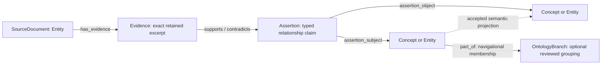

# Reading, relationships, and provenance: proposed property graph contract

**Status: design for Juniper's review; implementation paused.** This supersedes the audit's induced-edges-only recommendation and its recommendation to retire the ontology alarm. The unfinished `fix/reading-graph-repair` worktree is not the implementation of this design and has not been deployed. This branch changes documentation only.

## Arsonist summary

1. Curiosity needs a bounded neighborhood containing relationships **within the focal set and crossing its boundary, in either direction**. Keep those edge budgets separate and return the outside endpoints.
2. Curiosity, reading, recall, and UI exploration do **not** need a complete graph in application memory. Current graph dynamics does need complete coverage of its eligible cognitive nodes and relationships. Give these callers different read contracts; repair complete reads with pagination without making complete hydration a prerequisite for local queries.
3. Reading should create **source-backed relationship assertions**, not attach concepts because labels or definitions happen to match. Store the claim, its evidence, and its acceptance separately. Only accepted assertions produce traversable semantic relationships.
4. Use one provenance resolver for Orion's introspection tools and operator surfaces, with compact evidence handles in recall/reverie/email. Detailed evidence is fetched on demand under the caller's existing access boundary.
5. Preserve ontology expansion as an intended capability. Its plan-to-execution path, persistence, branch-membership semantics, and detection query need a separate explicit contract. A missing implementation is not a reason to invent branches or delete the alarm.

## Current architecture

### Sweep: what each consumer actually needs

The sweep inspected direct store calls and their consumers in substrate-runtime, Hub, substrate dynamics/relational/frontier code, graph cognition, Recall, introspection, reverie, and Orion's Day. It is a targeted read-path sweep, not a claim to have audited every service in the repository. File/function references below describe current `origin/main` at `f0fc91dc1`, not the paused edits.

| Consumer / code seam | Current behavior | Required read contract |
|---|---|---|
| `services/orion-substrate-runtime/app/worker.py::_endogenous_curiosity_tick` | Full snapshot, then uses nodes for intrinsic seeds; frontier evaluation makes bounded queries | Eligible node signals + bounded neighborhood around selected references. No whole edge set. |
| Same worker, `_attention_broadcast_tick` | Full snapshot, passes only nodes to attention | Complete eligible node coverage or an exactly equivalent filtered query, not the full graph. Moving filtering into DB must preserve the current predicate. |
| Same worker, `_brain_frame_tick`; `app/brain_frame_producer.py::_samples` | Full snapshot for region summaries and small visual samples | Server-side aggregates + bounded node/edge sample. Also audit the existing edge adapter: the worker iterates edge dictionary keys and the sampler expects a different endpoint shape. Completeness alone does not fix that. |
| `orion/substrate/dynamics.py::SubstrateDynamicsEngine.tick` | Builds adjacency; propagates pressure/activation; updates each node | Complete **eligible cognitive topology** for the existing algorithm. Keep this contract until an incremental algorithm has equivalence tests. Never substitute a top-N neighborhood. |
| `services/orion-hub/scripts/api_routes.py::decay_concept_activations` | Full snapshot, then concept-only per-node decay | Paged concept-node scan with identity keys, no relationships. |
| `orion/substrate/relational/layer.py` | Snapshot for anchor freshness and belief slices | Anchor-scoped nodes and any edges actually required by that slice; freshness aggregate. Preserve cross-anchor permission rules. |
| `orion/substrate/frontier_expansion.py::expand` | Full snapshot passed to a bounded context builder | Explicit request neighborhood + requested evidence; do not hydrate unrelated topology. No live worker caller for the orchestrator was found. |
| `orion/substrate/frontier_curiosity.py`, `consolidation.py`, `orion/graph_cognition/views.py` | Bounded queries; broad snapshot fallback; some endpoint filtering happens after edge truncation | Bounded neighborhood, typed degradation, separate internal/boundary edges. A failed query must not silently escalate to an unrestricted scan. |
| `services/orion-recall/app/collectors/concept_region.py` | Concept-region matching and cache reads; explicitly avoids per-turn snapshot | Relevance-scoped neighborhood and compact relation evidence/status. Avoid full hydration on chat's critical path. |
| Hub `concept_atlas_routes.py` summary/network | Some full scans for counts; bounded network view | Database aggregates for totals; paged neighborhood for exploration. Counts over a partial sample must be labeled as sample counts. |
| Hub `graph_workbench.py::graph_snapshot` | Existing bounded bidirectional neighborhood and property export | Reuse exploration interaction; add typed assertion/provenance focus and honest truncation. No replacement graph viewer needed. |
| Audits, rebuilds, consistency checks | Need full census in specific jobs | Paged complete traversal with explicit completion and consistency semantics. These are jobs, not default prompt context. |

**Answer to “full graph or subset?”:** subset for the task at hand; complete coverage for specifically named maintenance algorithms. “It calls `snapshot()` today” is not evidence that it needs the full graph. Conversely, changing dynamics to an arbitrary subset would change cognition, not just optimize storage.

Live read-only topology check on October 6: the latest sparse candidate's eight focal nodes had **4 internal edges**, **0 outgoing boundary edges**, and **3,355 incoming boundary edges from 633 distinct outside nodes**. All-graph predicate census: 20,612 `associated_with`, 13,397 `co_occurs_with`, 3,296 `supports`. These describe one current focal set, not universal distributions. The earlier audit separately confirmed Falkor's result cap is 10,000 and hydration returned only 10,000 of 37,305 edges.

### Existing contracts and gaps

- `orion/core/schemas/cognitive_substrate.py` already defines Concept, Entity, Evidence, Hypothesis, and OntologyBranch models, provenance, node promotion state, and typed predicates. Durable Falkor codecs only support Concept, Entity, and Evidence.
- `SubstrateEdgeV1` has provenance but **no first-class acceptance state**. Arbitrary metadata is not generally persisted by `falkor_codec.py`. A metadata flag is therefore not a safe proposal/accepted boundary.
- `world_pulse_read.py` Stage 1 handoff carries concepts and free-text `link_hints`. Stage 2 has concepts and prior tests but no validated relationship assertion contract. The adapter writes nodes and no relationships.
- `world_pulse_read_seed` already owns seed/run/trace/status/handoff history. Do not duplicate that workflow ledger as a parallel graph of task nodes.
- `SourceFetchEvidenceV1` proves a fetch returned content; for web reads it currently carries URL, tool name, and character count. It does **not** guarantee retained source text or an exact quote locator. Document snapshots have stronger hash evidence. A receipt cannot be upgraded into a verified quotation by assumption.
- The July property-graph doctrine keeps blobs and append-only audit in Postgres/artifact storage and traversal in Falkor. This design follows that split.

## Missing questions

These are the remaining decisions before implementation, with recommendations rather than silent choices:

1. **Acceptance authority:** recommend automatic extraction/validation of proposals, with the existing operator review surface as the initial acceptance boundary. Structural validation proves well-formed evidence, not the truth of a causal claim. A later policy for Orion to accept low-risk assertions independently needs its own named tests and limits; do not quietly enable it here.
2. **Evidence retention:** retain the actual tool-returned content in existing artifact storage, hashed and access-scoped. A web-fetch digest must be labeled `tool_digest`, not presented as verbatim page content. Expired/unavailable evidence remains explicitly unavailable. Retention must follow the source's existing privacy/deletion policy.
3. **Region budgets:** the budgets below are proposed initial experimental limits, not learned thresholds or cognitive metrics. Validate coverage/latency on the real hub-heavy graph before locking defaults.
4. **Ontology branches:** are these navigational groupings or asserted taxonomic classes? Recommend navigational groupings first, with independently justified `subtype_of` assertions for actual taxonomy. Do not make every grouping an “is-a” claim.

## Proposed schema / API changes

### 1. Neighborhood read contract

Proposed shared API, replacing the ambiguous use of “focal slice” for curiosity:

```text
read_neighborhood(
  focal_node_ids,
  direction = both,
  semantic_states = [provisional, canonical],
  internal_edge_limit,
  boundary_edge_limit,
  neighbor_node_limit,
  continuation = null
) -> {
  focal_nodes, neighbor_nodes,
  internal_edges, boundary_edges,
  read_started_at, read_finished_at,
  complete_for_request, truncated, degraded, reason,
  continuations
}
```

Rules:

- **Internal:** both endpoints are focal. **Boundary:** exactly one endpoint is focal. Fetch incoming and outgoing boundary relationships; preserve their actual direction and predicate.
- Determine the focal set first. Filter topology before applying each edge budget. Internal and boundary edges cannot consume each other's budget.
- Every returned edge has both endpoint nodes in the response. Dropping an outside endpoint requires dropping its edge and reporting truncation; never return dangling references.
- For boundary selection, use bounded round-robin across focal node, direction, and predicate groups, with stable edge-ID tie breaking. A giant Orion hub must not consume every slot before smaller focal nodes are considered. Do not introduce a new weighted curiosity score to solve this allocation problem.
- Initial experiment: keep the existing eight focal nodes; test 12 internal edges plus 16 boundary edges / at most 16 neighbors, one semantic hop. Explicitly test other budgets. These are response caps, not claims of completeness.
- Fetch evidence only for selected relations, by stable handles, in a separate bounded read. Provenance edges do not compete with semantic edges for these budgets.
- Continuations are bound to scope, focal set, filter, and ordering. A mutable graph response is not a transactional snapshot. On incompatible continuation state, return `changed`/restart information instead of pretending a historical view was preserved.
- Candidate contracts retain `focal_node_refs` for the focal set; add `neighbor_node_refs` and `boundary_edge_refs`. Existing `focal_edge_refs` explicitly means internal edges. Consumers must not infer the endpoint set from the wrong field. Update serializers, persisted candidate fixtures, and all candidate readers together; old rows default to absent neighborhood detail.

### 2. Complete coverage without compulsory full hydration

Direct neighborhood queries must work against durable Falkor without warming the full cache. Node-only scans and summaries get explicit methods; full snapshots are reserved for the consumers above.

For complete scans, use stable keyset pagination over database object IDs within a scan, bounded pages, and continue until an **empty** page. A short page can be a server cap, not end-of-data. Object IDs are cursors, not durable business identity. Detect nonadvancing cursors/duplicate business IDs; do not silently collapse incompatible duplicates.

Construct the next cache separately and swap it only after all required node/edge pages decode and validate. Page/query failure retains the previous good cache, marks it stale, and does not advance the successful-refresh cursor. Report scan start/end, counts, last successful refresh, and completeness as operational read receipts, not cognition signals.

Keyset pagination alone is **not** an atomic snapshot across concurrent mutation. Initially preserve this explicit consistency limit and refresh after observed mutation; jobs needing strict before/after equivalence require a quiescent fixture or snapshot-capable export. Do not promise snapshot isolation the backend does not provide.

### 3. Property graph model for reading

The minimum useful graph is **source → evidence → assertion → concepts**, plus an accepted semantic-edge projection. Assertions are first-class because a property graph cannot attach an evidence edge to another edge, and multiple sources can support or dispute the same relationship independently.



Reading-run, fetch, and review event rows remain in Postgres. Graph records hold their stable references. Raw documents/tool outputs remain in artifact storage, never in giant graph properties.

#### Nodes: physical labels, identity, required properties

All graph-owned nodes carry `node_id`, `node_kind`, `anchor_scope`, `visibility_scope`, `recorded_at`, and `schema_version`. `anchor_scope` describes the subject; **it is not an ACL**. `visibility_scope` binds to server-authored source access, never a model-selected permission.

| Label / typed model | Identity and properties | Producer → concrete consumer |
|---|---|---|
| `:SubstrateNode:Concept` (existing) | Stable concept ID; `label`, `definition`, optional aliases, existing promotion state. IDs are not hashes of labels; equal names can mean different things. Existing IDs remain intact. | Reader proposes/reuses concepts → neighborhood query, Recall, Atlas |
| `:SubstrateNode:Entity:SourceDocument` (Entity specialization) | `node_id = hash(visibility_scope, normalized source URI)`; `entity_type=source_document`, `source_uri`, display title. URI normalization uses the existing reading-source normalizer; do not strip meaningful query parameters. | Verified read reducer → provenance traversal, reading result UI |
| `:SubstrateNode:Evidence` (typed reading-evidence extension) | `evidence_type=reading_excerpt`; identity hashes source ID, exact retained artifact hash, and span locator. Required `content_ref`, `content_sha256`, `representation` (`source_text` or `tool_digest`), `span_start`, `span_end`, `excerpt_sha256`, `fetched_at`, `fetch_receipt_ref`. Span is a half-open UTF-8 byte range in the exact retained artifact, validated at character boundaries. Source text is fetched by reference. | Server-side content capture + span validator → assertion reviewer, Orion evidence drill-down, revalidation |
| `:SubstrateNode:Assertion` (**new durable node kind**) | Stable `node_id`; immutable `statement_key` for resolved subject/predicate/object/context; `predicate`, concise `statement_text`, `context_ref` when conditional, existing `valid_from`/`valid_to`, `promotion_state`, `revision`, `decision_ref` when reviewed. Subject/object are graph relationships, not opaque metadata. | Stage 2 bounded extraction + validator → review, accepted relation projector, explanation queries |
| `:SubstrateNode:OntologyBranch` (existing schema, missing durable support) | Existing `branch_key`, `branch_label`, plus documented scope/purpose and evidence/decision refs. Unique within scope. No branch is required for every read. | Separate reviewed grouping proposal → group navigation and branch-coverage inspection |

Concept/Entity endpoints may be old nodes or newly proposed nodes. Resolving identity requires a recorded decision that cites retrieved candidates and context. Label matches/embeddings retrieve candidates; neither automatically proves identity. An unresolved endpoint keeps the assertion proposed and unprojected. Do not mint placeholder endpoint nodes via `MERGE` merely to make edge creation succeed.

For an Assertion, existing `promotion_state` is the authoritative lifecycle: `proposed` (unaccepted), `provisional` (accepted as tentative), `canonical` (explicitly reviewed), `rejected`, `deprecated` (withdrawn). Do not add a second writable `accepted` boolean that can disagree. “Accepted” means admitted to a stated working model; “canonical” is not infallible truth.

Historical records lacking a retained excerpt keep receipt-only provenance. They do not get fabricated span offsets, quotes, hashes, or `human_verified` authority. New excerpt claims require captured content first.

#### Relationships: domain, range, cardinality, semantics

| Relationship | From → to | Contract |
|---|---|---|
| `has_evidence` (**new**) | SourceDocument → Evidence | Exactly one source per excerpt; source can have many versions/excerpts. Many fetch receipts can reference the same immutable excerpt. |
| `supports` / `contradicts` (existing names, specified domains here) | Evidence → Assertion | Many-to-many. Means this exact evidence supports/disputes this claim, not that fetching a source proved it true. Edge holds extraction/assessment receipt references. |
| `assertion_subject` (**new**) | Assertion → Concept/Entity | Exactly one resolved subject for an accepted assertion; proposed assertion may have an unresolved reference in its proposal receipt. |
| `assertion_object` (**new**) | Assertion → Concept/Entity | Exactly one resolved object for an accepted assertion. Subject/object attachment must be validated together. |
| Semantic predicate (existing vocabulary) | Concept/Entity → Concept/Entity | Materialized only from accepted assertions, with `assertion_id`, `assertion_revision`, `decision_ref`, and `edge_role=semantic_projection`. Independently retractable/rebuildable. |
| `part_of` (existing) | Concept → OntologyBranch | Navigational membership, with `edge_role=ontology_membership` and supporting assertion/decision. Does not assert biological/type inheritance. |

All edges have stable `edge_id`, endpoint IDs, typed predicate, `recorded_at`, temporal validity where relevant, `visibility_scope`, provenance refs, and explicit `edge_role`. New fields must be encoded/decoded as native typed properties; a JSON metadata dump is not the persistence contract.

Start the reader's semantic predicate allowlist with the existing `subtype_of`, `part_of`, `refines`, `associated_with`, `causes`, and `co_occurs_with`, each with a domain/range validator and evidence requirements. `subtype_of` and `refines` are Concept→Concept; `part_of` is same-domain compositional membership; `causes`/`associated_with` require explicitly resolved Concept/Entity endpoints and scoped statement text. `co_occurs_with` only records source co-occurrence and must not be narrated as causation. No arbitrary model-invented relationship types. Operational predicates such as `activates`, `suppresses`, and `seeks` are not emitted by a reading extractor.

**One statement, multiple evidence records:** deduplicate resolved assertions by typed endpoints + predicate + context/validity, within visibility scope. Preserve separate extraction/assessment receipts; never overwrite an earlier source's support with the latest read. Distinct time/condition claims remain distinct assertions. Evidence disagreement is retained, not averaged into a confidence number.

Semantic projection identity is `hash(assertion_id)` and properties include the applied revision. Retries are idempotent. Transition to rejected/deprecated removes that assertion's active projection while retaining its evidence and decision history. An unrelated assertion's edge is not deleted. Projector failures must not leave stale accepted edges silently eligible: readers verify assertion state/revision, and a reconciler repairs projections from durable receipts.

#### Persistence and ownership

- Postgres owns reading workflow state and append-only extraction/review/materialization receipts. Add one typed assertion-event journal only if the existing frontier/review persistence cannot carry these records; do not create another review service.
- Falkor owns traversable current projections: concepts, source/evidence references, assertion state, and accepted semantic edges. The immutable assertion proposal/review receipt is the recovery source for its projection.
- Existing concept IDs, provenance, and curated facts are preserved. Existing direct edges are classified `legacy_unreviewed` on read until a separate migration can establish their provenance; do not fabricate assertion IDs or delete all legacy edges.
- New reading assertions follow the strict projection rule from day one. Migration of old edges is explicit and separate. Readers must distinguish legacy relationships from newly accepted assertions in their answers.
- Proposed event contracts below make producer/consumer obligations concrete. Schema + registry + channel + fixtures change together. Use existing reading lifecycle/source-fetch events for capture; the three new graph events share the reading workflow, not a new service.
- Create indexes for stable node IDs, statement keys scoped by visibility, and lineage lookup fields. Verify supported uniqueness facilities on the deployed Falkor version; enforce idempotence and domain/cardinality validation in the single materializer regardless. Do not assume a database constraint that has not been deployed.

Proposed event payloads (all include `schema_version`, stable `event_id`, `recorded_at`, server-authored `visibility_scope`, and seed/run/trace references):

| Contract / kind / channel | Required payload | Producer → consumer |
|---|---|---|
| `ReadingGraphProposalV1` / `reading.graph.proposal.v1` / `orion:reading:graph:proposal` | `proposal_id`, resolved/proposed concept references, typed subject/predicate/object, `statement_text`, context/validity, evidence-span refs, endpoint-resolution evidence, extractor/model identity | Stage 2 → durable proposal/review intake |
| `ReadingGraphDecisionV1` / `reading.graph.decision.v1` / `orion:reading:graph:decision` | `decision_id`, `proposal_id`, assertion ID, expected prior revision, resulting promotion state, actor/authority, rationale and evidence refs | Review boundary → durable decision journal and projector |
| `ReadingGraphMaterializationV1` / `reading.graph.materialized.v1` / `orion:reading:graph:materialized` | `decision_id`, assertion ID/revision, actual canonical node/edge IDs, `outcome` (`applied`, `failed`), failure reason when failed, applied timestamp when successful | Graph materializer → lineage resolver, reading status, reconciler |

The append-only receipt store requires unique event IDs and unique `(visibility_scope, statement_key)` assertion identity; updates use an expected-revision check. A transactional outbox or the existing durable workflow's equivalent must bridge committed receipts to published events. Bus delivery alone is not durable acceptance. These are proposed contracts, not declarations that such consumers already exist.

#### Prevent provenance from changing cognition by accident

Current pressure propagation in `dynamics.py::_compute_pressures` traverses outgoing edges without a reading-provenance distinction. Adding source/assertion edges and letting that code consume them would change runtime behavior unintentionally.

Before writing the new graph shapes, update cognitive read contracts to select eligible cognitive node roles and semantic edges explicitly. Provenance edges and unaccepted assertions are available in evidence/debug views, but excluded from default activation/pressure propagation. Keep legacy cognitive eligibility unchanged for the first migration and test it. The full scan required by dynamics is the full **eligible semantic graph**, not every receipt, source, or review object.

### 4. Reading-to-graph flow

```text
verified fetch receipt + captured tool/source content
  → immutable evidence references
  → extracted concepts + proposed relationship assertions
  → retrieve relevant existing concepts and their bidirectional neighborhood
  → resolve endpoints; validate exact spans, types, scope, and claim qualifiers
  → durable proposal and review decision
  → idempotent graph projection
  → materialization receipt naming actual canonical node/edge/assertion IDs
  → Orion tools + operator view use the same evidence resolver
```

Use the existing Stage 1/Stage 2 seam: Stage 1 captures what was actually read; Stage 2 reasons over the retained content and relevant graph neighborhood. The model proposes meaning; deterministic code enforces IDs, evidence locators, types, scope, and lifecycle. The model cannot author successful fetch receipts, accept its own proposal through an invented status field, or claim a materialization that never happened.

The materialization receipt must use the canonical IDs returned by `SubstrateGraphMaterializer`, not recompute `_concept_node_id(trace,label)`: existing reconciliation may merge an incoming concept into a different durable node. A valid read with no justified semantic relationship remains an honestly unconnected proposal; edge count is not a success target.

Illustrative fixture, not a claim about live data: a source excerpt says “a heat pump transfers heat using a refrigeration cycle.” The read produces a proposed assertion whose subject is the new heat-pump concept and whose object is an existing refrigeration-cycle concept, with an explicitly supported predicate chosen by the reviewer. Matching the words alone does not create the semantic edge. Accepted edges make the old concept discoverable from the new one and vice versa; source evidence remains separately traversable. If the available predicate vocabulary cannot express the sentence without distortion, leave it unprojected rather than forcing `causes` or `subtype_of`.

### 5. Provenance placement: both, through one contract

| Surface | Finding | Proposed behavior |
|---|---|---|
| Orion `reading_results` (`orion/introspect/tools.py`, `world_pulse_read/introspect.py`) | SQL reads trace IDs but `_item` omits them; no graph landing IDs | Return seed/run/trace IDs, actual materialized IDs, assertion state, source URI and a bounded evidence handle. Distinguish read, proposed, accepted, and materialized. |
| Orion investigation / self-inquiry | Candidate references require manual SQL/Cypher joins today | Add an `evidence_lineage` introspection operation accepting one typed reference (candidate set, node, edge, assertion, or reading seed). Same caller binding and visibility enforcement as existing introspection. |
| Recall concept/edge fragments (`services/orion-recall/app/collectors/concept_region.py`) | Edge fragment is effectively a bare triple | Carry assertion state and compact source/evidence handles. Retrieval of a relation is not permission to narrate it as established truth. |
| Curiosity hints and generated plans | Primarily summaries and focal IDs | Preserve candidate-set ID and neighborhood/evidence handles through the chosen plan; do not stuff full documents into every tick. |
| Hub Reading details + Concept Atlas / Graph Workbench | Existing reading detail and graph explorer are available | “Why is this connected?” shows direction, predicate, state, excerpt/source, originating read, review decision, and exact materialization IDs. Open a related node or its evidence in the existing viewer. |
| Hub curiosity observability | Current section omits node/edge IDs | Show internal vs boundary relationships, omitted/truncated status, and evidence drill-down through the same resolver. |
| Orion's Day (`orion/orion_day/gather.py`) | Uses verified reading summaries and separately gathered reverie/curiosity material | Include bounded structured lineage and query receipts for cited numbers, with half-open window, population/filter, as-of time, and truncation. Do not infer graph repair from thematic similarity. |
| Reverie (`orion/reverie/semantic_lift.py`) | Coalition/source references are grounding handles; not an independent graph fault detector | Keep compact shared evidence handles; resolve only when a thought makes a checkable claim. Do not expand every background thought into a graph census. |

Proposed `EvidenceLineageV1`: typed root reference; authorized nodes/edges/assertions; seed/request/fetch-run/Stage-1-trace/Stage-2-trace references; source/excerpt references; decision and materialization receipt references; separate `observed_at`, `fetched_at`, `recorded_at`, `materialized_at`; `as_of`; truncation/continuation; and an explicit resolution outcome (`resolved`, `partial`, `unavailable`, `not_found`). Permission denial must not leak whether a private record exists. Missing timestamps stay null with a reason—never substitute one clock for another.

One resolver in the owning service serves both the introspection tool and Hub API. Extending the introspection operation requires updating its argument/result models, reading RPC request dispatch, registry/channel descriptions, tool description and tests. Adding only an HTTP endpoint does not satisfy Orion access. Conversely, adding only a tool does not satisfy operator explainability.

### Ontology expansion: preserve the capability, repair its prerequisites

The current alarm checks a bounded sampled union for absence of `ontology_branch`; its concept-region query returns concepts only. The current worker persists the evaluator's plan without executing `FrontierCuriosityOrchestrator`; durable codec rejects the branch kind. Merely adding codec support would not connect execution, and merely making one branch would not establish useful organization.

A subsequent explicit proposal should make reviewed branch membership traversable for retrieval, persist branches through the codec, wire a bounded proposal-producing execution path, and report capability blocks honestly. Branch coverage should be queried for the actual region, not inferred from “no branch in the top concepts.” Do not introduce or rewire a numeric cognition signal without the metric quality gate. This design neither retires the alarm nor enables autonomous expansion.

## Files likely to touch

- **Read contracts:** `orion/substrate/store.py`, `query_planning.py`, `falkor_store.py`, `routed_store.py`, active alternate backend parity in `graphdb_store.py`; neighborhood callers in `frontier_curiosity.py`, `consolidation.py`, `frontier_context.py`, `orion/graph_cognition/views.py`.
- **Property contracts:** `orion/core/schemas/cognitive_substrate.py`, frontier proposal/landing models, `orion/substrate/falkor_codec.py`, `materializer.py`, `reconcile.py`; schema registry and bus definitions where versioned payloads change.
- **Reading producer:** `orion/harness/reading_receipts.py`, `orion/schemas/reading.py`, `world_pulse_read.py`, `orion/world_pulse_read/queue.py`; Hub Stage 1 and Stage 2 pipelines and existing operator review integration.
- **Consumer isolation:** runtime attention/brain/curiosity callers, `orion/substrate/dynamics.py`, relational layer, Hub decay/summary reads, Recall concept-region collector.
- **Provenance:** `orion/schemas/introspect.py`, `orion/introspect/tools.py`, `orion/world_pulse_read/introspect.py`, `services/orion-hub/scripts/reading_listener.py`, reading operator routes, substrate observability, graph workbench, corresponding static assets/templates, `orion/orion_day/gather.py` and its schema, reverie reference handling.
- **Verification/docs:** focused substrate/backend/reconcile tests, reading pipeline/introspection tests, Hub route/UI tests, dedicated neighborhood and reading-lineage eval fixtures. Env/Docker changes only if required; sync local `.env` for any template change. No environment edits in this design task.

## Non-goals

No code implementation/deployment in this task; no acceptance of the paused patch; no graph deletion/backfill; no automatic concept merging by label; no empty ontology scaffold; no full-document graph blobs; no new service; no new urgency/confidence metric; no autonomous acceptance policy hidden in plumbing; no changes to Orion's worldview or private recall permissions.

Capability change proposed: Orion can inspect meaningful inward/outward relationships, retain source-backed relationship proposals, and explain where accepted graph structure came from. Data touched later: reading artifacts/receipts, scoped source/evidence/assertion projections, explicit accepted semantic edges, and enriched diagnostic outputs. Dangerous failures: an unsupported relationship masquerading as fact, provenance edges altering activation, private source content leaking through a public concept, and partial graph reads reported as complete. Disable new assertion extraction/projection independently; preserve evidence/history; revoke only projections identified by their assertion receipts. Keep old data readable and do not turn a rollback into graph destruction.

## Acceptance checks

1. **Internal plus boundary:** a fixture with four internal edges and thousands of higher-ranked boundary edges returns internal edges, bounded diverse incoming/outgoing neighbors, intact endpoint nodes, and explicit truncation. The current live focal set's incoming links are discoverable. No invented edges.
2. **Consumer scope:** curiosity/reading/Recall request neighborhoods without full hydration; decay scans only concepts; attention gets complete eligible node inputs. Dynamics before/after outputs agree on the same complete cognitive fixture.
3. **Complete scan:** more than the server cap, a server cap smaller than the requested page, duplicate IDs, mid-page failures, and concurrent-change cases. Never label a partial cache complete or advance its successful refresh timestamp on failure.
4. **Graph typing:** native codec round trips preserve every required property, edge role, lifecycle and lineage field. Wrong endpoint types, unresolved placeholders, nonexistent references and silent metadata loss fail gates.
5. **Evidence:** exact span validates against retained hashed content. Digest vs source text is visible. Missing source bytes/receipt-only legacy data cannot become verified quotes. Multiple source versions and conflicting evidence remain distinguishable.
6. **Identity:** equal labels with different meanings stay distinct; new and existing endpoints can be linked through a reviewed assertion; actual materialized canonical IDs appear in receipts. Retrying a read creates no duplicate semantic assertion/projection.
7. **Proposal lifecycle:** proposed assertions have no active semantic projection; accepted assertions do; rejection/retraction removes only their active projection. Partial projector failure and restart recover from durable receipts without presenting stale edges as accepted.
8. **Cognitive isolation:** source, excerpt, and proposal edges do not enter pressure/activation paths. No change to existing eligible topology merely from introducing provenance nodes.
9. **Both interfaces:** Orion tool and Hub return the same provenance for a known run→seed→node link; browse node→assertion→excerpt→source and back. Errors mean unavailable, not empty history. Private/intimate sources remain inaccessible to callers without that scope.
10. **Email/reverie:** a cited count has its population, time window, query receipt and truncation; matching prose cannot count as independent verification of a mechanism.
11. **Runtime proof after approval:** actual read receipt → proposed assertion → review decision → persisted accepted edge → neighborhood result → Orion tool and UI. Tests/config alone do not establish this; until exercised, mark the new path **UNVERIFIED**.

## Recommended next patch

Review this contract first. Then deliver a narrow **bidirectional neighborhood read** patch with separate internal/boundary budgets, complete endpoints, backend tests, and a read-only replay against the live focal set. In parallel sequencing (not automatic delegation), fix complete hydration only for its existing required consumers and migrate gratuitous full reads deliberately.

The reading property graph should follow as contract → retained evidence → proposal → review/projection → both provenance surfaces, with an end-to-end fixture at every step. Do not silently resume the paused exact-text-matching implementation. Ontology expansion remains a separately reviewed capability repair.
