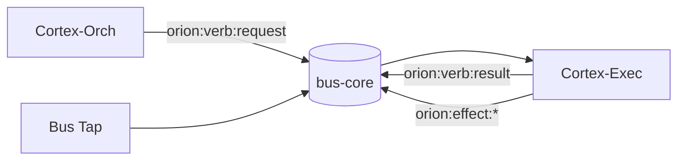

# Orion Platform Codex Testing

> Goal: stop “generate code in the dark.” Every substantive change must be validated in a minimal reproducible environment.

---

## Table of contents

1. Purpose
2. Principles
3. Minimal Test Harness (MTH)
4. Required Services and Topology
5. Environment Contract (env→compose→settings)
6. Test Data and Test Verbs
7. End‑to‑End Scenarios
8. Architecture Review Procedure (automatable)
9. Drift Detection Checks
10. Success Criteria
11. Suggested CI wiring
12. Appendices (templates, commands, checklists)

---

## 1. Purpose

Codex (and humans) frequently introduce bugs because they do not execute code, do not observe the bus in motion, and do not validate schema/channel invariants.

This document defines a **Codex Testing Contract**:

* a minimal dockerized harness
* a required set of end‑to‑end checks
* drift detection rules
* success criteria

This is not optional for platform changes.

---

## 2. Principles

1. **Reproducible**

* One compose file spins up the harness.

2. **Observable**

* Bus Tap shows traffic.
* Logs have correlation IDs.

3. **Contract‑driven**

* Channels come from `channels.yaml`.
* Payloads validate against Pydantic.

4. **Spine‑accurate**

* Orch is the entry point.
* Exec is the only verb executor.

5. **Drift‑resistant**

* Tests detect unknown channels, raw Redis usage, and bypassed verb runtime.

---

## 3. Minimal Test Harness (MTH)

The MTH is the smallest runnable system that exercises the platform contract.

### 3.1 Components

* `bus-core` (Redis)
* `cortex-orch` (or a minimal stub that can emit VerbRequestV1)
* `cortex-exec` (VerbRuntime + a tiny set of test verbs)
* `bus-tap` (passive observer)

Optional:

* `sql-writer` (if effects include sql)
* `vector-writer`
* `rdf-writer`

---

## 4. Required Services and Topology



**Note:** The harness may run as a simplified variant, but must preserve:

* verb request/result channels
* effect channels
* Titanium envelopes

---

## 5. Environment Contract (env→compose→settings)

Every service in the harness must:

* include a `.env_example`
* receive env vars via docker-compose `environment:`
* load via `app/settings.py` (Pydantic Settings)

### 5.1 Required env vars

At minimum:

* `ORION_BUS_URL`
* `ORION_BUS_ENFORCE_CATALOG` (false in dev, true in CI)

Recommended:

* `NODE_NAME`
* `INSTANCE_ID`

---

## 6. Test Data and Test Verbs

### 6.1 Test verb: Ping

Create a test verb that exercises the full request → result path.

* trigger: `orion.test.ping`
* input: `{ "message": "hello" }`
* output: `{ "pong": true, "echo": "hello" }`
* effects: optional `telemetry` effect

### 6.2 Test verb: Effect fanout

A second verb that emits one effect per writer type.

* trigger: `orion.test.effects`
* effects:

  * `orion:effect:sql`
  * `orion:effect:rdf`
  * `orion:effect:vector`

This validates effect routing.

---

## 7. End‑to‑End Scenarios

### Scenario A: Basic verb execution

1. Orch publishes `VerbRequestV1(trigger=orion.test.ping)` to `orion:verb:request`.
2. Exec runs the verb.
3. Exec publishes `VerbResultV1` to `orion:verb:result`.
4. Bus Tap confirms:

   * correct channel names
   * Titanium envelope shape
   * schema_id present
   * correlation_id propagated

### Scenario B: Effects emission

1. Orch publishes `VerbRequestV1(trigger=orion.test.effects)`.
2. Exec publishes effects to `orion:effect:*`.
3. Optional writers consume effects and log success.

### Scenario C: Catalog enforcement

1. With `ORION_BUS_ENFORCE_CATALOG=true`, attempt to publish to a channel not in `channels.yaml`.
2. Expect failure.

---

## 8. Architecture Review Procedure (automatable)

The architecture review for a branch should produce:

1. **Channel inventory**

* scan code for channel strings
* compare to `channels.yaml`

2. **Schema inventory**

* scan for envelope creation sites
* ensure `schema_id` matches a Pydantic model

3. **Spine enforcement**

* ensure only cortex-exec imports/uses VerbRuntime
* ensure orch is the only component emitting VerbRequestV1 in planned flows

4. **Config lineage check**

* ensure `.env_example` exists
* ensure compose wires variables
* ensure settings reads them

### Suggested automation outputs

* `docs/architecture_reviews/YYYY-MM-DD.md`
* `reports/channel_drift.json`
* `reports/schema_drift.json`

---

## 9. Drift Detection Checks

### 9.1 Channel drift

* Any literal channel string not found in `channels.yaml` is drift.
* Any change to a channel name without updating the catalog is drift.

### 9.2 Raw Redis drift

* Any direct `redis.publish` / `redis.subscribe` usage outside OrionBus is drift.

### 9.3 Verb bypass drift

* Any use/import of `VerbRuntime` outside cortex-exec is drift.

### 9.4 Envelope drift

* Any bus message missing `schema_id` is drift.
* Any bus message not wrapped in Titanium is drift.

---

## 10. Success Criteria

A change passes platform testing when:

* ✅ All services start in MTH without errors
* ✅ Ping verb passes end‑to‑end
* ✅ Effects verb emits expected effects
* ✅ Bus Tap shows the correct traffic
* ✅ No unknown channels are used
* ✅ No raw Redis pub/sub exists in new code
* ✅ Only exec executes verbs
* ✅ Env lineage is intact

---

## 11. Suggested CI wiring

Recommended CI stages:

1. **Static checks**

* channel drift scan
* raw redis scan
* VerbRuntime import scan

2. **MTH smoke test**

* `docker compose up -d`
* run ping scenario
* run effects scenario

3. **Report generation**

* publish drift reports as artifacts

---

## 12. Appendices

### A. Minimal compose template (conceptual)

This is not canonical code; adapt to the repo’s compose layout.

```yaml
services:
  bus-core:
    image: redis:7-alpine
    ports: ["6379:6379"]

  cortex-orch:
    build: services/orion-cortex-orch
    environment:
      - ORION_BUS_URL=redis://bus-core:6379/0

  cortex-exec:
    build: services/orion-cortex-exec
    environment:
      - ORION_BUS_URL=redis://bus-core:6379/0

  bus-tap:
    build: services/orion-bus-tap
    environment:
      - ORION_BUS_URL=redis://bus-core:6379/0
      - TAP_PATTERN=orion:*
```

### B. Codex prompt snippet to force testing

Use this snippet at the end of a Codex task:

* Add/update the MTH compose.
* Add `orion.test.ping` and `orion.test.effects`.
* Provide the manual run steps.
* Confirm success criteria.
