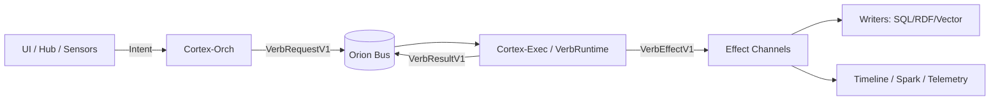
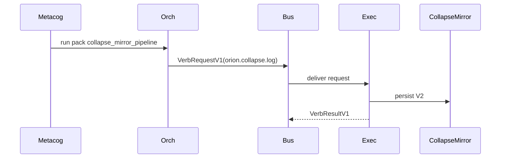

# Orion Platform Contract
>
> **If you change the platform:** update this doc first, then change core, then refactor services, and README.md files or any other relevant docs/* items.

---

## Table of contents

1. Purpose
2. Definitions
3. The Four Laws
4. The Execution Spine
5. Bus and Channels
6. Titanium Envelope
7. Shared Schemas
8. Verb SDK
9. Cortex‑Orch Gateway
10. Effects Model
11. Writers and Persistence
12. Observability: Bus Tap, Mirror, Timeline
13. Configuration Lineage
14. Service Template
15. Naming Conventions
16. Drift Prevention Guardrails
17. CI/Validation Guardrails
18. Architectural Review Process
19. Change Management
20. Appendices (checklists, anti‑patterns, examples)

---

## 1. Purpose

Orion is a distributed cognition platform: a mesh of services that perceive, deliberate, act, and remember.

As Orion grows, the primary failure mode is **platform drift**:

* A new service invents new channel names.
* Messages stop matching schemas.
* A tool or agent bypasses the orchestrator: orion-cortex-orch.
* Configuration becomes inconsistent: .env and docker-compose environment vars emitted and settings.py becomes primary.
* Debugging becomes archaeology.

This contract exists to keep Orion coherent under acceleration.

---

## 2. Definitions

**Orion Bus**
: A shared message fabric (Redis Pub/Sub) that all services use for inter‑service communication.

**Channel Catalog**
: The canonical inventory of channels and schemas at `orion/bus/channels.yaml`.

**Titanium Envelope**
: The single global message wrapper that carries metadata + `schema_id` + typed `payload`.

**Schema**
: A Pydantic model (and optionally JSON Schema artifact) that validates a payload crossing the bus.

**Verb**
: A typed action (logic) implemented via the Verb SDK, executed only by cortex‑exec.

**Pack / Plan**
: Orchestrated multi‑step work owned by cortex‑orch (planner/council/packs).

**Effect**
: A typed side‑effect emitted by verbs (write memory, trigger vision, emit spark signal, etc.).

**Platform Drift**
: Any divergence from this contract that causes implicit coupling, undocumented channels, untyped payloads, or bypassed orchestration.

---

## 3. The Four Laws (Non‑negotiable)

1. **Bus‑First**

* All cross‑service communication goes over **OrionBus** via: ORION*BUS_URL=redis://100.92.216.81:6379/0 with ORION_BUS_ENFORCE_CATALOG=false in the root .env... ORION_BUS_ENFORCE_CATALOG=true within the service/[service*name]/.env
* No new service should use raw Redis clients for Pub/Sub.

2. **Channel Catalog**

* Every channel used must exist in `orion/bus/channels.yaml`.
* No ghost channels.

3. **Titanium + Schemas**

* Everything on the bus is a Titanium envelope--see orion/bus/*
* Every envelope declares `schema_id` and the payload is validated by a Pydantic model.

4. **Orch + Verb SDK**

* All verbs execute only through:

  `cortex‑orch → orion:verb:request → cortex‑exec(VerbRuntime) → orion:verb:result` with cortex-orch as the primary entrypoint--no backdoors

* No other service calls `VerbRuntime`.

If a change violates any of these, it is not “pragmatic,” it is drift.

---

## 4. The Execution Spine (The one true path)

This is the canonical flow for planned/agentic work.



### Spine invariants

* **Only Orch decides** what runs and in what order.
* **Only Exec executes** verbs.
* **Only Writers persist** long‑term state.
* Observability services are consumers of events/effects, not secret orchestrators.

---

## 5. Bus and Channels

### 5.1 Canonical channel namespaces

We use predictable channel namespaces to reduce ambiguity:

* **Verb core**

  * `orion:verb:request`
  * `orion:verb:result`

* **Effects (typed)**

  * `orion:effect:sql`
  * `orion:effect:rdf`
  * `orion:effect:vector`
  * `orion:effect:spark`
  * (and additional effect types as needed)

* **Domain intake/events**

  * `orion:<domain>:intake`
  * `orion:<domain>:events`

* **Telemetry/events**

  * `orion:event:<name>`
  * `orion:telemetry:<name>`

### 5.2 Channel catalog is the law

`orion/bus/channels.yaml` is the canonical map.

Each channel entry must include:

* `name` (string)
* `kind` (request | result | effect | event | telemetry)
* `schema_id` (Pydantic model name)
* `producer_services` (list)
* `consumer_services` (list)
* `stability` (stable | experimental | deprecated)
* `since` (YYYY‑MM‑DD)

Example:

```yaml
channels:
  - name: "orion:verb:request"
    kind: "request"
    schema_id: "VerbRequestV1"
    producer_services: ["orion-cortex-orch"]
    consumer_services: ["orion-cortex-exec"]
    stability: "stable"
    since: "2026-01-08"
```

### 5.3 Channel enforcement

OrionBus integrates `ChannelCatalogEnforcer`:

* **Dev/Prod default:** warn on unknown channels.
* **CI (recommended):** error on unknown channels.

This is the primary anti‑drift ratchet.

---

## 6. Titanium Envelope (Global message wrapper)

All bus messages are Titanium envelopes.

### 6.1 Required fields

Minimum required metadata:

* `envelope_id` (uuid)
* `schema_id` (string)
* `payload` (object)
* `timestamp` (ISO‑8601 UTC)
* `source_service` (string)
* `source_instance` (string)
* `correlation_id` (uuid/string)
* `causation_id` (uuid/string, optional)

### 6.2 Envelope generation rules

* Never publish payloads without an envelope.
* Never omit `schema_id`.
* Preserve `correlation_id` across a chain.
* Treat `causation_id` as “this message was caused by …”.

### 6.3 Envelope stability

The envelope format is global infrastructure. Changes require:

1. update this contract,
2. implement backward compatibility,
3. update all core services.

---

## 7. Shared Schemas

### 7.1 Pydantic is the source of truth

Every bus payload must map to a Pydantic model.

* `schema_id` should match the model name (or a stable alias).
* Models live in discoverable modules under shared service modules.

### 7.2 Versioning

* Do not break payloads silently.
* When breaking changes are required, introduce a versioned schema:

  * `CollapseMirrorEntryV1` → `CollapseMirrorEntryV2`

### 7.3 “No dict soup” rule

* No ad‑hoc dict payloads crossing service boundaries.
* If it crosses the bus, it gets a schema.

---

## 8. Verb SDK

The Verb SDK standardizes verb execution.

### 8.1 Core components

* `VerbRequestV1`
* `VerbResultV1`
* `VerbEffectV1`
* `VerbContext`
* `BaseVerb[InputT, OutputT]`
* `VerbRegistry` + `@verb(trigger)` decorator
* `VerbRuntime`

### 8.2 Execution rules

* Only **cortex‑exec** runs VerbRuntime.
* Verbs should contain **logic**, not bus plumbing.
* All side effects are emitted as typed effects.

### 8.3 Effects as first‑class

Verbs return:

* An output model (for caller)
* A list of `VerbEffectV1` (for the world)

---

## 9. Cortex‑Orch Gateway

Cortex‑Orch is the **only gateway** to planned execution.

### 9.1 What Orch owns

* Packs / plans / council logic
* Ordering and retries
* Constructing VerbRequest
* Deciding when to run enrichment/scoring

### 9.2 What Orch must never do

* Execute verb logic directly
* Call VerbRuntime
* Persist long‑term data directly (except via effects)

---

## 10. Effects Model

Effects are typed, routed, and audited.

### 10.1 Effect channel design

* `orion:effect:<type>`

Examples:

* `orion:effect:sql`
* `orion:effect:rdf`
* `orion:effect:vector`
* `orion:effect:spark`

### 10.2 Effects vs Events

* **Effects:** requests for durable action (write, trigger, actuate)
* **Events:** observation/telemetry (something happened)

Both should be cataloged and schematized.

---

## 11. Writers and Persistence

Writers are sinks.

### 11.1 Writer responsibilities

* Validate incoming effect schema
* Persist data
* Emit success/failure telemetry

### 11.2 Writer non‑responsibilities

* No planning
* No LLM calls
* No orchestration

---

## 12. Observability: Bus Tap, Mirror, Timeline

### 12.1 Bus Tap

Bus Tap is a passive observer:

* subscribes to selected channel patterns
* decodes Titanium envelopes
* shows raw stream + filtered views

**Bus Tap must not:**

* invent channels
* write back side effects by default

### 12.2 Mirror

Mirror optionally persists bus envelopes for forensic replay:

* SQLite rolling buffer
* Parquet archival

### 12.3 Timeline

Timeline provides windowed, aggregated views:

* correlation threads
* verb durations
* effect propagation

Timeline can be **switchable** (passive by default; active only when explicitly enabled).

---

## 13. Service Configuration & Lineage

All configuration follows:

`.env → docker-compose.yml → app/settings.py`

Rules:

* No hardcoded URLs, ports, or credentials.

---

## 14. Service Template (Required shape)

Every service should contain:

* `app/settings.py` (Pydantic Settings)
* Every service has a docker-compose file with an environments section that uses the variables as parameters from the .env... those flow into app/settings.py
* All service use a healthcheck with a curl port exposed, and a heartbeat per the orion/bus/*
* All services use an app folder for scripts and a lightweight orchestration main.py
* All services have a test harness that is located within root/scripts/*
* All services have a requirements.txt with version numbers
* `app/main.py` (FastAPI or worker entrypoint)
* `Dockerfile`
* `.env with .env_example`

Optionally:

* `app/models.py`
* `app/bus_worker.py`

---

## 15. Naming Conventions

### 15.1 Channel naming

* Prefer `orion:<domain>:intake` and `orion:<domain>:events`.
* Avoid overly specific channels unless necessary.

### 15.2 Schema naming

* Use explicit version suffix when needed: `V1`, `V2`.

### 15.3 Service naming

* `orion-<node>-<service>` container names are fine.

---

## 16. Drift Prevention Guardrails

### 16.1 Human workflow

* If you add a channel → add it to `channels.yaml`.
* If you add a payload → add a schema.
* If you add an action → make it a verb.

### 16.2 Codex workflow

Every Codex prompt must begin with:

1. Read `docs/platform_contract.md`.
2. Read `orion/bus/channels.yaml`.
3. Identify any relevant shared schemas.
4. Produce a plan and list of files to change.

---

## 17. CI/Validation Guardrails (Recommended)

* Fail CI if:

  * a new channel string appears in code and is not in `channels.yaml`
  * raw Redis Pub/Sub is used outside OrionBus
  * VerbRuntime is imported/used outside cortex‑exec
  * envelopes are missing schema_id

---

## 18. Architectural Review Process

An architecture review must:

* enumerate all channels used per service
* compare them to catalog
* enumerate schemas used
* verify orch/exec spine
* verify env lineage

(See `docs/platform_codex_testing.md` for the environment harness and review procedure.)

---

## 19. Change Management

To evolve the platform:

1. Update this doc.
2. Update core modules (OrionBus, Titanium, Verb SDK).
3. Update affected services.
4. Add migration notes + compatibility adapters.
5. Update service README.md as needed and any relevant docs/* items
---

## 20. Appendices

### A. New Service Checklist

* Channels cataloged
* Schemas present
* Envelopes used
* OrionBus used
* Env lineage preserved
* Verbs routed via orch → exec

### B. Anti‑patterns

* hardcoded channel strings not in catalog
* raw Redis clients
* ad‑hoc JSON payloads
* direct VerbRuntime usage outside exec
* config hardcoded in code

### C. Example: Collapse Mirror pipeline


