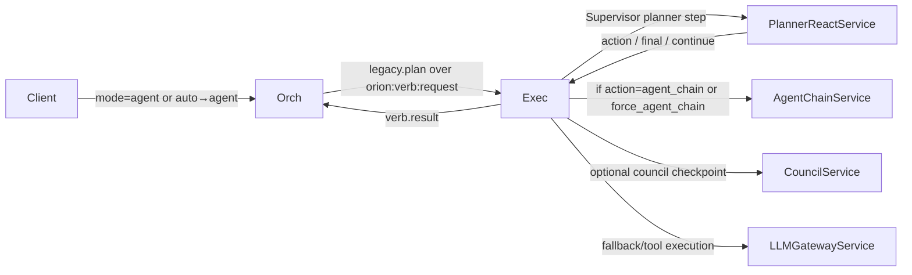

# Platform Review: Cortex Routing Surface Area and Wiring Map

## 1) Routing Surface Area Map

| Producer (`source.name`) | Published channel | `kind` / schema | Mode set | Verb set | Packs set | Recall flags | Typical consumers |
|---|---|---|---|---|---|---|---|
| `cortex-gateway` HTTP `/v1/cortex/chat` and bus gateway worker | `orion:cortex:request` | `cortex.orch.request` / `CortexClientRequest` | Request `mode` (default `brain`) | `chat_general` default unless `agent/council`; explicit `verb` passed through | Defaults `['executive_pack']` if omitted | `RecallDirective` defaults unless overridden | `orion-cortex-orch` |
| `orion-spark-introspector` worker (`handle_candidate`) | `orion:cortex:request` | `cortex.orch.request` / `CortexClientRequest` | hardcoded `brain` | hardcoded `introspect_spark` | `[]` | hardcoded recall disabled | `orion-cortex-orch` |
| `orion.spark.concept_induction.summarizer` | `orion:cortex:request` | `cortex.orch.request` / `CortexClientRequest` | hardcoded `brain` | configured `verb_name` (concept induction summarization path) | `[]` | recall disabled | `orion-cortex-orch` |
| `orion-planner-react` `_call_cortex_verb` helper | `orion:cortex:request` | `cortex.orch.request` / `CortexClientRequest` | hardcoded `agent` | caller-provided `verb_name` | `[]` | recall disabled | `orion-cortex-orch` |
| `cortex-orch` (normal orchestration path) | `orion:verb:request` | `verb.request` / `VerbRequestV1` (`trigger=legacy.plan`, payload=`PlanExecutionRequest`) | copied into `meta.mode` | copied into `meta.verb` | included in plan context | copied into args/context recall | `orion-cortex-exec` |
| `orion-equilibrium-service` | `orion:equilibrium:metacog:trigger` | `orion.metacog.trigger.v1` / `MetacogTriggerV1` | N/A (trigger event) | N/A | N/A | carries `recall_enabled` for downstream metacog run | `orion-cortex-orch` hunter |
| Schedulers / `orion-dream` POST `/dreams/run` / any publisher | `orion:dream:trigger` | `dream.trigger` / `DreamTriggerPayload` or `DreamInternalTriggerV1` | N/A | N/A | N/A | N/A | `orion-cortex-orch` dream hunter → republishes `cortex.orch.request` (`verb=dream_cycle`) |
| `orion-cortex-exec` | `orion:dream:log` | `dream.result.v1` / `DreamResultV1` | brain | `dream_cycle` | emergent | recall via `dream.v1` | `orion-sql-writer` |
| `cortex-orch` metacog dispatcher | `orion:cortex:exec:request` | `cortex.exec.request` / `PlanExecutionRequest` | effectively brain-style metacog plan | hardcoded `log_orion_metacognition` | not pack-driven | recall override derived from trigger | `orion-cortex-exec` |

### Direct/bypass paths discovered
- Legacy direct equilibrium → `orion:verb:request` path is intentionally disabled behind `EQUILIBRIUM_METACOG_PUBLISH_VERB_REQUEST`; code logs an error instead of publishing.
- `services/orion-equilibrium-service/app/settings.py` still defaults `CHANNEL_CORTEX_ORCH_REQUEST` to `orion:verb:request`, which is drift-prone and misleading even though runtime flow currently uses trigger channel.

---

## 2) Canonical Flow Diagrams (Mermaid)

### Hub chat path (gateway-mediated)

```mermaid
flowchart LR
    Hub[Hub / Client] -->|cortex.gateway.chat.request| Gateway[orion-cortex-gateway]
    Gateway -->|orion:cortex:request\ncortex.orch.request| Orch[orion-cortex-orch]
    Orch -->|DecisionRouter\nmode!=auto passthrough| Orch
    Orch -->|orion:verb:request\nVerbRequestV1(trigger=legacy.plan)| Exec[orion-cortex-exec]
    Exec -->|PlanRunner non-supervised brain path| LLM[LLMGatewayService]
    Exec -->|optional recall| Recall[RecallService]
    Exec -->|orion:verb:result| Orch
    Orch -->|orion:cortex:result:*\ncortex.orch.result| Gateway
    Gateway --> Hub
```

### Hub agent path (planner-react -> agent-chain)



### Brain/metacog path (equilibrium trigger -> introspection/metacog)

```mermaid
flowchart LR
    Eq[orion-equilibrium-service] -->|orion:equilibrium:metacog:trigger\norion.metacog.trigger.v1| OrchHunter[cortex-orch Hunter]
    OrchHunter -->|dispatch_metacog_trigger| Orch
    Orch -->|cortex.exec.request\nPlanExecutionRequest(verb=log_orion_metacognition)| Exec
    Exec -->|steps from verb YAML| Recall[RecallService]
    Exec -->|steps from verb YAML| LLM[LLMGatewayService]

    DreamPub[Publisher dream.trigger] -->|orion:dream:trigger| DreamHunter[cortex-orch dream Hunter]
    DreamHunter -->|cortex.orch.request verb=dream_cycle| Orch
    Orch -->|cortex.exec.request| Exec
    Exec -->|dream.result.v1| SQLW[orion-sql-writer dreams table]

    Spark[spark-introspector] -->|orion:cortex:request\nmode=brain verb=introspect_spark| Orch
    Orch -->|orion:verb:request| Exec
    Exec -->|LLMGatewayService via introspect_spark plan| LLM
```

### Shortcut paths that bypass Orch/Exec spine

```mermaid
flowchart LR
    Planner[orion-planner-react] -->|_call_cortex_verb| Orch
    Planner -.also direct RPCs.-> LLM
    Council[orion-agent-council] -->|orion:exec:request:LLMGatewayService| LLM
    Note[No direct equilibrium->verb.request active path\n(guarded off)]
```

---

## 3) Mode/Verb Inventory

### Runtime `mode` values found in typed request schemas
- `CortexClientRequest.mode`: `brain | agent | council | auto`.
- `CortexChatRequest.mode`: `brain | agent | council | auto`.
- Auto-router internal `route_mode`: `chat | agent | council` then rewritten to request mode (`chat`→`brain`).

### Effective mode assignments by ingress
- Gateway chat defaults to `brain` unless caller overrides.
- Spark introspector hardcodes `brain`.
- Concept induction summarizer hardcodes `brain`.
- Planner-react helper hardcodes `agent` when it self-calls Orch.
- DecisionRouter only runs routing logic when ingress mode is `auto`; otherwise it validates/clamps passthrough decision metadata.

### Verb inventory used in orchestration
- Full verb YAML inventory (37): `active`, `analyze_text`, `assess_risk`, `auto_route`, `chat_deep_graph`, `chat_general`, `concept_induction`, `counterfactual`, `daily_metacog_v1`, `daily_pulse_v1`, `dream_preprocess`, `dream_simple`, `evaluate`, `extract_facts`, `goal_formulate`, `introspect`, `introspect_spark`, `log_collapse_mirror`, `log_orion_metacognition`, `pattern_detect`, `perceive_caption_frame`, `perceive_detect_open_vocab`, `perceive_embed_image`, `perceive_retina_fast`, `perceive_vision_events`, `perceive_vision_memory`, `plan_action`, `rdf_build`, `recall`, `reflect`, `search_web`, `self_critique`, `simulate`, `story_weave`, `summarize_context`, `tag_enrich`, `triage`.

### Brain-only vs hub-only vs shared (current practical routing)
- **Hub-default conversational**: `chat_general` under `mode=brain`.
- **Auto-router allowed verbs**: strict set `chat_general | agent_runtime | council_runtime`.
- **Brain/internal-heavy**: `introspect_spark`, `log_orion_metacognition`, `daily_metacog_v1`, `daily_pulse_v1`, and most cognition YAML verbs (not surfaced by gateway defaults).
- **Agent/council entry verbs**: `agent_runtime`, `council_runtime` are synthesized by orchestration code and not verb YAML files.
- **Shared risk area**: because hub chat uses `mode=brain`, any brain-targeted validation/routing logic can collide with hub traffic.

---

## 4) Decision Points (Routing-affecting)

1. **Gateway request normalization**  
   - File/function: `services/orion-cortex-gateway/app/main.py::chat`, `services/orion-cortex-gateway/app/bus_client.py` bus handler.  
   - Inputs: `CortexChatRequest.mode/verb/packs/recall`; defaulting rules assign `chat_general` and `executive_pack` for non-agent/council.

2. **Orch ingress schema validation**  
   - File/function: `services/orion-cortex-orch/app/main.py::handle`.  
   - Inputs: envelope `kind` plus `CortexClientRequest.model_validate`; rejects malformed mode/verb/recall/context.

3. **Auto routing decision and clamp**  
   - File/function: `services/orion-cortex-orch/app/decision_router.py::route`, `_clamp_decision`, `_rpc_llm`.  
   - Inputs: request mode (`auto` or passthrough), text heuristics / LLM JSON response, allowlists for verbs+packs, recall fields.

4. **Verb activity validation**  
   - File/function: `services/orion-cortex-orch/app/main.py::_normalize_and_validate_verb`, `orion.cognition.verb_activation.is_active`.  
   - Inputs: normalized mode + verb + node_name. Special case: `mode=brain` with missing verb defaults to `chat_general`.

5. **Plan construction selector**  
   - File/function: `services/orion-cortex-orch/app/orchestrator.py::_build_plan_for_mode`, `build_plan_request`, `orion/cognition/plan_loader.py::build_plan_for_verb`.  
   - Inputs: mode (`agent`→hardcoded two-step plan; `council`→council stub; else verb YAML), request context/options/recall/router metadata.

6. **Spine handoff decision (Orch -> VerbRuntime path)**  
   - File/function: `services/orion-cortex-orch/app/orchestrator.py::build_verb_request`, `call_verb_runtime`.  
   - Inputs: built plan, mode/verb metadata; publishes `legacy.plan` over `orion:verb:request`.

7. **Exec request validation**  
   - File/function: `services/orion-cortex-exec/app/main.py::handle` validating `CortexExecRequest` (`PlanExecutionRequest`).  
   - Inputs: envelope payload shape and plan schema.

8. **Exec router split (supervised vs direct)**  
   - File/function: `services/orion-cortex-exec/app/router.py::PlanRunner.run_plan`.  
   - Inputs: resolved mode (`extra.mode` or context), supervised flags; modes `agent/council/auto` route into `Supervisor`.

9. **Supervisor gating and continuation**  
   - File/function: `services/orion-cortex-exec/app/supervisor.py::execute` and helpers (`_planner_step`, `_normalize_planner_decision`, `_execute_action`).  
   - Inputs: planner stop_reason/action/final content, `require_council`, `force_agent_chain`, allowed verbs, packs toolset.

10. **Metacog trigger routing**  
   - File/function: `services/orion-equilibrium-service/app/service.py::_publish_metacog_trigger`; `services/orion-cortex-orch/app/main.py::_handle_equilibrium_envelope`; `dispatch_metacog_trigger`.  
   - Inputs: equilibrium distress/zen/cooldown + trigger kind; orch receives trigger and forces `log_orion_metacognition` plan.

---

## 5) Risk Register

1. **Mode overloading (`brain`) is real and broad**  
   Hub default chat, spark introspection, and concept-induction calls all use `mode=brain`; `brain` is not internal-only.

2. **Auto-route schema is narrow vs real brain verbs**  
   `AutoRouteDecisionV1.verb` only permits `{chat_general, agent_runtime, council_runtime}` while real brain/internal calls include `introspect_spark`, `log_orion_metacognition`, etc.

3. **Likely recent break mechanism**  
   If non-auto brain requests were passed through auto-route validation (or compared against decision schema assumptions), brain verbs like `introspect_spark` fail literal validation/clamp, producing downstream failure.

4. **Channel drift / naming inconsistency**  
   Mixed `orion:cortex:*` vs historical `orion-cortex:*` references remain in docs/compose defaults; equilibrium settings still include a misleading cortex-orch request default of `orion:verb:request`.

5. **Multiple ingresses to same orch contract**  
   `cortex.orch.request` is produced by gateway, spark introspector, concept induction, and planner-react helper; route policy changes at Orch affect all of them immediately.

6. **Legacy bypass footgun remains configurable**  
   Although disabled, `EQUILIBRIUM_METACOG_PUBLISH_VERB_REQUEST` exists and could bypass Orch if re-enabled.

---

## 6) Change Plan Proposal (safe auto-routing placement)

### Option A — Strict auto-route only when `mode=auto` (recommended)
- **What to gate on**: `req.mode == 'auto'` only. For non-auto, skip decision-schema validation entirely; keep only verb activity validation.
- **Schema impact**: none required for `AutoRouteDecisionV1`; it remains router-internal.
- **Pros**: smallest blast radius; preserves all existing brain/internal flows untouched.
- **Cons**: no opportunistic rerouting for legacy callers that still send `brain` expecting smart routing.

### Option B — Add explicit routing intent field (e.g., `options.route_intent=auto`) and gate by source
- **What to gate on**: `(mode==auto) OR (options.route_intent==auto AND source.name in allowlist)`.
- **Schema impact**: optional contract extension for explicit routing intent; keep `AutoRouteDecisionV1` strict.
- **Pros**: controlled gradual rollout by producer (`cortex-gateway` first), safe for internal brain producers.
- **Cons**: requires producer updates + rollout coordination.

### Option C — Broaden decision schema + keep clamping (most flexible, highest risk)
- **What to gate on**: allow auto-routing in broader cases, but permit arbitrary verbs in decision schema.
- **Schema impact**: relax `AutoRouteDecisionV1.verb` from enum to constrained string or split into `route_verb` vs `target_verb`.
- **Pros**: can represent internal verbs without validation crashes.
- **Cons**: increases policy surface; weakens guardrails and can route to unintended verbs unless additional allowlists are introduced.

### Mandatory safeguards regardless of option
1. Never run auto-route decision validation for non-auto requests unless explicitly opted-in.
2. Add producer-aware guardrails (at least `source.name`) because multiple internal services emit `mode=brain`.
3. Preserve `introspect_spark` and metacog trigger pathways as explicit exemptions.
4. Add telemetry counters by `(source.name, input_mode, resolved_mode, resolved_verb)` for rollout observability.
5. Add regression tests for spark introspector + equilibrium metacog triggers so `AutoRouteDecisionV1` constraints cannot break them again.

---

## Next actions (top 5)

1. **Implement Option A gate in Orch first** — stop validating/routing non-auto brain requests through auto-route schema paths.
2. **Add explicit source-based protection list** — safeguard `spark-introspector`, `orion-equilibrium-service` trigger-derived runs, and other internal producers.
3. **Introduce routing telemetry + dashboards** — measure actual mode/verb/source distribution before any broader routing rollout.
4. **Normalize channel defaults/docs** — remove lingering `orion-cortex:*` drift and misleading equilibrium request default to reduce operator error.
5. **Add end-to-end regression suite for internal cognition triggers** — cover introspect_spark and metacog trigger flows through Orch→Exec.
