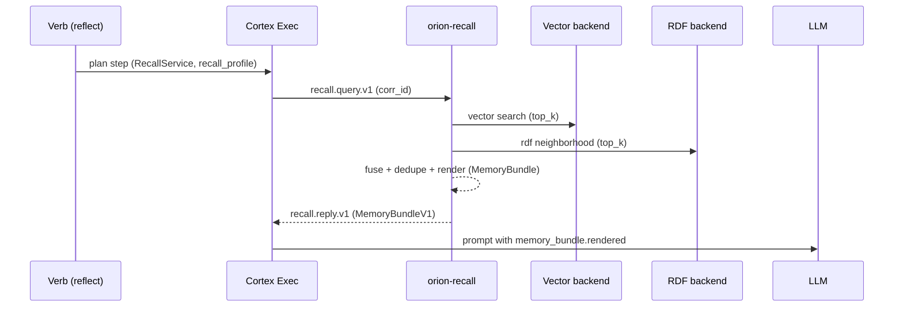
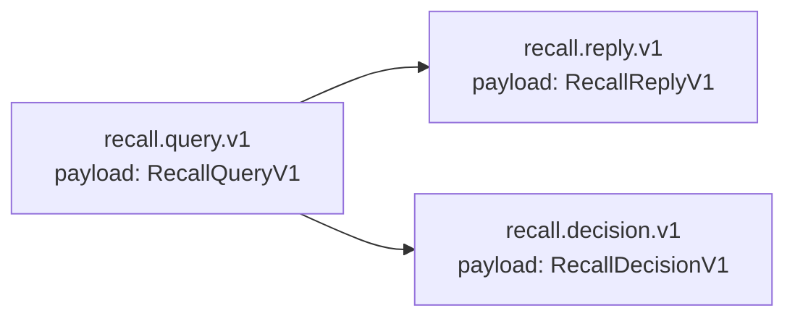

# Recall Service (orion-recall)

This service is the single canonical hub for retrieving memory across vector and RDF backends. Verbs issue exactly one bus RPC:

```
recall.query.v1  ->  recall.reply.v1
```

Telemetry is emitted on every request as `recall.decision.v1` and persisted when Postgres is configured.

## Flow



## Bus Contracts



### Envelope

All messages use the Titanium envelope fields:

- `corr_id` / `correlation_id`
- `event` / `kind`
- `service` / `source`
- `reply_to`
- `ts`
- `ttl_ms`
- `trace`

### Payloads

- `RecallQueryV1`: fragment, verb, intent, session_id, node_id, profile, reply_to
- `RecallReplyV1`: bundle (MemoryBundleV1)
- `MemoryBundleV1`:
  - `rendered`: prompt-ready bullet list
  - `items[]`: id, source, source_ref, uri, score, ts, title, snippet, tags
  - `stats`: backend_counts, latency_ms, profile
- `RecallDecisionV1`: corr_id, session_id, node_id, verb, profile, query, selected_ids, backend_counts, latency_ms, dropped
- SQL timeline: optional source reading from Postgres (e.g., `collapse_mirror`), controlled via profile (`enable_sql_timeline`, `sql_top_k`, `sql_since_minutes`). Items are emitted with `source="sql_timeline"` and `source_ref` identifying the table.

## Profiles

Profiles live in `orion/recall/profiles/*.yaml`:

- `reflect.v1`: balanced vector+RDF
- `assist.light.v1`: cheap, vector-focused
- `deep.graph.v1`: RDF-heavy neighborhood

Fields:

- `vector_top_k`, `rdf_top_k`
- `max_per_source`, `max_total_items`
- `time_decay_half_life_hours` (reserved)
- `render_budget_tokens`
- `enable_query_expansion`

## Prompt Usage

Prompts should consume the rendered bundle:

```jinja2
{{ memory_bundle.rendered | default("No additional memory context provided.") }}
```

The executor places the full `memory_bundle` in the step context; raw vector/RDF calls in verbs are no longer allowed.
