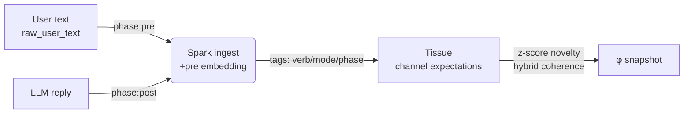

# Spark Metrics v2

## What changed
- **raw_user_text is first-class**: Cortex→Gateway now forwards canonical user input to Spark, avoiding scaffold prompts from exec steps.
- **Dual-phase embeddings**: Spark ingests embeddings for both the pre-LLM user message and the post-LLM assistant reply whenever `include_embeddings` is enabled, but gracefully degrades if the embedding host is unavailable.
- **Mode-aware tagging**: Ingestion tags now include `verb:*`, `phase:*`, and lightweight `mode:*` heuristics (summarize/analyze/debug/build) so Tissue expectations stay channel-specific.
- **Novelty/coherence v2**:
  - Novelty uses a baseline-relative z-score:  
    \[
    d = \text{cosine\_distance}(stimulus, expectation)
    \]  
    \[
    \text{novelty} = \sigma\left(\frac{d - \mu_d}{\sigma_d}\right) \in [0,1]
    \]  
    where \(\mu_d,\sigma_d\) are rolling per-channel stats and \(\sigma(x)=1/(1+e^{-x})\).
  - Coherence is hybrid: if an embedding is present, coherence = \(1 - \text{cosine\_distance}(embedding, expected\_embedding)\); otherwise it falls back to the variance-based heuristic.
- **Adaptive learning**: Channel-specific expectations learn faster when coherence is high and stable, and slower when coherence is low or distress is elevated. Learning rate is clamped to `[0.02, 0.5]`.
- **Channelized expectations**: Tissue keeps separate expectations per channel (chat/plan/system/equilibrium), keyed from tags such as `verb:*` or `signal_type:*`.



## How to verify
1. **Unit tests**
   ```bash
   python -m unittest tests/test_spark_metrics_v2.py
   ```
2. **Scenario sanity check**
   ```bash
   python scripts/spark_metrics_v2_scenario.py
   ```
   - Ten routine turns should converge to a non-zero novelty baseline.
   - The summary turn spikes novelty.
   - Returning to routine moves novelty back toward the baseline band.
3. **State read-model**
   - Call `GET /state/latest` (state-service) or publish `state.get_latest.v1` on the bus and confirm φ contains coherent novelty values per node.
4. **SQL spot-check**
   - Query recent telemetry rows that embed the canonical snapshot:
     ```sql
     SELECT metadata->'spark_state_snapshot'
     FROM spark_telemetry
     ORDER BY timestamp DESC
     LIMIT 5;
     ```
   - Verify `trace_verb`, `trace_mode`, `phi.novelty`, and `spark_tags` reflect verb/phase/mode tagging.

## Practical notes
- Embedding fetches are best-effort; failures simply skip the vector while continuing ingestion.
- `raw_user_text` is preferred everywhere Spark encodes user intent, but the gateway still falls back to message lists for backward compatibility.
- Novelty statistics are maintained per channel, so cross-verb habituation no longer collapses chat novelty when planner scaffolds are active.
