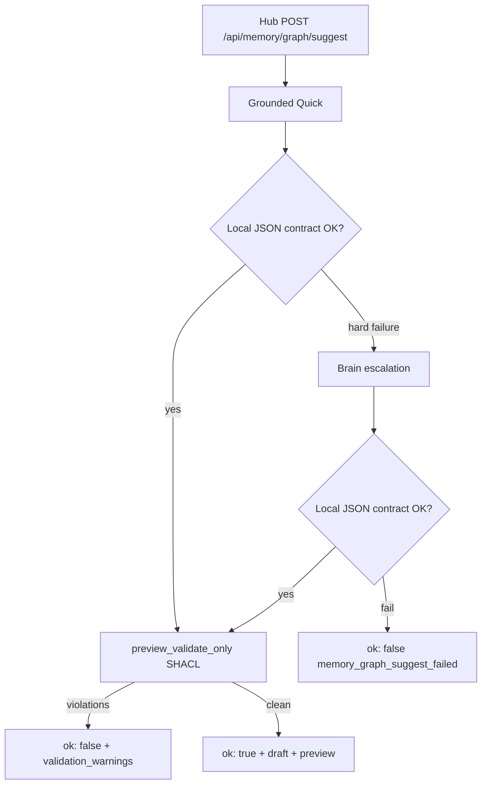

# Memory Graph Suggest: Grounded Quick + Brain Escalation

**Branch:** `feature/memory-graph-suggest-escalation`  
**Worktree:** `.worktrees/memory-graph-suggest-escalation`

## Summary

Memory-graph **Suggest** now calls **grounded Quick** first and escalates to **Brain** only on hard extraction failures (empty output, timeout, invalid JSON, contract violations). Operator-reviewable issues—low confidence, ambiguity, SHACL/RDF warnings—are returned to Hub without escalation.

The full **orionmem-2026-05** JSON contract is embedded directly in the prompt and validated locally (no Appendix C references).

## Architecture



## Routing policy

| Condition | Action |
|-----------|--------|
| Empty response, timeout, invalid JSON | Escalate to Brain |
| Missing top-level keys, wrong `ontology_version` | Escalate |
| Unknown `entityKind` / predicate, invalid confidence | Escalate |
| Empty `utterance_ids`, missing entities/situations when utterance implies them | Escalate |
| Low confidence, ambiguity, RDF/SHACL violations | **No** escalation — return warnings |

## Settings (defaults)

| Variable | Default |
|----------|---------|
| `MEMORY_GRAPH_SUGGEST_PRIMARY_ROUTE` | `quick` |
| `MEMORY_GRAPH_SUGGEST_ESCALATION_ROUTE` | `brain` |
| `MEMORY_GRAPH_SUGGEST_ENABLE_ESCALATION` | `true` |
| `MEMORY_GRAPH_SUGGEST_INCLUDE_GROUNDING` | `true` |
| `MEMORY_GRAPH_SUGGEST_QUICK_TIMEOUT_SEC` | `8` |
| `MEMORY_GRAPH_SUGGEST_BRAIN_TIMEOUT_SEC` | `20` |

Updated in `services/orion-hub/.env_example`, `docker-compose.yml`, and local `services/orion-hub/.env` (gitignored).

## API response shape

Success and failure responses include:

- `route_used` — `quick` or `brain`
- `attempts[]` — per-attempt diagnostics: `route`, `phase`, `model_used`, `finish_reason`, `completion_tokens`, `content_len`, `validation_errors`, `grounding_included`
- `grounding_included` — top-level flag
- `validation_warnings` — non-escalating issues (e.g. SHACL on otherwise valid JSON)

Total failure: `{ "ok": false, "error": "memory_graph_suggest_failed", "attempts": [...] }`

Legacy aliases `suggest_route_used` / `suggest_attempts` remain on `run_memory_graph_suggest_with_fallback()`.

## Files changed

| Area | Files |
|------|-------|
| Contract + validation | `orion/memory_graph/suggest_validate.py`, `orion/memory_graph/dto.py` |
| RDF builder | `orion/memory_graph/json_to_rdf.py` (`surfaceForms`, `target_entity_ids`) |
| Hub routing | `services/orion-hub/scripts/memory_graph_suggest.py`, `memory_graph_routes.py` |
| Config | `services/orion-hub/app/settings.py`, `.env_example`, `docker-compose.yml` |
| Prompt | `orion/cognition/prompts/memory_graph_suggest_prompt.j2` |
| Tests | `services/orion-hub/tests/test_memory_graph_suggest_escalation.py`, `tests/test_memory_graph_suggest_validate.py` |
| Fixture | `tests/fixtures/memory_graph/joey_cats_draft.json` |

**Unchanged (LLM-free):** `json_to_rdf` logic path, `validate.py`, `project.py`, `graphdb.py`, `approve.py` / `POST /api/memory/graph/approve`.

## Test plan

- [x] `PYTHONPATH=. venv/bin/python -m pytest tests/test_memory_graph_suggest_validate.py services/orion-hub/tests/test_memory_graph_suggest_escalation.py -q` — **15 passed**
- [ ] Hub UI: Memory graph bridge → **Suggest** on a turn with named entities; confirm `route_used: quick` in network response when Quick succeeds
- [ ] Force Quick failure (bad model output or short timeout) → confirm Brain attempt in `attempts[]`
- [ ] Submit draft with SHACL issues via **Validate** — confirm no second cortex call
- [ ] **Approve** path persists without cortex (local RDF + GraphDB + Postgres only)

## Verification

```bash
cd .worktrees/memory-graph-suggest-escalation
PYTHONPATH=. /mnt/scripts/Orion-Sapienform/venv/bin/python -m pytest \
  tests/test_memory_graph_suggest_validate.py \
  services/orion-hub/tests/test_memory_graph_suggest_escalation.py -q --tb=short
# 15 passed
```

## Remaining risks

- Event/subject heuristics in `suggest_validate.py` may escalate Brain on borderline utterances (common words like “was”, “when”).
- Diagnostics (`finish_reason`, `completion_tokens`) depend on cortex metadata population; attempt-level fields may be null if the gateway omits them.
