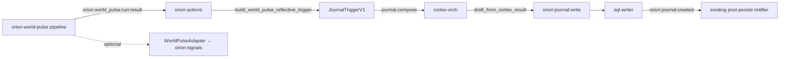

# PR: World Pulse Reflective Synthesizer v1

**Branch:** `feat/world-pulse-reflective-synthesizer-v1`  
**Worktree:** `.worktrees/feat-world-pulse-reflective-synthesizer-v1`  
**Commits:** `0ffa4eee` → `ee4cc3ff` (+ review fix)

## Summary

Adds a reflective synthesis pass that metabolizes **Daily World Pulse** run results into the existing Orion Journal pipeline—no parallel organ, no new notifier, no LLM inside the deterministic world-pulse pipeline.



## Preflight findings

| Area | Finding |
|------|---------|
| **Journaler** | `build_compose_request`, `draft_from_cortex_result`, `build_write_payload` live in `orion/journaler/worker.py`; actions `_run_journal` / `_dispatch_journal` already wire compose → write. |
| **Triggers today** | `daily_summary`, `collapse_response`, `metacog_digest`, `manual`, `notify_summary` — no world-pulse trigger yet. |
| **Actions scheduler** | `_trigger_world_pulse_run` POSTs with `dry_run=True`; cursor key `world_pulse` in scheduler store. |
| **World Pulse bus** | `world.pulse.run.result.v1` on `orion:world_pulse:run:result`; sql-writer already persists `WorldPulseRunResultV1`. |
| **Signals** | `WorldPulseAdapter` was a stub; `ORGAN_REGISTRY["world_pulse"]` has empty causal parents (by design). |

## What changed

### Journaler (`orion/journaler`)

- New `JournalTriggerKind`: `world_pulse_digest` → `JournalMode`: `digest`
- New `JournalSourceKind`: `world_pulse`
- `build_world_pulse_prompt_seed()` — deterministic digest/capsule compaction for `prompt_seed`
- `build_world_pulse_reflective_trigger()` — builds `JournalTriggerV1` from `WorldPulseRunResultV1`
- Cooldown key uses `source_ref` (run_id) for per-run idempotency

### Actions (`services/orion-actions`)

- Subscribes to `orion:world_pulse:run:result` (default + `.env_example` + auto-append when flag on)
- Handles `world.pulse.run.result.v1` → `_handle_world_pulse_run_result_journal`
- Gated by **`ACTIONS_WORLD_PULSE_JOURNAL_ENABLED`** (default **false**)
- Skips: disabled, invalid payload, `dry_run`, non-terminal run status, missing digest
- Reuses `_dispatch_journal` → existing `journal.compose` / `orion:journal:write` / post-persist notifier
- Recall profile: `ACTIONS_JOURNAL_WORLD_PULSE_RECALL_PROFILE` → `journal.world_pulse.grounded.v1`

### Cognition / recall

- `orion/recall/profiles/journal.world_pulse.grounded.v1.yaml`
- `journal_compose_prompt.j2` — world-pulse-specific reflective rules

### Signals (`orion/signals/adapters/world_pulse.py`)

- Replaced stub with coverage-aware `level` / `confidence` dimensions and channel-specific `signal_kind`

### Config / ops

| File | Updates |
|------|---------|
| `services/orion-actions/.env_example` | subscribe channel, journal flag, recall profile |
| `services/orion-actions/.env` | same (local committed env) |
| `services/orion-actions/docker-compose.yml` | world-pulse journal + scheduler env passthrough |
| `services/orion-actions/app/settings.py` | defaults + bool coercion field |

## Enable locally

```bash
# Production reflective journaling (scheduler + bus path):
ACTIONS_WORLD_PULSE_RUN_DRY_RUN=false
ACTIONS_WORLD_PULSE_JOURNAL_ENABLED=true
ACTIONS_JOURNALING_ENABLED=true
# ACTIONS_SUBSCRIBE_CHANNELS includes orion:world_pulse:run:result in .env_example and settings default
```

`ACTIONS_WORLD_PULSE_RUN_DRY_RUN` (default **true**) controls the scheduler POST body to `/api/world-pulse/run`. Journaling skips `dry_run` run results unless `ACTIONS_WORLD_PULSE_JOURNAL_ALLOW_DRY_RUN=true`.

**Note:** `services/orion-actions/.env` is **gitignored** (`*.env`); only `.env_example` and docker-compose passthrough are tracked. Copy example keys into your local `.env` manually.

### Smoke (no live services)

```bash
python scripts/world_pulse_reflective_journal_smoke.py
```

## Tests

```bash
cd .worktrees/feat-world-pulse-reflective-synthesizer-v1
PYTHONPATH=. /path/to/venv/bin/pytest \
  tests/test_world_pulse_reflective_journal.py \
  orion/signals/adapters/tests/test_world_pulse_adapter.py \
  services/orion-actions/tests/test_world_pulse_reflective_journal_handler.py -q
```

**Result:** 20+ passed (actions integration, adapter channels, smoke script)

### Hardening (pre-merge)

- `app.state.bus_handler` exposes `handle_envelope` for integration tests
- `handle_world_pulse_run_result_journal` extracted to `app/world_pulse_journal.py` (injectable `dispatch_journal`)
- `ACTIONS_WORLD_PULSE_RUN_DRY_RUN` + `ACTIONS_WORLD_PULSE_JOURNAL_ALLOW_DRY_RUN`
- `test_handle_envelope_world_pulse_journal.py` — lifespan + `bus_handler` → `_dispatch_journal` with correct trigger
- `scripts/world_pulse_reflective_journal_smoke.py` — fixture path without Redis/Cortex
- Expanded `WorldPulseAdapter` channel matrix + malformed payload degradation

## Code review

- **Spec compliance:** Approved — reuses journaler compose/write/created notifier; no parallel notification path; no LLM in world-pulse pipeline.
- **Fixes applied:** default subscribe channel, auto-append when flag enabled, run_id dedupe, handler return/audit consistency.

## Test plan

- [ ] Run world-pulse with `WORLD_PULSE_DRY_RUN=false` + `WORLD_PULSE_SQL_ENABLED=true`; confirm `orion:world_pulse:run:result` on bus
- [ ] Set `ACTIONS_WORLD_PULSE_JOURNAL_ENABLED=true`; confirm `journal.world_pulse_digest` audit + `orion:journal:write` envelope
- [ ] Confirm sql-writer emits `journal.entry.created.v1` and post-persist notify fires (if enabled)
- [ ] Hub signals graph shows non-stub `world_pulse` organ signal after gateway ingest
- [ ] Re-run with same `run_id` → journal cooldown skip

## Out of scope (follow-ups)

- Scheduler POST `dry_run` alignment for production journaling cadence
- `handle_envelope` integration test (routing by kind)
- Hub UI surfacing of world-pulse journal entries
