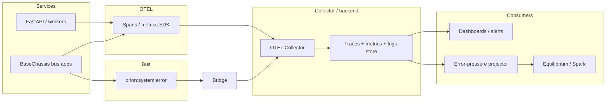

# Orion errors: OpenTelemetry + `system.error` bridge — design

**Date:** 2026-05-02  
**Status:** Draft — operator review before implementation planning  
**Context:** [docs/contracts.md](../../contracts.md) (observability), [orion/core/bus/bus_schemas.py](../../../orion/core/bus/bus_schemas.py) (`ErrorInfo`), [docs/equilibrium_service.md](../../equilibrium_service.md)

---

## 1. Purpose

Give Orion **meaningful cross-service error visibility** for:

1. **Ops (A):** dashboards, alerts, and trace-linked drill-down when spans exist.  
2. **Modulation (B):** a **derived scalar signal** suitable for equilibrium / Spark (error pressure), without requiring those consumers to parse raw traces.

This spec adopts **OpenTelemetry as the primary instrumentation and export path**, while **retaining** the existing bus convention (`kind="system.error"`, `ErrorInfo` payloads on `orion:system:error`) and **bridging** those envelopes into the same observability pipeline so async/bus failures are not invisible.

---

## 2. Goals and non-goals

### Goals

- **OTLP** from services that participate (traces; metrics where practical). Consistent **resource attributes** (`service.name`, `deployment.environment`, node/instance where available).
- **Errors on spans** where work runs inside a span: `record_exception`, stable attributes (see §5).
- **`system.error` retained**: chassis and manual publishers keep emitting; a **bridge component** forwards normalized signals into OTLP (logs as OTLP logs **or** synthetic spans/events—implementation choice in plan phase).
- **Aggregated error metrics** (rate / count by service and coarse error category) consumable by **Grafana or equivalent (A)** and by a **small projector** that emits a **bus signal for equilibrium (B)**.
- **Correlation:** preserve `correlation_id` from `BaseEnvelope` into OTEL context where possible so ops can jump from metric → exemplar.

### Non-goals (v1)

- **Replacing** heartbeat-based equilibrium zen/distress with error-only semantics—heartbeat stays **§3.2** in [equilibrium_service.md](../../equilibrium_service.md). Any error factor is an **additional** input with an explicit name and range.
- **Defining a full exception enum** for every service. Prefer **optional** `details` keys (§5) and `type(err).__name__` for rollups.
- **Choosing a specific vendor** (Grafana Cloud, Datadog, self-hosted stack). The spec is **backend-agnostic**; the collector and retention policy are deployment decisions.
- **100% span coverage** on day one. Rollout is **staged**; blind spots are acceptable only where explicitly documented as out of scope for the phase.

---

## 3. Architecture

**Interpretation:**

- **Dual source of truth for failure events:** native OTEL from instrumented code paths **and** bus errors via **bridge**. After bridging, **aggregates** should reconcile (same backend queries).
- **Equilibrium** does **not** subscribe to `system.error` directly in v1 unless a later spec simplifies topology; it consumes **projected** rollups (§6).

---

## 4. Components (conceptual)

| Component | Responsibility |
|-----------|----------------|
| **Per-service instrumentation** | Init OTLP exporter from env (existing pattern in `orion-signal-gateway`-style `instrumentation.py`); create spans around hot paths; record exceptions on span. |
| **Bridge service or sidecar** | Subscribe to `orion:system:error`; validate `ErrorInfo`; emit OTLP logs or minimal spans with attributes matching §5; **must not** drop correlation/source metadata. |
| **Collector** | Receives OTLP; processors for batching, resource enrichment; exporters to trace/metrics/log backends. |
| **Metrics derivation** | Prefer **OTEL semantic conventions** for exceptions where applicable; optional collector transforms to **error rate by service**. |
| **Error-pressure projector** | Periodic job or lightweight service: reads **aggregated metrics** or query API; emits a **versioned bus envelope** (§6) for Spark/equilibrium tuning. |

---

## 5. Conventions (normative for new code)

### 5.1 Span attributes (when a span exists)

| Attribute | Notes |
|-----------|--------|
| `service.name` | From resource; matches Orion logical service name. |
| `exception.type` | Exception class name or stable category. |
| `exception.message` | Sanitized if needed (length cap deployment-defined). |
| `orion.correlation_id` | When known from envelope or request context. |
| `orion.error.phase` | Optional: `request`, `handler`, `publish`, `rpc`, `shutdown`. |

### 5.2 `ErrorInfo.details` (optional but recommended)

Producers **may** set:

| Key | Type | Meaning |
|-----|------|--------|
| `error_family` | string | Coarse bucket: `rpc`, `validation`, `timeout`, `internal`, `upstream`, `bus`. |
| `severity` | string | `warn` / `error` / `fatal` (default treat as `error`). |
| `orion.rail` | string | Optional workflow or rail name for rollup. |

Existing **`when`** from chassis remains allowed.

### 5.3 Bridge mapping

For each `system.error` envelope:

- Map `payload.type` → `exception.type` (or equivalent log attribute).
- Map `payload.message`, optional stack into OTEL log body / span event.
- Map `source` from envelope → resource or attributes (`orion.source.service`, etc.).
- Map `correlation_id` → `orion.correlation_id`.

---

## 6. Modulation output (B)

**Requirement:** Equilibrium’s existing **distress_score / zen_score** from heartbeats remain unchanged in meaning.

**New signal (v1):** A separate artifact—either:

- **Option A:** Extend `equilibrium.snapshot.v1` with optional fields `error_pressure` (float, `0..1`) and `error_pressure_window_sec` — **only after** schema versioning discussion; **or**
- **Option B (preferred for decoupling):** New envelope kind, e.g. `telemetry.error_pressure.v1`, published on a dedicated channel consumed only by Spark/equilibrium adapters.

The **exact formula** (rate normalization, burst detection, EWMA) is left to the implementation plan; this spec only requires **deterministic**, **documented** inputs (aggregated error counts per window).

---

## 7. Testing and rollout

| Phase | Scope |
|-------|--------|
| **P0** | Collector receives OTLP from one pilot service + bridge subscribed to `orion:system:error` in a staging bus; spot-check dashboard panels. |
| **P1** | Instrument highest-traffic orchestration paths (`orion-cortex-exec`, `orion-hub` API boundaries as applicable). |
| **P2** | Error-pressure projector + one modulation consumer behind a feature flag. |

**Verification:** Bridge unit tests with sample envelopes; integration smoke: publish synthetic `system.error` → assert OTLP export contains expected attributes (harness or collector debug exporter).

---

## 8. Risks

| Risk | Mitigation |
|------|------------|
| Duplicate counting (span + bus same failure) | Prefer recording once at boundary; bridge dedupe key `(correlation_id, source, type, truncated message)` optional later. |
| Volume / cost | Sampling policy on traces; aggregate metrics for alerts; retain full stacks only in sampled traces or bounded retention. |
| Equilibrium overload | Keep modulation signal low-rate (e.g. same cadence as snapshots or slower). |

---

## 9. Spec self-review checklist

- **Placeholders:** Backend vendor TBD by ops—that is a deployment choice, not a spec hole.  
- **Consistency:** Bus bridge complements OTEL; equilibrium heartbeat semantics unchanged.  
- **Scope:** Single implementation plan should fit; projector may ship after bridge.

---

## 10. Approval gate

After operator review of this file, proceed with **implementation planning** (writing-plans workflow): rollout order, bridge placement repo location, and chosen modulation option (§6 A vs B).
