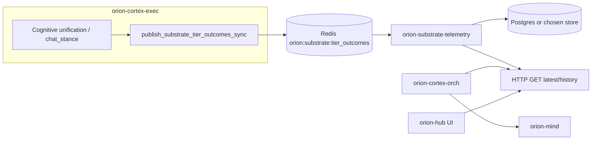

# Substrate tier telemetry — bus + persisted read path

**Date:** 2026-05-14  
**Status:** Approved for implementation (design)  
**Relates to:** [2026-05-09 cognitive unification](2026-05-09-cognitive-unification-design.md) (Mind Bus telemetry / Gap 4)

---

## Problem

`orion-cortex-exec` already publishes `substrate.tier_outcomes.v1` on `orion:substrate:tier_outcomes` when unified beliefs run a **cold-path** materialization (`cold_anchors` non-empty). That satisfies the live “nervous system” contract.

Downstream needs differ:

- **orion-mind** is stateless HTTP today and should not depend on Redis for correctness.
- **Operators and UI** want **durable or at least queryable** recent tier outcome rows keyed to a conversation / trace, not only ephemeral pub/sub delivery.
- **orion-hub** should remain a **thin UI layer**: no bus subscriptions and no ownership of substrate persistence policy in Hub code.

The bus catalog currently lists `orion-mind` and `orion-hub` as consumers of this channel; neither implements a subscriber. Persistence closes that gap without bloating orch or Hub.

---

## Goal

1. Keep **existing publish path** unchanged (`publish_substrate_tier_outcomes_sync` in `orion/substrate/tier_outcomes_bus.py`, envelope kind `substrate.tier_outcomes.v1`, payload `SubstrateTierOutcomesPayloadV1`).
2. Introduce a **dedicated small service** (working name: **`orion-substrate-telemetry`**) that:
   - subscribes to `orion:substrate:tier_outcomes`,
   - **persists** each accepted event,
   - exposes a **minimal HTTP read API** keyed by `correlation_id` (from the envelope).
3. Define how **cortex-orch** and/or **orion-mind** obtain persisted tier telemetry for a run (pull by correlation, with optional inline snapshot override for tests).
4. Define how **Hub** displays the same data: **HTTP only**, no Hub-side bus client.

---

## Non-goals

- Changing when cortex-exec emits (still **cold path only**; warm path remains silent on the bus).
- Storing full `UnifiedRelationalBeliefSetV1` or graph nodes — only the existing telemetry payload fields plus envelope metadata needed for lookup.
- Replacing `SubstrateTierOutcomesPayloadV1` or adding a second bus channel for the same semantic event.
- Subscribing **inside** `orion-mind` (remains bus-free; may call HTTP or receive inlined snapshot from orch).

---

## Architecture

**Pattern:** Mirror `services/orion-state-journaler`: `BaseChassis` (or equivalent) async bus consumer, async persistence, single responsibility. Do **not** fold the subscriber into `orion-cortex-orch` (avoids duplicate writes across orch replicas and keeps orch request-path only).

---

## New service: `orion-substrate-telemetry`

### Responsibilities

| Area | Behavior |
|------|----------|
| Subscribe | Channel `orion:substrate:tier_outcomes`; decode with `OrionCodec`; validate `kind == substrate.tier_outcomes.v1`. |
| Persist | Insert or upsert one row per event with envelope `correlation_id`, payload fields, and `received_at_utc`. |
| Read API | Authenticated or internal-network-only HTTP (deployment choice); see below. |
| Failure | Log and skip malformed messages; never crash the subscription loop on one bad frame. |

### Suggested persistence shape

Store **envelope metadata + payload JSON** (or normalized columns). Minimum columns:

- `id` (UUID, primary key)
- `correlation_id` (UUID, indexed; matches `BaseEnvelope.correlation_id`)
- `generated_at` (text or timestamptz; from payload, used for ordering)
- `cold_anchors` (JSONB or text[])
- `tier_outcomes` (JSONB; map anchor → list of `outcome:count` strings)
- `degraded_producers` (JSONB or text[])
- `source_service`, `source_node` (from envelope `source`, optional)
- `received_at_utc` (timestamptz, server receipt time)

**Ordering:** For a given `correlation_id`, “latest” is the row with greatest `generated_at` (ISO-8601 comparable) or greatest `received_at_utc` if `generated_at` ties.

**Idempotency:** Multiple deliveries of the same logical event are acceptable; either insert every row (append-only audit) or upsert on `(correlation_id, generated_at)` if duplicate suppression is required. Implementation plan should pick one and document it.

**Retention:** Time-based or row-count cap per `correlation_id` (e.g. keep last 50 events or 7 days); periodic delete job or TTL table policy.

---

## HTTP API (read)

All responses JSON. Names are illustrative; implementation may align with existing internal API style.

| Method | Path | Description |
|--------|------|-------------|
| `GET` | `/v1/substrate/tier-outcomes/latest` | Query: `correlation_id` (required). Returns latest persisted payload + envelope fields needed for UI, or 404. |
| `GET` | `/v1/substrate/tier-outcomes/history` | Query: `correlation_id`, `limit` (default 20, max 100). Newest first. Optional; useful for debugging. |

**Security:** Not a public internet API without auth. Prefer Tailscale / internal DNS / gateway mTLS or shared secret header, consistent with other internal Orion services.

---

## cortex-orch and orion-mind

**Preferred default:** Before `call_orion_mind_http`, orch **GETs** `/v1/substrate/tier-outcomes/latest?correlation_id=...` and merges a small structured blob into `MindRunRequestV1.snapshot_inputs` (e.g. under `facets.substrate_telemetry` or an agreed key) so Mind remains deterministic and testable without embedding an HTTP client in Mind.

**Alternative:** Mind performs the GET internally using the same `correlation_id` from `MindRunRequestV1`. Acceptable if you want Mind to be self-contained at the cost of an extra dependency and test doubles.

**Merge rule:** If `snapshot_inputs` already contains an **inline** tier telemetry blob (tests or callers), **prefer inline** over the persisted fetch.

**Semantics when missing:** No row yet (warm-only path so far, or journaler down) → omit facet or pass explicit `{"status": "absent"}`; Mind policies treat as **neutral**, not “no conflicts.”

---

## orion-hub

Hub **only** calls the telemetry service HTTP (or a gateway route that forwards) to render the Mind / substrate tab. No Redis subscription in Hub. No substrate retention logic in Hub.

---

## Bus catalog

Update `orion/bus/channels.yaml` for `orion:substrate:tier_outcomes`:

- Add **`orion-substrate-telemetry`** to `consumer_services`.
- Remove **`orion-hub`** from bus `consumer_services` for this channel if Hub will **never** subscribe (UI uses HTTP only). Keep **`orion-mind`** only if Mind eventually subscribes; if Mind stays HTTP-only via orch, remove it from `consumer_services` and document **orch + telemetry service** as the actual consumers.

Goal: the catalog reflects **real** subscribers, not aspirational ones.

---

## Testing

- **Unit:** Decode sample `OrionCodec` bytes into `BaseEnvelope` + `SubstrateTierOutcomesPayloadV1`; map to DB row.
- **Integration (optional):** Redis publish fixture → subscriber persists → GET latest returns expected JSON.
- **Contract:** OpenAPI or static JSON examples for GET responses shared with Hub and orch clients.

---

## Verification

- Cold-path chat turn produces a bus message; within seconds, `GET .../latest` returns that payload for the same `correlation_id` as the envelope.
- Hub can render the payload using only HTTP.
- Warm-only turn: no bus message; GET returns 404 or empty policy as documented; Mind does not error.

---

## Summary

| Component | Role |
|-----------|------|
| `orion-cortex-exec` | Publish only (unchanged). |
| Redis `orion:substrate:tier_outcomes` | Real-time fan-out (“nervous system”). |
| **`orion-substrate-telemetry`** | Subscribe, persist, serve read API. |
| `orion-cortex-orch` | Fetch persisted telemetry; inject into Mind snapshot (recommended). |
| `orion-mind` | Merge facet; optional direct HTTP later. |
| `orion-hub` | UI → HTTP to telemetry service only. |

This completes the **persisted read path** for cognitive unification Gap 4 without violating the “dumb Hub” constraint or overloading cortex-orch.
