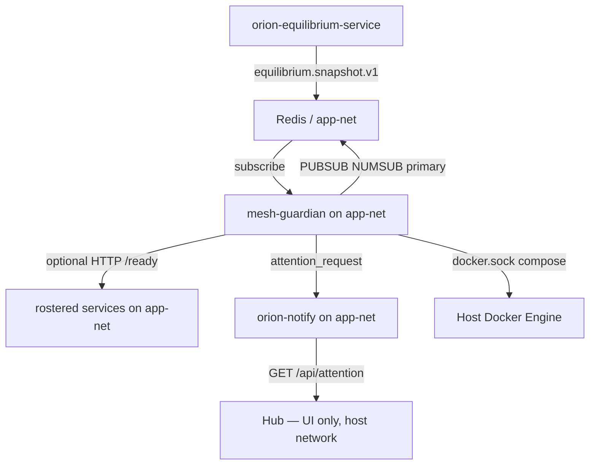

# Design: Mesh Bus Resilience + Auto-Remediation

**Date:** 2026-06-18  
**Status:** Draft — pending user review  
**Scope:** New service `services/orion-mesh-guardian/`, shared bus resilience in `orion/core/bus/`, `/ready` endpoints on chat-critical path services, Hub Pending Attention surfacing via existing `orion-notify` path

---

## Problem

Orion mesh services conflate **process health** with **bus health**:

- Most `/health` endpoints return HTTP 200 when the process is up — no Redis ping, no subscriber count, no RPC smoke.
- `BaseChassis._heartbeat_loop` logs publish failures and continues without reconnect.
- Resilience fixes (June 16–17) landed per-service (landing pad, cortex-gateway, etc.) — not as a mesh contract.
- Failures go unnoticed until a user-facing RPC times out (20–90s later). Docker shows `Up`; equilibrium may lag; logs fill with warnings nobody pages on.

The landing-pad stale-connection incident is the canonical **half-death** pattern: process alive, container `Up`, bus path broken.

---

## Goals

1. **Detect** half-dead bus consumers before user-facing paths stall.
2. **Remediate** automatically with tiered docker compose actions (recreate → build).
3. **Surface** incidents in Hub **Pending Attention** (via `orion-notify`).
4. **Prevent** recurrence by promoting bus resilience to core platform code.

## Non-goals (v1)

- Full mesh (70+ services) auto-remediation
- Docker HEALTHCHECK on every compose file
- Replacing or rewriting equilibrium-service
- Manual "Rebuild" button in Hub UI
- Cross-node remediation (single-host assumption: guardian runs on the same host as remediated containers)
- Hub-native watcher (Hub uses `network_mode: host`; guardian is a separate service on `app-net`)

---

## Decisions (locked in brainstorming)

| Decision | Choice |
|----------|--------|
| Watcher placement | New **`orion-mesh-guardian`** service |
| Remediation | Fully automated |
| Scope | Configurable roster; v1 seeded to chat critical path |
| Health signal | Layered: equilibrium snapshots + active readiness probes |
| Remediation action | Tiered: force-recreate first; build+up if still unhealthy after grace |
| Hub surfacing | Pending Attention cards via `notify.attention_request` |
| Guardian networking | **`app-net`** (not host network) |

---

## Architecture



### Component map

| Component | Location | Purpose |
|-----------|----------|---------|
| **Roster config** | `config/mesh_remediation_roster.yaml` | Maps heartbeat name → compose → probe channels/URLs |
| **Mesh Guardian** | `services/orion-mesh-guardian/` | Watch, decide, act, notify |
| **Bus resilience** | `orion/core/bus/resilience.py` | `publish_with_reconnect` (lifted from landing pad) |
| **Chassis heartbeat fix** | `orion/core/bus/bus_service_chassis.py` | Reconnect + retry on heartbeat publish failure |
| **`/ready` endpoints** | Chat-path services missing them | Expose `check_bus_consumer_readiness` as `BusConsumerReadinessV1` |

### Why not Hub-native?

Hub runs `network_mode: host` and reaches peers via `127.0.0.1:<published_port>`. Most mesh services live on **`app-net`** and use Docker DNS (`${PROJECT}-recall`, etc.). Mixing these strategies in a watcher tied to Hub creates fragile probe URLs.

Mesh-guardian joins **`app-net`** like other mesh services:

| Need | Strategy |
|------|----------|
| Bus / Redis probes | `ORION_BUS_URL` on app-net (e.g. `redis://bus-core:6379/0`) |
| HTTP `/ready` (optional) | Roster URLs on app-net: `http://${PROJECT}-recall:8260/ready` |
| Notify / Pending Attention | `http://${PROJECT}-notify:7140` on app-net |
| Docker remediation | `/var/run/docker.sock` + `/repo:ro` — network mode irrelevant |

**Primary probe = Redis `PUBSUB NUMSUB`** on declared intake channel(s). HTTP `/ready` is secondary confirmation where endpoints exist.

---

## Roster configuration

File: `config/mesh_remediation_roster.yaml` (path override: `MESH_GUARDIAN_ROSTER_PATH`).

Each entry defines:

```yaml
services:
  - id: landing-pad
    heartbeat_name: landing-pad                # must match APP_NAME as emitted on orion:system:health
    compose_dir: orion-landing-pad
    compose_service: orion-landing-pad           # docker compose service key
    include_bus_env: false
    auto_remediate: true
    probe:
      mode: redis_and_http                     # redis | http | redis_and_http
      intake_channels:
        - orion:pad:rpc:request                # NUMSUB > 0 required
      ready_url: "http://${PROJECT}-landing-pad:8370/ready"
      service_name: landing-pad                # for heartbeat freshness check (optional)
    exclude_from_remediation: false
```

Template variables resolved at load time: `${PROJECT}`, `${NODE_NAME}` from guardian env.

### v1 seed roster (chat critical path)

| id | heartbeat_name | compose_dir | compose_service | intake / probe notes |
|----|----------------|-------------|-----------------|----------------------|
| landing-pad | `landing-pad` | `orion-landing-pad` | `orion-landing-pad` | RPC channel `orion:pad:rpc:request`; pattern-based ingest not NUMSUB-able — rely on RPC smoke in `/ready`. `heartbeat_name` must match `APP_NAME` in service `.env`. |
| cortex-gateway | `cortex-gateway` | `orion-cortex-gateway` | `cortex-gateway` | `orion:cortex:gateway:request` |
| cortex-orch | `cortex-orch` | `orion-cortex-orch` | `cortex-orchestrator` | `orion:cortex:request` |
| cortex-exec | `cortex-exec` | `orion-cortex-exec` | `cortex-exec` | lane exec intake channels per `.env`; v1 primary container only |
| recall | `recall` | `orion-recall` | `recall` | `orion:exec:request:RecallService` |
| llm-gateway | `llm-gateway` | `orion-llm-gateway` | `llm-gateway` | LLM intake channel; `/ready` exists today |
| notify | `notify` | `orion-notify` | `notify` | HTTP `/health` only — **observe, never auto-remediate** |
| equilibrium | `orion-equilibrium-service` | `orion-equilibrium-service` | `equilibrium-service` | **observe-only** in v1 |

### Remediation exclusions (hard-coded + roster)

Never auto-remediate:

- `mesh-guardian` (self)
- `hub` / `orion-hub`
- `notify` / `orion-notify`
- Any roster entry with `auto_remediate: false`

Rationale: remediating notify kills the attention path mid-incident; remediating hub disrupts the operator UI.

---

## Health decision logic

### Layer 1 — Equilibrium (fast, coarse)

Subscribe to `CHANNEL_EQUILIBRIUM_SNAPSHOT` (`orion:equilibrium:snapshot`). Parse `EquilibriumSnapshotV1`; for each roster entry match `EquilibriumServiceState.service` to `heartbeat_name`.

Treat as **`equilibrium_bad`** when:

- `status == "down"`, or
- `status == "degraded"` and `down_for_ms > grace`, or
- service absent from snapshot but listed in guardian's expected subset

### Layer 2 — Active probe (precise)

Every `MESH_GUARDIAN_PROBE_INTERVAL_SEC` (default **15**):

1. Redis `PING` on guardian bus client
2. `PUBSUB NUMSUB` on each declared `intake_channels` — fail if count == 0
3. If `probe.mode` includes `http`: `GET ready_url` — fail on non-200 or JSON `ok: false`
4. Optional: `check_heartbeat_fresh` when `service_name` set

Probe result: **`probe_ok`** or **`probe_bad`** with structured reason.

### Combined state machine

```
healthy
  └─(equilibrium_bad OR probe_bad)─► suspect

suspect
  └─(equilibrium_bad AND probe_bad) OR (2 consecutive probe_bad)─► unhealthy_confirmed

unhealthy_confirmed
  └─(cooldown clear AND auto_remediate)─► remediating_tier1

remediating_tier1  [force-recreate]
  └─► post_check_grace (MESH_GUARDIAN_POST_REMEDIATE_GRACE_SEC, default 60)

post_check_grace
  ├─(probe_ok AND NOT equilibrium_bad)─► healthy  + recovery attention
  └─(still bad)─► remediating_tier2

remediating_tier2  [build + up]
  └─► post_check_grace (same)

post_check_grace after tier2 still bad
  └─► attention_only  (no further auto-act until hourly window resets)
```

### Safety rails

| Setting | Default | Purpose |
|---------|---------|---------|
| `MESH_GUARDIAN_ENABLED` | `true` | Master enable |
| `MESH_GUARDIAN_AUTO_REMEDIATE` | `true` | Observe-only when false (attention still fires) |
| `MESH_GUARDIAN_REMEDIATION_COOLDOWN_SEC` | `300` | Min gap between attempts per service |
| `MESH_GUARDIAN_MAX_ATTEMPTS_PER_HOUR` | `3` | Escalate to attention-only |
| `MESH_GUARDIAN_PROBE_INTERVAL_SEC` | `15` | Active probe cadence |
| `MESH_GUARDIAN_POST_REMEDIATE_GRACE_SEC` | `60` | Wait before post-check |
| `MESH_GUARDIAN_CONSECUTIVE_PROBE_FAILS` | `2` | Probe-only confirmation threshold |

Guardian persists per-service state in Redis hash `mesh-guardian:state` (attempt counts, last remediate ts, current phase).

---

## Remediation commands

Reuse the env-file pattern from Hub's `build_compose_logs_command` (`services/orion-hub/scripts/service_logs.py`):

```bash
docker compose --env-file .env \
  [--env-file services/orion-bus/.env] \
  --env-file services/<compose_dir>/.env \
  -f services/<compose_dir>/docker-compose.yml \
  up -d --force-recreate <compose_service>
```

Working directory: `ORION_REPO_ROOT` (default `/repo` in container).

**Tier 1:** `--force-recreate` only (no image rebuild).  
**Tier 2:** `build <compose_service>` then `up -d <compose_service>`.

Guardian logs exact command, exit code, stderr tail. Failed compose → attention card, no silent retry until cooldown.

---

## Pending Attention (Hub surfacing)

Guardian calls `orion.notify.client.NotifyClient.attention_request()` (same path as `orion-actions` workflow attention).

| Transition | Notify payload |
|------------|----------------|
| → `unhealthy_confirmed` | `severity=error`, `event_kind=orion.mesh.health.attention.v1`, message with service id + probe/equilibrium reason |
| → `remediating_tier1` | Update context: `"action": "force-recreate"` |
| → `remediating_tier2` | Update context: `"action": "build+up"` |
| → `healthy` (recovered) | `severity=info`, reason `"recovered"`, tags `["mesh-guardian", "recovered"]` |
| → `attention_only` | `severity=error`, reason `"max remediation attempts exceeded"` |

Context fields (for Hub diagnostics):

```json
{
  "source_service": "orion-mesh-guardian",
  "reason": "landing-pad bus consumer unhealthy",
  "event_kind": "orion.mesh.health.attention.v1",
  "service_id": "landing-pad",
  "heartbeat_name": "landing-pad",
  "equilibrium_status": "down",
  "probe_error": "no subscribers on orion:pad:rpc:request",
  "remediation_tier": 1,
  "correlation_id": "<uuid>"
}
```

Hub requires **no UI changes** for v1 — existing Pending Attention panel renders cards from `GET /api/attention?status=pending`. Optional v2: custom badge/icon for `orion.mesh.health.attention.v1`.

---

## Platform resilience (prevention layer)

Ship in parallel with guardian — probes need `/ready`; prevention reduces incident rate.

### 1. Lift `publish_with_reconnect` to core

Move from `services/orion-landing-pad/app/bus_resilience.py` → `orion/core/bus/resilience.py`. Landing pad imports from core. Other publishers adopt incrementally.

### 2. BaseChassis heartbeat reconnect

In `_heartbeat_loop`, on publish failure:

```python
except Exception as e:
    logger.warning("Heartbeat publish failed: %s; reconnecting", e)
    await self.bus.reconnect()
    # retry once
```

### 3. `/ready` on chat-path services

Add `GET /ready` returning `BusConsumerReadinessV1` (503 when not ready) using `check_bus_consumer_readiness`:

| Service | Priority | Notes |
|---------|----------|-------|
| `orion-landing-pad` | P0 | RPC smoke + optional heartbeat |
| `orion-cortex-gateway` | P0 | gateway request channel NUMSUB |
| `orion-cortex-orch` | P0 | orch request channel NUMSUB |
| `orion-cortex-exec` | P0 | primary exec intake |
| `orion-recall` | P0 | already has pattern in codebase — verify exposed |
| `orion-llm-gateway` | Done | `/ready` exists |

Follow `orion-llm-gateway/app/main.py` and `BusConsumerReadinessV1` schema in `orion/schemas/telemetry/system_health.py`.

---

## `orion-mesh-guardian` service shape

```
services/orion-mesh-guardian/
  Dockerfile
  docker-compose.yml
  .env_example
  app/
    main.py              # FastAPI /health + lifespan starts guardian loop
    settings.py
    roster.py            # load + validate YAML roster
    probe.py             # Redis NUMSUB + HTTP ready
    state_machine.py     # per-service phase transitions
    equilibrium_watch.py # snapshot subscriber
    remediator.py        # compose command builder + executor
    attention.py         # notify client wrapper
    service.py           # orchestrates loops
  tests/
    test_state_machine.py
    test_compose_command.py
    test_probe_logic.py
    test_roster_load.py
```

### docker-compose.yml essentials

```yaml
services:
  mesh-guardian:
    build:
      context: ../..
      dockerfile: services/orion-mesh-guardian/Dockerfile
    container_name: ${PROJECT}-mesh-guardian
    restart: unless-stopped
    networks: [app-net]
    env_file: [.env]
    volumes:
      - /var/run/docker.sock:/var/run/docker.sock
      - ../..:/repo:ro
    environment:
      - ORION_REPO_ROOT=/repo
      - PROJECT=${PROJECT}
      - ORION_BUS_URL=${ORION_BUS_URL}
      - NOTIFY_BASE_URL=http://${PROJECT}-notify:7140
      - MESH_GUARDIAN_ROSTER_PATH=/repo/config/mesh_remediation_roster.yaml
```

No `network_mode: host`. Guardian `/health` is process-only; guardian's own bus readiness is best-effort on `/ready`.

---

## Files likely to touch (implementation)

| Area | Files |
|------|-------|
| New service | `services/orion-mesh-guardian/**` |
| Roster | `config/mesh_remediation_roster.yaml` |
| Core bus | `orion/core/bus/resilience.py`, `orion/core/bus/bus_service_chassis.py` |
| Landing pad | `services/orion-landing-pad/app/bus_resilience.py` → import from core |
| `/ready` endpoints | `services/orion-landing-pad/app/main.py`, cortex-gateway, cortex-orch, cortex-exec, recall |
| Root env | `.env_example` (optional roster path note) |
| Tests | guardian unit tests; extend landing pad bus resilience test import path |
| Smoke | `scripts/smoke_mesh_guardian.sh` (optional v1) |

Hub: **no code changes required** for Pending Attention v1.

---

## Acceptance checks

1. **Half-death detect:** Stop landing pad bus subscriber (or simulate stale Redis) → equilibrium marks down → probe fails → Pending Attention error card within ~30–45s.
2. **Tier-1 recover:** Guardian force-recreates landing pad → post-grace probe passes → info recovery attention.
3. **Tier-2 escalate:** Mock persistent failure after tier-1 → guardian runs build+up after grace.
4. **Cooldown:** Repeated failures do not recreate more than once per 5 min.
5. **Max attempts:** After 3 attempts/hour → attention-only, no docker commands.
6. **Kill switch:** `MESH_GUARDIAN_AUTO_REMEDIATE=false` → cards appear, no docker exec.
7. **Notify exclusion:** Notify unhealthy → card appears, notify container not recreated.
8. **Unit tests:** State machine transitions, compose command builder, roster parse — pass in CI.

---

## Risks and mitigations

| Risk | Mitigation |
|------|------------|
| Remediation loop during deploy | Cooldown + max attempts; exclude self/hub/notify |
| False positive NUMSUB (race at startup) | Require 2 consecutive probe failures OR equilibrium agreement |
| Docker.sock exposure | Read-only repo mount; guardian runs compose only for rostered keys; no arbitrary shell |
| cortex-exec multi-container | v1 remediates primary `cortex-exec` only; lane profiles documented in roster comments |
| Guardian itself dies | Docker `unless-stopped`; equilibrium marks guardian down; hub attention from other sources |
| Build tier slow (GPU images) | Tier 2 only after tier 1 + grace fails; logged with elapsed time |

---

## Implementation phasing (for writing-plans)

**Phase A — Foundation**

- Core `publish_with_reconnect` + chassis heartbeat reconnect
- `/ready` on P0 chat-path services
- Roster YAML + guardian skeleton

**Phase B — Observe**

- Equilibrium subscriber + probe loop + state machine
- Pending Attention notify (auto-remediate off)

**Phase C — Act**

- Remediator (tier 1 + tier 2)
- Enable `MESH_GUARDIAN_AUTO_REMEDIATE`
- Smoke script + live-stack proof

---

## References

- `orion/bus/consumer_readiness.py` — `check_bus_consumer_readiness`
- `orion/schemas/telemetry/system_health.py` — `BusConsumerReadinessV1`, `EquilibriumSnapshotV1`
- `services/orion-hub/scripts/service_logs.py` — compose discovery + env-file pattern
- `services/orion-actions/app/main.py` — `_send_pending_attention` pattern
- `services/orion-landing-pad/app/bus_resilience.py` — origin of `publish_with_reconnect`
- `docs/equilibrium_service.md` — equilibrium snapshot contract
