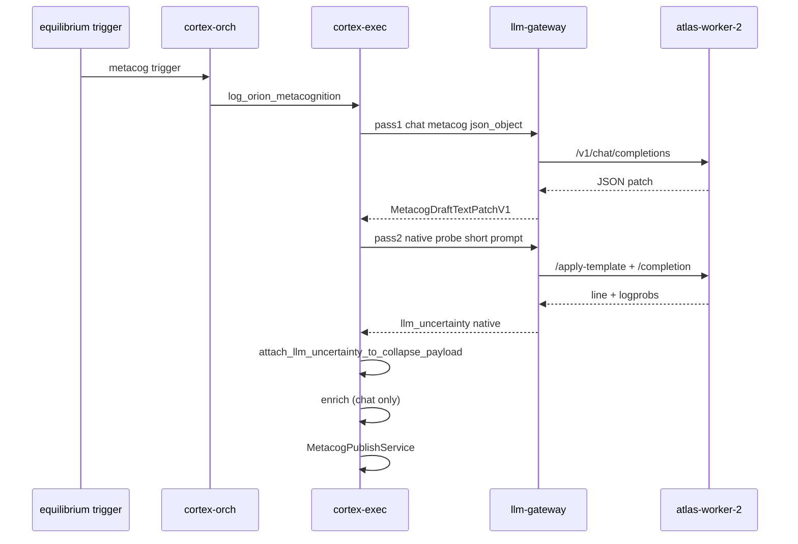

# Metacog collapse mirror — two-pass draft (JSON + native logprob probe)

**Date:** 2026-07-02  
**Status:** Draft — pending user review  
**Problem:** Enabling `CORTEX_METACOG_RETURN_LOGPROBS` + `CORTEX_METACOG_LOGPROB_PROBE_MODE=native_completion` routes metacog **draft** through llama.cpp `/apply-template` + `/completion`, which bypasses `response_format: json_object`. Draft returns preamble + truncated non-JSON; baseline firebreak skips publish. User wants **both** reliable collapse-mirror JSON **and** native-aligned `llm_uncertainty` telemetry.

**Chosen approach:** **B — two-pass draft** (content pass on chat completions, uncertainty pass on native completion probe).

---

## Goals

1. Metacog draft produces parseable `MetacogDraftTextPatchV1` JSON via chat completions (`route=metacog`, `response_format: json_object`).
2. Collapse-mirror entries carry `state_snapshot.telemetry.llm_uncertainty` with `source=llamacpp_native_completion` when the probe succeeds.
3. Native completion detour never runs on the content pass (even when logprobs are globally enabled).
4. Probe failure is **non-fatal** — entry still publishes if pass 1 succeeded (`draft_mode=llm`); uncertainty simply absent or marked `available=false`.
5. Enrich step stays single-pass chat completions (no second probe in v1).

## Non-goals

- Changing φ-gated `causal_density.score` (already separate).
- Native logprobs on enrich or on the full 11k-char metacog prompt.
- Upgrading atlas-worker-2 hardware/model (profile swap is a separate ops decision).
- Removing firebreak for `baseline` + `draft_mode=fallback`.

---

## Root cause (evidence)

| Layer | Finding |
|-------|---------|
| cortex-exec draft | Sets `return_logprobs`, `logprob_probe_mode=native_completion`, `response_format: json_object` together |
| gateway `_should_use_native_llamacpp_completion` | When all flags true, **wins over** chat path — ignores `response_format` |
| native `/completion` | No JSON mode; Llama 3 8B adds preamble; output truncated mid-field |
| executor | `no_json` → `draft_mode=fallback` → baseline firebreak skip |
| enrich (separate) | Chat path 400 on ~15k-char prompt vs 4k ctx profile — fix via prompt diet preflight, not two-pass |

Commit that introduced wiring: `5ccc2a0e` (enable native `llm_uncertainty` + wire cortex/mind callers), building on `bf940db0` (native completion path).

---

## Architecture

### Pass 1 — content (authoritative)

**Purpose:** Produce the collapse-mirror draft patch. This is the only pass whose output is parsed into `MetacogDraftTextPatchV1`.

| Property | Value |
|----------|--------|
| API | `/v1/chat/completions` (gateway `_execute_openai_chat`) |
| Route | `metacog` |
| Profile | `ATLAS_METACOG_PROFILE_NAME` / ctx default |
| Options | `response_format: {type: json_object}`, `max_tokens: 1024`, `temperature: 0.8` |
| Logprobs | **Off** — no `return_logprobs`, no `logprob_probe_mode` |
| Messages | Existing `_metacog_messages(..., phase="draft")` + full rendered prompt |

**Gateway guard (new):** `_should_use_native_llamacpp_completion` returns false when `opts.response_format` is set (or structured output requested). Defense-in-depth even if a caller mistakenly passes logprob flags on pass 1.

### Pass 2 — uncertainty probe (advisory only)

**Purpose:** Native-aligned token logprobs for language-surface stability metrics. Output is **never** parsed as collapse JSON.

| Property | Value |
|----------|--------|
| API | `/apply-template` + `/completion` (gateway `_execute_llamacpp_native_completion`) |
| Route | `metacog` (same worker) |
| Options | `return_logprobs: true`, `logprob_probe_mode: native_completion`, `logprob_summary_only: true`, `max_tokens: 128` |
| Logprobs | On — uses existing `extract_llm_uncertainty_from_native_completion` |

**Probe prompt (minimal context):** Built from pass-1 patch fields only — not the full metacog template.

```
System: You are a metacognition uncertainty probe. Output exactly one line: the resonance_signature only. No JSON, no markdown, no preamble.

User: type={type} entity={emergent_entity} summary={summary}
      Format: "<type>: <entity> | Δ:<delta> | →<intent>"
```

- If `resonance_signature` was produced in pass 1, include it as a **reference** in the user line but instruct the model to re-emit one line (probe measures stability re-generating the fingerprint, not copying).
- Cap probe system+user text at **512 chars** each (hard truncate with ellipsis) so probe fits 4k ctx even when pass 1 prompt is huge.

**Attachment:** On pass 2 success, `attach_llm_uncertainty_to_collapse_payload(base_entry, unc)` with `unc["source"] == "llamacpp_native_completion"`. On pass 2 failure/timeout, log `metacog_uncertainty_probe_failed` and continue — do not flip `draft_mode` to fallback.

### Enrich (unchanged count, hardened)

Single chat completions call as today. Add **token/context preflight** before LLM (see Error handling). No native probe on enrich in v1.

---

## Choke points

| File | Function / area | Change |
|------|-----------------|--------|
| `services/orion-llm-gateway/app/llm_backend.py` | `_should_use_native_llamacpp_completion` | Return false when `response_format` present |
| `services/orion-cortex-exec/app/executor.py` | `MetacogDraftService` block (~2685–2810) | Split into pass 1 (content) + pass 2 (probe); move logprob options to pass 2 only |
| `services/orion-cortex-exec/app/executor.py` | new `_metacog_uncertainty_probe_request(...)` | Build minimal probe messages / options |
| `orion/schemas/collapse_mirror.py` | `attach_llm_uncertainty_to_collapse_payload` | No change (already supports native source dict) |

---

## Settings / env contract

### cortex-exec `.env_example`

```bash
# Pass 1: content JSON (chat completions). Pass 2: native probe when true.
CORTEX_METACOG_RETURN_LOGPROBS=true
CORTEX_METACOG_LOGPROB_PROBE_MODE=native_completion
# Optional kill-switch for pass 2 only (pass 1 unaffected):
# CORTEX_METACOG_UNCERTAINTY_PROBE_ENABLED=true
```

When `CORTEX_METACOG_RETURN_LOGPROBS=false`, skip pass 2 entirely (pass 1 only).

### llm-gateway (unchanged defaults)

```bash
LLM_LOGPROB_NATIVE_COMPLETION_ENABLED=true
LLM_LOGPROB_NATIVE_COMPLETION_MAX_TOKENS=256  # probe passes explicit max_tokens=128
```

---

## Error handling

| Condition | Behavior |
|-----------|----------|
| Pass 1 JSON parse fail | Existing: `draft_mode=fallback`, firebreak on baseline |
| Pass 1 prompt budget exceeded | Existing: skip LLM, fallback |
| Pass 2 timeout / 400 / empty logprobs | Log warning; publish without `llm_uncertainty` (or `available: false`) |
| Pass 1 ok + pass 2 ok | `draft_mode=llm`, attach native uncertainty, publish (subject to firebreak rules) |
| Enrich 400 / context overflow | New preflight: if `prompt_chars` > worker ctx budget (configurable, default derive from profile `ctx_size`), trim `biometrics_json` section first, then fail with `prompt_context_overflow` before LLM call |

---

## Data flow



---

## Testing

| Test | Path |
|------|------|
| Gateway: `response_format` blocks native detour | `services/orion-llm-gateway/tests/test_llm_backend.py` |
| Executor: pass 1 options exclude native probe flags | `services/orion-cortex-exec/tests/test_metacog_two_pass_draft.py` (new) |
| Executor: pass 2 failure does not set fallback | same |
| Executor: pass 2 success attaches `llamacpp_native_completion` | extend `test_collapse_llm_uncertainty_telemetry.py` or new fixture replay |
| Regression: firebreak still skips baseline+fallback | existing `test_firebreak.py` |

Fixture style: mock `llm_client.chat` twice — first returns valid JSON content, second returns meta with `llm_uncertainty`. Assert `draft_mode=llm` and telemetry attached.

---

## Acceptance checks

1. Baseline metacog trigger → gateway logs **chat** `llamacpp req ... /v1/chat/completions` for draft (not `native completion`).
2. Same trace → gateway logs `native completion` for probe with `n_predict<=128`.
3. `collapse_mirror` row with `observer=orion`, non-fallback summary, `draft_mode=llm` in telemetry.
4. `state_snapshot.telemetry.llm_uncertainty.source == llamacpp_native_completion` when probe succeeds.
5. Disabling `CORTEX_METACOG_RETURN_LOGPROBS` → single pass, no native log line, publish still works.

---

## Risks

- **2× metacog draft latency** on atlas-worker-2 (~5–50s observed per call). Acceptable for episodic baseline ticks (~25 min).
- **4k ctx profile** still limits pass 1; probe is short but pass 1 may need prompt diet separately for enrich.
- **Probe line ≠ draft JSON** — uncertainty measures re-generation stability of fingerprint, not the full patch tokens. Document in telemetry semantics (already `language_surface_stability_not_truth`).

---

## Open questions (resolved for v1)

| Question | Decision |
|----------|----------|
| Probe on enrich too? | No — draft only in v1 |
| Chat-path logprobs as fallback if native probe fails? | No — omit uncertainty; keep semantics clean |
| Commit spec before implement? | User review gate |
