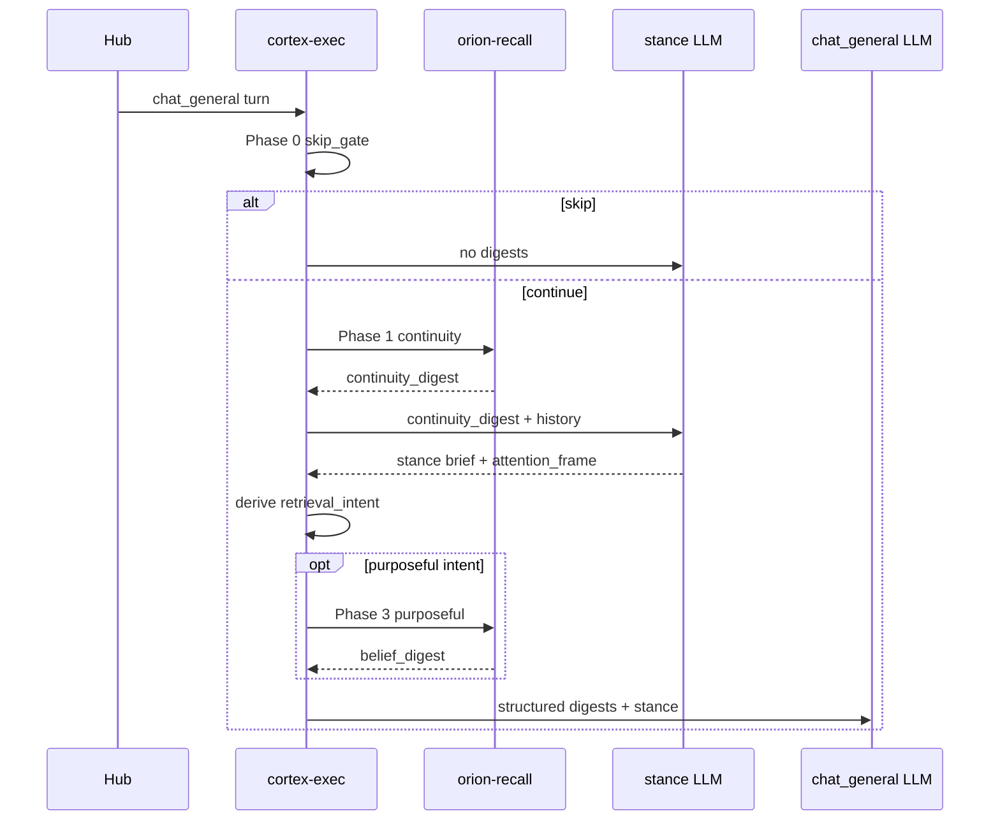

# Purpose-conditioned recall (PCR) — read-side cognitive memory

**Date:** 2026-07-07  
**Status:** Draft for operator review  
**Authors:** Operator + agent (brainstorming session)  
**Program partner (write side):** [`2026-07-07-consolidation-crystallization-gate-design.md`](./2026-07-07-consolidation-crystallization-gate-design.md)

> **This is not a follow-up to consolidation.** Fixing what Orion remembers is useless if the wrong memory arrives at the wrong moment in chat. PCR is **co-equal scope**: cortex-exec orchestration, recall contracts, fusion, active-packet wiring, prompt surfaces, telemetry, and acceptance checks at the same rigor as the write gate.

---

## Arsonist summary

Orion already built governed beliefs (`MemoryCrystallizationV1`), multi-rail retrieval (`retrieve_active_packet`), attention frames, and turn-change appraisal — then **chat ignores almost all of it**.

Today `chat_general` does:

```text
last user message → one recall RPC (lane profile) → score soup → memory_digest → stance → speech
```

That is not cognitive memory. It is **grep with extra steps**.

PCR replaces blind recall with **purpose-conditioned retrieval**: three timed phases, structural intent (not keywords), bucket-specific backends, and **separate chat surfaces** so continuity does not fight beliefs in a 256-token slurry.

**If PCR does not ship, write-side gate only moves swamp from graph drafts to unused crystallizations.**

---

## Executive summary

| Question | Owner spec |
|----------|------------|
| What is worth remembering? | Consolidation crystallization gate (write) |
| **What should enter cognition this turn?** | **PCR (this doc)** |
| How does Juniper experience memory in chat? | **PCR → `continuity_digest` + `belief_digest`** |

### Hard constraints

- No grammar substrate schema changes.
- No new memory stores — route existing rails.
- No keyword cathedrals — intent from stance schema, appraisal struct, attention frame, hub lane.
- No LLM classifier for retrieval intent in v1.

### v1 deliverables (read path is primary)

1. **Phase orchestration** in `orion-cortex-exec` (router + supervisor + chat_general plan)
2. **`RecallQueryV1` + `RecallDecisionV1` PCR fields** (contract + registry + bus)
3. **`orion-recall` PCR worker path** — collectors, fusion, renderers per intent
4. **`retrieve_active_packet` on chat read path** (not Hub-only)
5. **Structured chat ctx** + prompt contract updates
6. **Recall telemetry** — phase, intent, backend plan, drops (Hub + cortex debug)
7. **Gate tests + smoke** — greeting skip, reflective, topic, open-loop scenarios

---

## Why read-side is broken (evidence)

### Current `chat_general` pipeline (file-level)

```text
orion-cortex-orch intake
  → cortex-exec router.execute_plan
       ├─ delivery_safe_recall_decision()     # lane → profile (quick/brain)
       ├─ run_recall_step()  BEFORE steps     # router.py ~1046 — blind fetch
       │    └─ RecallQueryV1.fragment = last user message only
       │    └─ fuse_candidates() score soup
       │    └─ ctx["memory_digest"] = bundle.rendered
       ├─ synthesize_chat_stance_brief        # task_mode decided HERE
       ├─ enforce_chat_stance_quality
       └─ llm_chat_general                    # speech uses memory_digest
```

**Choke point:** `services/orion-cortex-exec/app/router.py` pre-step recall (~1038–1055) runs **before** stance knows `task_mode`, `conversation_frame`, or `open_loops`.

Secondary choke points:

| Location | What it does wrong |
|----------|-------------------|
| `executor.run_recall_step` | Single fragment query; no phase/intent |
| `recall_utils.delivery_safe_recall_decision` | Profile from hub lane, not cognitive purpose |
| `fusion.fuse_candidates` | Flat composite score across backends |
| `chat_general.j2` | One `memory_digest`; prompt tells model to ignore stale junk |
| `orion-recall/worker.py` | No `active_packet` collector; crystallizations invisible |
| `retrieve_active_packet` | Hub HTTP only; never called from recall worker |
| `chat_stance.fetch_chat_stance_memory_graph_hints` | RDF dispositions only; runs in stance, not recall |

### Symptom catalog (what Juniper sees)

| Turn type | What happens today | What should happen |
|-----------|-------------------|-------------------|
| "hey" / "thanks" | Random old cards/RDF in digest | **No belief recall**; optional tiny continuity |
| Venting / reflective | Task tracker tone + irrelevant RDF facts | **Relational** beliefs + disposition hints; no procedural RDF |
| "What did we decide about X?" | sql_chat + maybe wrong card | **Semantic** active-packet + cards + topic RDF |
| Open thread / repair | Stale timeline dominates digest | **Open_loop** bucket + attention frame |
| Planning / how-to | Mixed continuity + random graph entities | **Procedural** crystallizations + cards |

### Architectural mistake to avoid

- **Write-only fix** — gate without PCR leaves chat on grep.
- **More backends** — adds swamp surface without routing.
- **Bigger `memory_digest`** — prompt yelling scales poorly.
- **LLM retrieval router** — duplicates stance; use structural intent.

---

## Target architecture

### PCR turn timeline

```text
T0  Turn arrives (user_message, session_id, correlation_id, spark_meta from sql-writer)

T1  Phase 0 — recall_skip_gate (deterministic, <1ms)
      skip → empty digests, skip stance-enrichment recall, go to stance with message_history only
      continue → T2

T2  Phase 1 — continuity recall (fast RPC, assist.light / chat.continuity.v1)
      sql_chat only → continuity_digest
      inject into ctx BEFORE stance synthesizer

T3  Stance pipeline (unchanged contract, new inputs)
      chat_stance_brief sees continuity_digest (not full belief swamp)
      → task_mode, conversation_frame, attention_frame.open_loops

T4  derive_retrieval_intent (deterministic, <1ms)
      stance + appraisal + attention → RetrievalIntentV1

T5  Phase 3 — purposeful recall (conditional RPC)
      if intent ∈ {relational, semantic, procedural, open_loop, contradiction}
      → RecallQueryV1(recall_phase=purposeful, retrieval_intent=…)
      → bucket collectors + active-packet → belief_digest

T6  Speech
      chat_general(continuity_digest, belief_digest, chat_stance_brief, attention_frame)
      memory_digest = compat join for legacy
```



### Design principles

1. **Time separation** — continuity before stance; beliefs after purpose is known.
2. **Surface separation** — `continuity_digest` ≠ `belief_digest` ≠ disposition hints.
3. **Canonical beliefs on read path** — `active_packet` is first-class, not card-only fallback.
4. **Same rigor as write gate** — deterministic rules, tests, trace reasons, env flags, smoke.

---

## Cognitive need → retrieval (authoritative table)

| Need | Phase | Intent | Signals (structural) | Backends | Render budget | Chat slot |
|------|-------|--------|------------------------|----------|---------------|-----------|
| Skip memory | 0 | `none` | low_info_social + low novelty + no repair grammar | *none* | 0 | empty |
| Thread continuity | 1 | `continuity` | always (if not phase 0 skip) | `sql_chat` | ~96 tokens | `continuity_digest` |
| Relational presence | 3 | `relational` | reflective/playful task_mode | active-packet stance bucket, cards, RDF dispositions, light rdf_chat | ~128 tokens | `belief_digest` + disposition hints |
| Topic / fact | 3 | `semantic` | TOPIC shift, entity overlap | active-packet, cards, rdf, rdf_chat | ~128 tokens | `belief_digest` |
| How-to / plan | 3 | `procedural` | instrumental task_mode + planning frame | active-packet procedures, procedure cards | ~96 tokens | `belief_digest` |
| Unfinished thread | 3 | `open_loop` | attention open_loops, REPAIR shift | active-packet open_loops, cards, rdf_chat | ~128 tokens | `belief_digest` + attention_frame |
| Conflicting beliefs | 3 | `contradiction` | contradiction links / high stance novelty | active-packet contradictions, graphiti neighborhood | ~96 tokens | `belief_digest` |

**Write path feeds read path:** approved crystallizations → Chroma/cards/Graphiti → Phase 3 collectors. See consolidation spec for gate/propose/approve.

---

## Contracts

### `RetrievalIntentV1` + `RecallPhaseV1`

Add to `orion/schemas/memory_crystallization.py` or new `orion/schemas/recall_pcr.py` (registered):

```python
RetrievalIntentV1 = Literal[
    "none",
    "continuity",      # phase 1 only; phase 3 not invoked
    "relational",
    "semantic",
    "procedural",
    "open_loop",
    "contradiction",
]

RecallPhaseV1 = Literal["skip", "continuity", "purposeful"]
```

### `RecallQueryV1` extensions

```python
recall_phase: RecallPhaseV1 | None = None
retrieval_intent: RetrievalIntentV1 | None = None
task_hints: dict[str, Any] | None = None
# task_hints keys: task_mode, conversation_frame, shift_kind, novelty_score,
#   conversation_phase, open_loop_ids, hub_chat_lane
seed_crystallization_id: str | None = None
continuity_digest_max_tokens: int | None = None
belief_digest_max_tokens: int | None = None
```

Legacy queries omit fields → `orion-recall` uses current flat path (`RECALL_PCR_ENABLED=false` or missing phase).

### `RecallDecisionV1` / `recall_debug` extensions

```python
pcr: {
  "enabled": true,
  "phase": "purposeful",
  "retrieval_intent": "semantic",
  "intent_rule_id": "shift_topic_novelty_floor",
  "skip_reasons": [],
  "backend_plan": ["active_packet", "cards", "rdf"],
  "continuity_item_count": 3,
  "belief_item_count": 2,
  "active_packet_refs": ["crys_abc..."],
  "render_budget": {"continuity": 96, "belief": 128},
}
```

Persist in `recall.decision.v1` telemetry when Postgres configured.

### `PcrChatMemoryV1` (cortex ctx shape)

```python
@dataclass
class PcrChatMemoryV1:
    phase: RecallPhaseV1
    retrieval_intent: RetrievalIntentV1 | None
    continuity_digest: str
    belief_digest: str
    memory_digest: str  # compat
    skip_reasons: list[str]
    recall_debug: dict[str, Any]
```

Stored at `ctx["pcr_memory"]` and hoisted to prompt render keys.

---

## Phase 0 — `recall_skip_gate`

**Module:** `orion/memory/recall_skip_gate.py`  
**Shared:** `orion/memory/low_info_social.py` (same helper as consolidation write gate)

### Inputs

| Input | Source |
|-------|--------|
| `user_message` | ctx |
| `turn_change_appraisal` | spark_meta on current turn OR latest in session from recall sql lookup |
| `has_repair_grammar_signal` | read `grammar_events` for `hub.chat:{node}:{corr}` → `repair_signal` atom |

### Skip when ALL true

- `is_low_info_social(user_message)`
- `novelty_score < RECALL_SKIP_MAX_NOVELTY` (default `0.25`) or appraisal missing/degraded
- `shift_kind` not in `{TOPIC, STANCE, REPAIR}` OR novelty below `RECALL_SKIP_SHIFT_NOVELTY_FLOOR` (default `0.35`)
- `has_repair_grammar_signal` is false

### Outputs

```python
@dataclass
class RecallSkipGateResult:
    skip: bool
    reasons: list[str]  # low_info_social, novelty_below_floor, ...
```

### Cortex behavior when skip

- Do **not** call recall RPC (phase 1 or 3).
- Set `ctx["pcr_memory"]` with empty digests, `phase=skip`, `retrieval_intent=none`.
- Stance still runs on `message_history` + user_message.
- Emit `pcr.skip` trace on ctx.debug.

### Tests

- `"hey Orion"` → skip
- `"hey" + repair_signal grammar` → no skip
- substantive message → no skip

---

## Phase 1 — continuity recall

**Profile:** new `orion/recall/profiles/chat.continuity.v1.yaml`

```yaml
profile: chat.continuity.v1
enable_vector: false
vector_top_k: 0
rdf_top_k: 0
cards_top_k: 0
enable_sql_timeline: false
sql_chat_top_k: 6
sql_since_minutes: 120  # RECALL_CONTINUITY_SQL_MINUTES
max_per_source: 4
max_total_items: 6
render_budget_tokens: 96
render_lane: continuity
relevance:
  backend_weights:
    sql_chat: 1.0
  enable_recency: true
  recency_weight: 0.4
```

### RPC

```python
await run_recall_step(
    ...,
    recall_profile="chat.continuity.v1",
    recall_cfg={**recall_cfg, "recall_phase": "continuity"},
)
```

### Worker behavior

- Only `fetch_chat_history_pairs` / `sql_chat` collectors run.
- `fusion.render_continuity_bundle()` — transcript-shaped, user-prioritized lines.
- **Exclude** current turn id from `exclude.active_turn_ids` (existing).

### Output

- `ctx["continuity_digest"]`
- Items tagged `source=sql_chat`, `tags=["pcr:continuity"]`

### Stance consumption

Update `chat_stance_brief.j2`:

```jinja2
- continuity_digest: {{ continuity_digest | default("") }}
```

Instruction: use for thread orientation only; do not treat as durable belief.

---

## Phase T4 — `derive_retrieval_intent`

**Module:** `orion/memory/retrieval_intent.py`

### Inputs

```python
def derive_retrieval_intent(
    *,
    skip_gate: RecallSkipGateResult,
    stance_brief: ChatStanceBrief | dict,
    attention_frame: dict | None,
    appraisal: dict | None,
    hub_chat_lane: str | None,
    user_message: str,
) -> tuple[RetrievalIntentV1, str]:  # intent, rule_id
```

### Deterministic priority (first match wins)

| Rule ID | Condition | Intent |
|---------|-----------|--------|
| `phase0_skip` | `skip_gate.skip` | `none` |
| `open_loops_present` | `attention_frame.open_loops` non-empty | `open_loop` |
| `repair_shift` | `shift_kind==REPAIR` and novelty ≥ floor | `open_loop` |
| `relational_mode` | `task_mode` in `{reflective_dialogue, playful_exchange}` OR `conversation_frame` in `{reflective, playful_relational}` | `relational` |
| `stance_shift` | `shift_kind==STANCE` and novelty ≥ floor | `relational` |
| `contradiction_seed` | active contradiction crystallization linked to session scope (optional sql seed) | `contradiction` |
| `procedural_mode` | `task_mode` instrumental AND `response_priorities` contains planning-like priority from brief schema | `procedural` |
| `topic_shift` | `shift_kind==TOPIC` and novelty ≥ floor | `semantic` |
| `entity_query` | capitalized entity / known anchor token match (existing recall anchor logic, not keyword cathedral) | `semantic` |
| `continuity_only` | default | `continuity` |

When intent is `continuity` only → **skip Phase 3 RPC** (phase 1 output is sufficient).

### Tests (table-driven)

Fixture stance briefs + appraisals → expected intent + rule_id.

---

## Phase 3 — purposeful recall

### When

`retrieval_intent` not in `{none, continuity}`.

### Profile mapping

| Intent | Profile |
|--------|---------|
| `relational` | `chat.belief.relational.v1` (new) |
| `semantic` | `chat.belief.semantic.v1` (new) |
| `procedural` | `chat.belief.procedural.v1` (new) |
| `open_loop` | `chat.belief.open_loop.v1` (new) |
| `contradiction` | `chat.belief.contradiction.v1` (new) |

Each profile sets backend tops and `render_lane: belief`.

### Collector plan (`orion-recall/app/pcr_collectors.py`)

```python
def collectors_for_intent(intent: RetrievalIntentV1) -> CollectorPlan:
    ...
```

| Intent | sql_chat | cards | rdf | rdf_chat | active_packet | graphiti |
|--------|----------|-------|-----|----------|---------------|----------|
| relational | ✗ | ✓ stance tags | dispositions SPARQL | light | ✓ | opt |
| semantic | ✗ | ✓ | ✓ | ✓ | ✓ | opt |
| procedural | ✗ | ✓ procedure types | ✗ | ✗ | ✓ procedures bucket | ✗ |
| open_loop | ✗ | ✓ | light | ✓ | ✓ open_loops bucket | opt |
| contradiction | ✗ | ✓ | ✓ | ✗ | ✓ contradictions bucket | ✓ |

### Active-packet collector (critical path)

**Module:** `orion-recall/app/collectors/active_packet.py`

```python
async def fetch_active_packet_fragments(
    query: RecallQueryV1,
    *,
    pool,
    settings,
) -> list[dict]:
```

Steps:

1. Load active crystallizations for scope (`project_id`, `session_id` lane).
2. Call `retrieve_active_packet()` from `orion.memory.crystallization.retriever` **in-process** (shared `RECALL_PG_DSN`).
3. Map packet buckets to fragments:

```python
{
  "id": f"ap:{crystallization_id}",
  "source": "active_packet",
  "snippet": summary,
  "score": salience,
  "tags": [f"kind:{kind}", f"bucket:{bucket}"],
}
```

4. Apply intent filter — e.g. procedural intent drops `stance` bucket entries.

**This is the read-path seam that makes write-side crystallization matter in chat.**

### Fusion (`fusion.pcr_fuse_belief_candidates`)

Separate from continuity fusion:

1. Drop `low_info_social` in belief lane always.
2. Rank order:
   - `active_packet` by salience desc
   - `cards` with `high_recall` / crystallization_ref boost
   - `rdf*` by composite score
   - `graphiti` refs appended with cap
3. Render with section header:

```text
[Durable beliefs — purposeful recall: semantic]
- ...
```

4. Enforce `belief_digest_max_tokens` (default 128).

### Output

- `ctx["belief_digest"]`
- `ctx["memory_digest"]` = join continuity + belief with headers (compat)

---

## Cortex-exec orchestration (detailed)

### Files to change

| File | Change |
|------|--------|
| `app/router.py` | Replace single pre-step recall with `run_pcr_chat_memory()` |
| `app/supervisor.py` | Same for supervised agent path |
| `app/pcr_chat_memory.py` | **Create** — phases 0→1→stance hook→3 |
| `app/executor.py` | `run_recall_step` accepts `recall_phase`, passes to query |
| `app/chat_stance.py` | `build_chat_stance_inputs` reads `continuity_digest` |
| `orion/cognition/verbs/chat_general.yaml` | Document PCR pre-step; optional remove inline RecallService step |

### `run_pcr_chat_memory` pseudocode

```python
async def run_pcr_chat_memory(bus, *, ctx, correlation_id, recall_cfg, settings) -> PcrChatMemoryV1:
    if not settings.chat_pcr_enabled:
        return await legacy_single_recall(...)

    gate = recall_skip_gate(user_message, appraisal, grammar_repair=...)
    if gate.skip:
        return empty_pcr(phase="skip", reasons=gate.reasons)

    cont = await run_recall_step(..., profile="chat.continuity.v1", recall_phase="continuity")
    ctx["continuity_digest"] = cont.rendered

  # stance steps run in plan between PCR phase 1 and 3 — see integration below

    intent, rule_id = derive_retrieval_intent(...)
    if intent == "continuity":
        return PcrChatMemory(phase="continuity", intent=intent, continuity_digest=..., belief_digest="")

    belief = await run_recall_step(..., profile=profile_for(intent), recall_phase="purposeful", retrieval_intent=intent, task_hints=...)
    return assemble_pcr(...)
```

### Plan step ordering for `chat_general`

**Today:** pre-recall → stance step → speech step.

**PCR:**

1. `pcr_phase0_1` (new implicit hook at plan start OR explicit micro-step)
2. `synthesize_chat_stance_brief` — sees `continuity_digest`
3. `pcr_phase3` (new hook after stance enforce, before speech)
4. `llm_chat_general`

Implementation preference: **`router.py` orchestration hooks** around existing steps (minimal YAML churn):

- Before first step: phase 0+1
- After `synthesize_chat_stance_brief` + enforce: phase 3

### Supervisor parity

`supervisor.py` ~1614 duplicate recall path must call same `run_pcr_chat_memory` or shared helper — agent mode cannot diverge.

---

## Prompt contract (first-class)

### `chat_stance_brief.j2`

```jinja2
- continuity_digest: {{ continuity_digest | default("") }}
- memory_digest: {{ memory_digest | default("") }}  {# legacy; deprecate #}
```

Add instruction block:

- continuity_digest = recent thread only
- do not infer durable beliefs from continuity alone

### `chat_general.j2`

```jinja2
- continuity_digest: {{ continuity_digest | default("") }}
- belief_digest: {{ belief_digest | default("") }}
- memory_digest: {{ memory_digest | default("") }}
```

Replace "ignore stale memory_digest" band-aid with:

- belief_digest = operator-approved durable memory for this turn's purpose
- continuity_digest = recent thread; may be discarded if user_message is a hard reset
- if belief_digest empty, do not claim lack of memory when continuity shows context

### `chat_quick.j2`

Phase 0 skip especially important (latency). Phase 1 only unless quick lane explicitly enables mini phase 3 via env.

---

## Worked examples (acceptance narratives)

### Example A — greeting

```
User: "hey"
Appraisal: novelty 0.1, shift NONE
```

- Phase 0: skip (low_info_social)
- No recall RPC
- Stance: casual
- Speech: no memory claims, no stale card injection

### Example B — move stress (semantic)

```
User: "still drowning in move logistics alone"
Appraisal: TOPIC, novelty 0.72
Prior approved crystallization: "Juniper carrying move logistics solo"
```

- Phase 0: continue
- Phase 1: last 2 turns in continuity_digest
- Stance: reflective_dialogue → intent semantic (topic_shift wins if both)
- Phase 3: active_packet returns crystallization; belief_digest includes it
- Speech: references durable belief with continuity grounding

### Example C — reflective check-in

```
User: "rough day, just checking in"
Stance: reflective_dialogue
```

- Intent: relational
- Phase 3: stance bucket + disposition hints; **no** heavy RDF entity spam
- Speech: companion presence without task tracking

### Example D — open loop

```
Attention frame: open_loop "promised to revisit GPU migration"
User: "anyway—"
```

- Intent: open_loop
- Phase 3: open_loop bucket prioritized
- Speech + attention_frame aligned

---

## Env / config (complete)

### `services/orion-cortex-exec/.env_example`

| Key | Default | Purpose |
|-----|---------|---------|
| `CHAT_PCR_ENABLED` | `true` | Master PCR switch |
| `CHAT_PCR_POST_STANCE_RECALL` | `true` | Phase 3 after stance |
| `CHAT_PCR_SKIP_ON_LOW_INFO` | `true` | Phase 0 |
| `CHAT_PCR_QUICK_PHASE3` | `false` | quick lane skips phase 3 unless true |

### `services/orion-recall/.env_example`

| Key | Default | Purpose |
|-----|---------|---------|
| `RECALL_PCR_ENABLED` | `true` | Worker PCR branches |
| `RECALL_SKIP_MAX_NOVELTY` | `0.25` | Phase 0 |
| `RECALL_SKIP_SHIFT_NOVELTY_FLOOR` | `0.35` | shift gating |
| `RECALL_CONTINUITY_SQL_MINUTES` | `120` | Phase 1 window |
| `RECALL_BELIEF_RENDER_BUDGET` | `128` | Phase 3 default |
| `RECALL_CONTINUITY_RENDER_BUDGET` | `96` | Phase 1 default |
| `RECALL_ACTIVE_PACKET_ENABLED` | `true` | Collector on |
| `RECALL_GRAPHITI_IN_CHAT` | `false` | contradiction intent only when true |
| `CRYSTALLIZER_EMBED_HOST_URL` | | active-packet Chroma rail |

Sync via `python scripts/sync_local_env_from_example.py`.

---

## File map

| File | Action | Responsibility |
|------|--------|----------------|
| `orion/memory/low_info_social.py` | Create | Shared courtesy detector |
| `orion/memory/recall_skip_gate.py` | Create | Phase 0 |
| `orion/memory/retrieval_intent.py` | Create | Intent derivation |
| `orion/schemas/recall_pcr.py` | Create | PCR schema types |
| `orion/core/contracts/recall.py` | Modify | Query/decision extensions |
| `orion/schemas/registry.py` | Modify | Register new types |
| `orion/recall/profiles/chat.continuity.v1.yaml` | Create | Phase 1 profile |
| `orion/recall/profiles/chat.belief.*.v1.yaml` | Create | Phase 3 profiles (5) |
| `services/orion-recall/app/pcr_collectors.py` | Create | Backend plans |
| `services/orion-recall/app/collectors/active_packet.py` | Create | Canonical belief collector |
| `services/orion-recall/app/fusion.py` | Modify | `pcr_fuse_*` render lanes |
| `services/orion-recall/app/worker.py` | Modify | Phase/intent branch |
| `services/orion-cortex-exec/app/pcr_chat_memory.py` | Create | Orchestration |
| `services/orion-cortex-exec/app/router.py` | Modify | Hook PCR |
| `services/orion-cortex-exec/app/supervisor.py` | Modify | Hook PCR |
| `services/orion-cortex-exec/app/executor.py` | Modify | Pass phase to query |
| `orion/cognition/prompts/chat_general.j2` | Modify | Structured digests |
| `orion/cognition/prompts/chat_stance_brief.j2` | Modify | continuity_digest |
| `tests/test_recall_skip_gate.py` | Create | Phase 0 |
| `tests/test_retrieval_intent.py` | Create | Intent rules |
| `services/orion-recall/tests/test_pcr_*.py` | Create | Collectors/fusion |
| `services/orion-cortex-exec/tests/test_pcr_chat_memory.py` | Create | Orchestration |
| `scripts/smoke_pcr_chat_memory_e2e.sh` | Create | Live stack |

---

## Testing strategy

### Gate tests (deterministic, <2s each)

- Phase 0 skip / no-skip matrix
- Intent derivation rule table
- Collector plan per intent
- Fusion: continuity items never in belief render
- active_packet fragments map with salience ordering

### Integration tests

- `test_pcr_chat_memory_greeting` — mock bus, assert 0 recall RPCs on skip
- `test_pcr_chat_memory_semantic` — phase 1 + 3 RPC order, belief contains ap: fragment
- `test_supervisor_pcr_parity` — same as router

### Evals (periodic)

- Fixture transcripts: greeting / reflective / topic / repair
- Score: belief_digest precision (contains relevant crystallization id), contamination (no greeting cards)

### Smoke

`scripts/smoke_pcr_chat_memory_e2e.sh`:

1. Send greeting → trace shows `pcr.phase=skip`, empty digests
2. Seed approved crystallization + topic message → `retrieval_intent=semantic`, `active_packet_refs` non-empty
3. Hub cognition trace JSON includes `pcr` block

---

## Acceptance checks

1. **Greeting:** Phase 0 skip; `belief_digest` empty; Orion does not cite stale memory cards.
2. **Continuity:** Phase 1 only on "ok thanks" with mild continuity — no phase 3.
3. **Semantic:** Approved crystallization retrievable via `source=active_packet` without card projection.
4. **Relational:** Reflective turn uses relational profile; RDF entity spam drop count increases in debug.
5. **Open loop:** attention open_loop → `open_loop` intent; belief digest cites loop crystallization.
6. **Supervisor parity:** agent supervised path matches router PCR traces.
7. **Legacy:** `CHAT_PCR_ENABLED=false` restores single pre-stance recall (regression).
8. **Telemetry:** `recall.decision.v1` includes `pcr` block with intent + rule_id.
9. **Prompt:** `chat_general` renders `continuity_digest` and `belief_digest` separately in cortex debug.

---

## Risks

| Severity | Risk | Mitigation |
|----------|------|------------|
| High | Latency: two recall RPCs + stance | Phase 3 conditional; continuity profile fast; quick lane phase 3 off by default |
| High | Supervisor/router drift | Single `pcr_chat_memory.py` helper |
| Medium | active_packet DSN parity | Reuse `RECALL_PG_DSN`; gate test |
| Medium | Prompt regressions | compat `memory_digest`; A/B eval fixtures |
| Low | Graphiti latency | `RECALL_GRAPHITI_IN_CHAT=false` default; contradiction only |

---

## Implementation order (read path is not deferred)

**Program milestone A — read relief (ship first if forced to choose)**

1. `low_info_social.py` + `recall_skip_gate.py` + tests
2. `chat.continuity.v1.yaml` + phase 1 RPC from router
3. `pcr_chat_memory.py` phase 0+1 integration
4. Prompt: `continuity_digest` in stance
5. Smoke greeting scenario

**Program milestone B — purposeful recall**

6. `retrieval_intent.py` + tests
7. Post-stance phase 3 hook in router/supervisor
8. `active_packet` collector + belief profiles
9. `belief_digest` prompt contract
10. Smoke semantic + reflective scenarios

**Program milestone C — write path (parallel spec)**

11. Consolidation gate (stop bad writes feeding stores)

Milestones A+B **must not wait** on C. Greeting swamp is read-path damage today.

---

## Open questions

1. **Quick lane phase 3:** default off — confirm?
2. **Contradiction without Graphiti:** active-packet only sufficient for v1?
3. **spark_meta appraisal on live turn:** hub websocket must pass latest appraisal into exec ctx for phase 0 — verify path?

---

## Status

Draft for review. **Approve as co-equal to consolidation gate.** Combined implementation plan should allocate **≥50% effort to read path** (PCR milestones A+B).

On approval → `writing-plans` skill for unified cognitive memory program.
