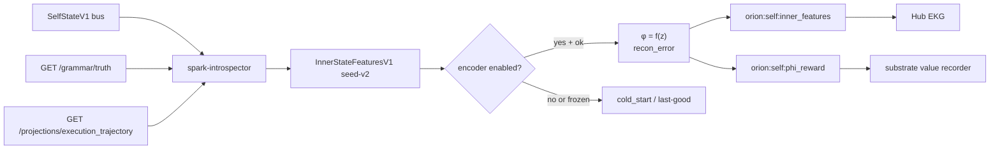

# φ Encoder Plan 2 — MLP inner-state objective, prerequisites, and versioned artifacts

> **Status:** Approved (brainstorming 2026-07-08). **Builds on:** Plan 1 / PR #888 (`docs/superpowers/plans/2026-07-07-phi-inner-state-truthful.md`, `docs/superpowers/specs/2026-07-07-phi-inner-state-truthful-design.md`).
> **Sibling:** `docs/superpowers/specs/2026-07-08-phi-intrinsic-reward-value-learning-design.md` (Δφ consumer).
> **Supersedes (partial):** Plan 2 deferrals table in the Plan 1 implementation doc.

## Arsonist summary

Plan 1 killed the fake geometric-mean φ and lit honest feature lanes. Plan 2 gives φ its **first real objective function**: a shallow self-supervised MLP trained offline on the corpus, with reconstruction error as coherence/surprise, versioned artifacts under telemetry storage, and ship-blocking probes/attributions so spikes are inspectable. Prerequisites are **not optional**: grammar-truth liveness and `ExecutionRunStateV1` cognitive-substance features must be live before fit or inference — otherwise the encoder learns "idle infra = normal."

## Locked decisions (brainstorming)

| Decision | Choice |
|---|---|
| Scope | Full Plan 2 deferred bundle + C robustness (prerequisites ship-blocking) |
| Encoder architecture | **MLP-first** — `mlp_shallow_v1` (2-layer ReLU autoencoder + scalar φ head) |
| Training topology | **Offline only** — `scripts/fit_phi_encoder.py`; introspector inference-only |
| Artifacts | `${TELEMETRY_ROOT}/models/phi/encoders/<encoder_version>/` |
| Corpus | `${TELEMETRY_ROOT}/phi/corpus/inner_state.jsonl` |
| Prerequisite reads | HTTP fork C: `GET /grammar/truth` + new `GET /projections/execution_trajectory` on substrate-runtime |
| Δφ handoff | Dual spec — producer here; sibling spec for consumer |

---

## Current architecture (post-#888)

- **Producer:** `orion-spark-introspector` emits `InnerStateFeaturesV1` per self-state tick on `orion:self:inner_features`.
- **Headline:** arithmetic cold-start (`honest_headline`, `headline_source="cold_start_aggregate"`).
- **Corpus:** append-only JSONL via `InnerStateCorpusSink` (Plan 1 path may still point at `/data/orion/...`; Plan 2 repoints to telemetry).
- **GIGO:** degeneracy-streak freeze implemented; `grammar_degraded=False` literal in worker (Plan 2 wires real source).
- **Encoder:** env placeholders only (`ORION_PHI_ENCODER_ENABLED=false`).

## Architecture touched

| Service | Changes |
|---|---|
| `orion-spark-introspector` | Cognitive features, grammar-truth HTTP poll, execution trajectory HTTP poll, MLP inference, `PhiIntrinsicRewardV1` emit, corpus path migration |
| `orion-substrate-runtime` | `GET /projections/execution_trajectory` |
| `orion-hub` / `orion-sql-writer` | Wire `orion:self:inner_features` + `orion:self:phi_reward` consumers (durable/debug) |
| `scripts/fit_phi_encoder.py` | Offline train, eval gates, promote/rollback |

---

## Telemetry layout

```text
${TELEMETRY_ROOT}/                    # repo default: /mnt/telemetry
  phi/
    corpus/
      inner_state.jsonl               # append-only training corpus
  models/
    phi/
      encoders/
        <encoder_version>/
          manifest.json               # PhiEncoderManifestV1
          weights.npz                 # W1,b1,W2,b2,W3,b3,w_phi,b_phi, scaler params
          probes.json                 # per-latent feature correlations
        active -> <encoder_version>   # symlink; ORION_PHI_ENCODER_WEIGHTS points here
```

## Env / config

```text
TELEMETRY_ROOT=/mnt/telemetry
INNER_FEATURES_VERSION=seed-v2
INNER_FEATURES_CORPUS_PATH=${TELEMETRY_ROOT}/phi/corpus/inner_state.jsonl
ORION_PHI_ENCODER_WEIGHTS=${TELEMETRY_ROOT}/models/phi/encoders/active
ORION_PHI_ENCODER_ENABLED=false
SUBSTRATE_RUNTIME_URL=http://orion-athena-substrate-runtime:8115
PHI_ENCODER_HIDDEN_DIM=16
PHI_ENCODER_LATENT_DIM=8
PHI_ENCODER_MIN_ROWS=500
PHI_ENCODER_MIN_FEATURE_VAR=0.02
PHI_ENCODER_MIN_HOURS=4
EXEC_TRAJECTORY_MAX_AGE_SEC=120
PHI_DEGENERATE_STREAK=20              # unchanged from Plan 1
```

**Corpus migration (Plan 1 → Plan 2):** Plan 1 default was `/data/orion/phi/inner_state_corpus.jsonl`. Plan 2 repoints to telemetry. Migration task:
1. `mkdir -p ${TELEMETRY_ROOT}/phi/corpus`
2. Copy or append-merge existing JSONL to new path (do not delete old file until fit script confirms row count).
3. Update `INNER_FEATURES_CORPUS_PATH` in spark-introspector `.env_example` + local `.env`.
4. `fit_phi_encoder.py` accepts `--legacy-corpus <path>` for one-time reads of the old location.

After `.env_example` edits: `python scripts/sync_local_env_from_example.py` from repo root.

---

## Feature vector extensions (`features_version=seed-v2`)

Plan 1 felt dims (10 + `overall_intensity`) remain. Plan 2 **adds cognitive-substance features** from `ExecutionTrajectoryProjectionV1`.

### Active run filter

A run is **active** when:

```python
(now - run.last_updated_at).total_seconds() <= EXEC_TRAJECTORY_MAX_AGE_SEC
```

Only active runs participate in cognitive-substance aggregation. If no active runs: all four cognitive features = `0.0` with `source="execution_trajectory.none"`.

| Feature | Derivation | Source label |
|---|---|---|
| `recall_gate_fired` | `1.0` if any active run has `recall_observed=true`, else `0.0` | `execution_trajectory.runs.*.recall_observed` |
| `reasoning_present` | fraction of active runs with `reasoning_present=true` | `execution_trajectory.runs.*.reasoning_present` |
| `exec_step_fail_rate` | `sum(failed_step_count) / max(1, sum(step_count))` | `execution_trajectory.runs.*.failed_step_count` |
| `execution_friction` | mean of `pressure_hints.execution_friction` (0.0 if absent) | `execution_trajectory.runs.*.pressure_hints` |

**Infra sub-vector unchanged** — never read by φ. `policy_pressure` and `uncertainty` remain excluded.

**Encoder input layering (intentional):** `execution_pressure` / `reasoning_pressure` from `SelfStateV1` capture substrate-integrated load; trajectory features (`reasoning_present`, `exec_step_fail_rate`, etc.) capture discrete cortex-exec grammar substance. Both feed the encoder — they measure different things. Do not drop SelfState execution dims when seed-v2 cognitive features are live.

Each feature carries `{name, raw_value, scaled_value, source}`. No grammar text content.

---

## Prerequisite reads (HTTP fork C)

### Grammar-truth liveness

Poll `GET ${SUBSTRATE_RUNTIME_URL}/grammar/truth` each self-state tick (or cache ≤2s to match tick cadence):

```python
grammar_degraded = bool(truth.get("degraded"))  # equivalent to not truth["ok"]
```

Additionally freeze when cognitive lanes are dark:
- `enabled_reducers.execution_trajectory` is false, OR
- `reducer_health_by_name.execution_trajectory.classification` ∈ `{dead_no_heartbeat, blocked_on_event, cursor_commit_failing}`

**Deployment parity note:** pydantic defaults for `enable_execution_trajectory_reducer` may be `True` while compose still passes `${ENABLE_EXECUTION_TRAJECTORY_REDUCER:-false}`. Acceptance requires **deployed env + compose** parity, not pydantic default alone.

Populate `grammar_truth_degraded`, `liveness.grammar_truth`, and `metadata.degraded_reasons` on `InnerStateFeaturesV1`.

**Fail closed:** HTTP timeout/5xx → treat as degraded, freeze φ, log warning. Never fabricate values on dark lanes.

### Execution trajectory

New substrate-runtime endpoint:

```python
@app.get("/projections/execution_trajectory")
async def execution_trajectory() -> dict:
    proj = worker._store.load_execution_trajectory(EXECUTION_TRAJECTORY_PROJECTION_ID)
    if proj is None:
        return {"ok": False, "reason": "no_projection"}
    return {"ok": True, "projection": proj.model_dump(mode="json")}
```

Read-only, internal mesh (same exposure model as `/grammar/truth`).

---

## GIGO guards (stacked)

1. **Degeneracy streak** (Plan 1) — identical felt tuple across `PHI_DEGENERATE_STREAK` ticks → `phi_health="frozen"`, hold last-good headline.
2. **Grammar-truth degraded** — freeze.
3. **Fit-time exclusion** — skip corpus rows where `phi_health != "ok"` or `grammar_truth_degraded=true`.
4. **Inference guard** — frozen/degraded tick: no encoder headline update, no `PhiIntrinsicRewardV1` emit.

---

## MLP encoder: `mlp_shallow_v1`

Vanilla numpy only (spark-introspector already has `numpy` + `scipy`). No sklearn.

```text
input_dim = len(encoder_features)     # scaled felt + cognitive; NO infra
hidden_dim = PHI_ENCODER_HIDDEN_DIM   # default 16
latent_dim = PHI_ENCODER_LATENT_DIM   # default 8

x → Linear+ReLU → z (latent) → Linear → x̂ (reconstruction)
φ = sigmoid(w_φ · z + b_φ)
coherence_surprise = MSE(x, x̂)       # high = incoherent / surprising
```

**Training loss:** `MSE(x, x̂) + λ·||z||²` with λ=0.01. Optimizer: SGD in fit script, ~200 epochs, early stop on held-out recon error.

**Inspectability (ship-blocking):**
- `probes.json`: per-latent-axis Pearson correlation with each input feature on held-out set
- `attribution_top` at inference: top-3 features by |∂φ/∂x_i · x_i| (backward through MLP)

---

## Schemas

### `PhiEncoderManifestV1`

```python
class CorpusStatsV1(BaseModel):
    corpus_path: str
    row_count: int
    excluded_degenerate: int
    time_range_start: datetime | None
    time_range_end: datetime | None

class TrainingStatsV1(BaseModel):
    epochs: int
    final_loss: float
    held_out_loss: float
    recon_error_p50: float
    recon_error_p95: float

class PhiEncoderManifestV1(BaseModel):
    encoder_id: str
    encoder_version: str               # e.g. "2026-07-08T0600Z-a3f2"
    parent_version: str | None
    status: Literal["candidate", "active", "retired"]
    architecture: str                  # "mlp_shallow_v1"
    features_version: str              # "seed-v2"
    input_features: list[str]          # ordered
    hidden_dim: int
    latent_dim: int
    corpus: CorpusStatsV1
    training: TrainingStatsV1
    probes: dict[str, dict[str, float]]
    git_sha: str
    trained_at: datetime
    promoted_at: datetime | None
```

`weights.npz` keys: `W1, b1, W2, b2, W3, b3, w_phi, b_phi, scaler_medians, scaler_iqrs`.

Runtime validates `manifest.features_version == INNER_FEATURES_VERSION` before loading; mismatch → encoder disabled, cold-start fallback, log error.

### `PhiIntrinsicRewardV1` (producer)

See sibling spec for consumer; producer fields:

```python
class AttributionV1(BaseModel):
    feature: str
    raw_value: float
    scaled_value: float
    attribution: float

class PhiIntrinsicRewardV1(BaseModel):
    generated_at: datetime
    self_state_id: str | None
    encoder_version: str
    features_version: str
    phi: float
    delta_phi: float
    recon_error: float
    delta_recon_error: float
    latent: dict[str, float]
    tick_metadata_window_sec: int = 2   # producer metadata only; episode aggregation uses PHI_VALUE_EPISODE_WINDOW_SEC on consumer
    phi_health: str = "ok"
    grammar_truth_degraded: bool = False
    attribution_top: list[AttributionV1]
```

Emit on `orion:self:phi_reward` (`self.phi_reward.v1`) only when encoder enabled, manifest loaded, `phi_health="ok"`.

### `InnerStateFeaturesV1` extensions

- `features_version` bumps to `seed-v2`
- `headline_source` may be `"encoder"` when MLP active
- `metadata` gains `recon_error`, `latent`, `encoder_version` when encoder active

---

## Contracts / channels / registry

| Addition | Detail |
|---|---|
| Schema | `PhiEncoderManifestV1`, `PhiIntrinsicRewardV1`, `AttributionV1`, `CorpusStatsV1`, `TrainingStatsV1` |
| Channel | `orion:self:phi_reward` (`message_kind: self.phi_reward.v1`) — producer `orion-spark-introspector`; consumers `orion-substrate-runtime`, `orion-sql-writer`, `orion-hub` |
| Registry | Register all new schemas in `orion/schemas/registry.py` |

Existing `orion:self:inner_features` consumer wiring completed in Plan 2 (hub + sql-writer durable subscribe).

**Consumer ownership split:**
- **Plan 2:** producer, channel registry, hub EKG read, sql-writer durable inner_features + phi_reward
- **Step 3a sibling spec:** substrate trace recorder + episode reducer + autonomy metabolism

---

## Fit / eval / promote pipeline

### `scripts/fit_phi_encoder.py`

```bash
# Train candidate
python scripts/fit_phi_encoder.py \
  --corpus ${TELEMETRY_ROOT}/phi/corpus/inner_state.jsonl \
  --out ${TELEMETRY_ROOT}/models/phi/encoders/2026-07-08T0600Z-a3f2 \
  --min-rows 500 --min-variance 0.02

# Eval gate
python scripts/fit_phi_encoder.py --eval-only --manifest <path>

# Promote (symlink active + status flip)
python scripts/fit_phi_encoder.py --promote --version 2026-07-08T0600Z-a3f2
```

**Corpus readiness gates (refuse without `--force`):**
- ≥ `PHI_ENCODER_MIN_ROWS` non-degenerate rows
- Per-feature variance ≥ `PHI_ENCODER_MIN_FEATURE_VAR` on ≥ 80% of features
- Time span ≥ `PHI_ENCODER_MIN_HOURS`

**Promote gates (refuse on failure):**
- Held-out recon error on `fixtures/phi_encoder_promote_gate.jsonl` separates normal from injected anomalies: `p95_recon_error_anomaly / p95_recon_error_normal >= 2.0`
- Each latent axis has ≥ 1 probe with |r| ≥ 0.3
- Replay `|delta_phi| < 0.5` per tick, no NaN

**Promote fixture format (`fixtures/phi_encoder_promote_gate.jsonl`):**
- `normal` rows: sampled non-degenerate corpus ticks (≥100)
- `anomaly` rows: same base with one feature injected ±3σ from training median per row
- Fit script `--eval-only` loads fixture, runs forward pass, reports ratio; promote refuses if ratio < 2.0

**Rollback:** repoint `active` symlink to prior version; restart introspector.

---

## Runtime inference (spark-introspector)

Per self-state tick when `ORION_PHI_ENCODER_ENABLED=true`:

1. Build `InnerStateFeaturesV1` (seed-v2, prerequisites wired).
2. If frozen/degraded → cold-start or last-good headline; skip reward emit.
3. Else load manifest from `ORION_PHI_ENCODER_WEIGHTS` dir; forward pass → `φ`, `recon_error`, `latent`.
4. Set `headline=φ`, `headline_source="encoder"`.
5. Compute `delta_phi = phi - prev_phi` (0.0 on first tick after enable).
6. Publish `InnerStateFeaturesV1` + `PhiIntrinsicRewardV1`.
7. Broadcast WS `stats.phi` from encoder headline when active.

---

## Data flow



---

## Tests (gate — deterministic, <2s each)

1. `test_execution_trajectory_features` — active run with `reasoning_present=true` raises cognitive features.
2. `test_execution_trajectory_stale_runs_excluded` — run older than `EXEC_TRAJECTORY_MAX_AGE_SEC` → cognitive features 0.0, source `execution_trajectory.none`.
3. `test_grammar_truth_http_freeze` — mock degraded truth → `phi_health=frozen`.
4. `test_grammar_truth_stale_fail_closed` — HTTP timeout → frozen.
5. `test_mlp_encoder_forward` — loaded weights → φ ∈ [0,1], recon_error ≥ 0.
6. `test_manifest_version_mismatch_refused` — `features_version` mismatch → encoder disabled.
7. `test_phi_reward_emitted_when_ok` — encoder on + ok → bus event.
8. `test_phi_reward_suppressed_when_frozen` — frozen tick → no reward.
9. `test_fit_script_corpus_gates` — <500 rows → fit refuses.
10. `test_promote_requires_eval_pass` — bad held-out ratio → promote refuses.
11. `test_substrate_execution_trajectory_endpoint` — HTTP returns projection.

## Evals (periodic)

- `eval_phi_encoder_fit.py` — train on corpus slice; report recon_error, probes, per-feature variance.
- `eval_phi_reward_bounded.py` — replay window; assert bounded `delta_phi`, no NaN.

---

## Failure modes & mitigations

| Failure | Mitigation |
|---|---|
| Encoder learns idle as normal | Cognitive features + grammar-truth gate + fit excludes degenerate rows |
| Dark cognitive lanes in prod | Default-on reducers + grammar-truth freeze; never hollow read |
| Opaque latent | Probes + attributions ship-blocking; promote refuses without |
| Manifest/features mismatch | Runtime refuses load; cold-start fallback |
| Corpus too small | Fit script gates; encoder stays off |
| Tick-path latency | Inference-only numpy forward pass; no training in-process |

---

## Privacy / safety

Numeric features and source labels only. No thought/memory/speech text. Reversible: `ORION_PHI_ENCODER_ENABLED=false` restores cold-start; `INNER_FEATURES_ENABLED=false` restores pre-Plan-1 behavior.

---

## Acceptance checks

- [ ] `INNER_FEATURES_VERSION=seed-v2` in env + emitted payload.
- [ ] `features_version=seed-v2` emitted with cognitive-substance features from live execution trajectory.
- [ ] Active-run filter verified (stale runs excluded).
- [ ] Corpus migrated to `${TELEMETRY_ROOT}/phi/corpus/inner_state.jsonl`.
- [ ] Grammar-truth HTTP wired; degraded/stale → freeze verified.
- [ ] Substrate `GET /projections/execution_trajectory` live.
- [ ] `scripts/fit_phi_encoder.py` trains candidate with manifest + weights under telemetry.
- [ ] Promote gates pass on eval fixture before `active` symlink flip.
- [ ] Encoder inference updates Hub `stats.phi` with `headline_source="encoder"`.
- [ ] `PhiIntrinsicRewardV1` emitted when ok; suppressed when frozen.
- [ ] Probes + attributions present in manifest and runtime metadata.
- [ ] Rollback via symlink repoint verified.

---

## Non-goals (Plan 2)

- Deep RL / policy gradient on φ
- In-process training or hot refit
- PCA-first gate (MLP-first by operator decision; PCA may return as future ablation only)
- Consuming grammar text content
- Replacing equilibrium distress/zen
- Auto-promoting candidates without explicit `--promote`
- Turn-scoped φ (continuous tick only)
- Full intrinsic value-learning loop (sibling spec; recorder default-off)

---

## Files likely to touch

**Created:**
- `orion/schemas/telemetry/phi_encoder.py` — manifest + reward schemas
- `services/orion-spark-introspector/app/phi_encoder.py` — MLP load/infer/attributions
- `services/orion-spark-introspector/app/substrate_reads.py` — HTTP grammar-truth + execution trajectory
- `scripts/fit_phi_encoder.py`
- `tests/test_phi_encoder*.py`, `services/orion-spark-introspector/evals/eval_phi_*.py`

**Modified:**
- `services/orion-spark-introspector/app/inner_state.py` — seed-v2 features
- `services/orion-spark-introspector/app/worker.py` — wire prerequisites, encoder, reward emit
- `services/orion-spark-introspector/app/settings.py` + `.env_example`
- `services/orion-substrate-runtime/app/main.py` — execution trajectory endpoint
- `orion/schemas/registry.py`, `orion/bus/channels.yaml`
- Hub/sql-writer consumer wiring

---

## Recommended next patch

Implementation plan via `writing-plans` skill: `docs/superpowers/plans/2026-07-08-phi-encoder-plan2.md` (task-split mirroring Plan 1 anti-stub rules).
