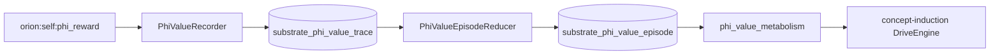

# φ intrinsic reward → value learning (Step 3a — Plan 2 consumer v1)

> **Status:** Approved (brainstorming 2026-07-08). **Step 3a** of the autonomy origination arc (`docs/superpowers/plans/2026-07-07-autonomy-origination-measurement-gate.md`).
> **Unblocked by:** Plan 1 / PR #888 (honest feature vector) + Plan 2 encoder (`docs/superpowers/specs/2026-07-08-phi-encoder-plan2-design.md`).
> **Related:** `docs/superpowers/specs/2026-07-06-substrate-fed-motivation-design.md` (drive metabolism adapter).
> **Deferred sibling:** `docs/superpowers/specs/2026-07-07-phi-intrinsic-reward-value-learning-design.md` (Step 3b — autonomy-episode `θ` learning via `ValueUpdateV1`; builds on traces produced here).

## Arsonist summary

Orion's motivation path is **turn/receipt-scoped** — drives react to discrete grammar events, not continuous self-coherence drift. The old harness φ was geometric-mean fiction pinned at 0.01. Plan 2 gives continuous `Δφ` from a learned reconstruction objective. This spec defines the **consumer side**: record `PhiIntrinsicRewardV1`, roll it into episodes, and optionally feed a bounded pressure into the **coherence** drive — default-off, no weight learning in v1.

The prize is a inspectable seam between self-modeling and wanting. v1 is record + visualize + eval, not deep RL.

---

## Problem statement

| Layer | Exists | Gap |
|---|---|---|
| Honest inner state | `InnerStateFeaturesV1`, cold-start headline (Plan 1) | No continuous reward signal |
| Encoder φ | Plan 2 producer | Consumer + durable trace missing |
| Drive metabolism | `DriveEngine`, six canonical drives | No `Δφ` input; coherence is receipt-driven |
| Value learning | Salience `weights_version` precedent | No φ-value trace or episode reducer |

**Failure mode to avoid:** Turn-scoped surprise scalars masquerading as intrinsic motivation, or drive feed that oscillates wildly on encoder noise.

---

## Producer contract (owned by Plan 2)

`orion-spark-introspector` publishes `PhiIntrinsicRewardV1` on `orion:self:phi_reward` when:
- `ORION_PHI_ENCODER_ENABLED=true`
- Manifest loaded and `features_version` compatible
- `phi_health="ok"` and `grammar_truth_degraded=false`

**Not emitted** on frozen/degraded ticks.

Key fields: `phi`, `delta_phi`, `recon_error`, `delta_recon_error`, `encoder_version`, `latent`, `attribution_top`.

---

## Consumer architecture (v1)



### `PhiValueRecorder` (`orion-substrate-runtime`)

- Subscribe to `orion:self:phi_reward` (bus consumer group).
- **Ingest filter (defense in depth):** persist only when `phi_health == "ok"` and `grammar_truth_degraded == false` (producer should already suppress on frozen ticks).
- Append one row per event to `substrate_phi_value_trace` (Postgres).
- Idempotent on `(encoder_version, self_state_id)` — dedupe replays.
- Fail-open on DB errors (log, do not crash substrate worker).

**Scope boundary:** substrate-runtime owns persistence + episode projection only. It does **not** mutate drive state directly.

### `PhiValueEpisodeReducer` (`orion-substrate-runtime`)

- Materialize rolling episodes every `PHI_VALUE_EPISODE_WINDOW_SEC` (default 300s).
- Aggregate per window: `sum_delta_phi`, `mean_phi`, `mean_recon_error`, `max_abs_delta_phi`, `tick_count`, `encoder_version`.
- Split episode on `encoder_version` change mid-window.
- Write to `substrate_phi_value_episode`.
- Cursor-based; resumable.

### Metabolism adapter (`orion/autonomy/phi_value_metabolism.py`)

Follows the existing `substrate_metabolism.py` → `TensionEventV1` → concept-induction pattern. **Not** in substrate-runtime.

When `ORION_PHI_VALUE_LEARNING_ENABLED=true` (default **false**), concept-induction (or autonomy bus worker) reads the latest completed episode row and applies bounded coherence pressure:

```python
# Primary signal: sustained negative Δφ over the episode window
sum_delta = episode.sum_delta_phi
if sum_delta < -PHI_VALUE_DELTA_EPS:  # default 0.05
    intrinsic_phi_pressure = clamp01(-sum_delta / PHI_VALUE_DELTA_SCALE)  # default scale 0.5
else:
    intrinsic_phi_pressure = 0.0

# Emit as drive_impact on coherence (bounded)
coherence_impact = PHI_VALUE_COHERENCE_WEIGHT * intrinsic_phi_pressure  # default weight 0.15
```

**Semantics:** sustained negative `sum_delta_phi` (falling coherence over the window) raises coherence drive pull — "something inside me is drifting, attend to it." Positive or flat `sum_delta_phi` does not starve drives (asymmetric; no hedonic maximization in v1).

`mean_phi` is recorded for observability only; it does **not** drive the feed formula.

### Future bridge to Step 3b

`substrate_phi_value_episode` rows become the durable input for `docs/superpowers/specs/2026-07-07-phi-intrinsic-reward-value-learning-design.md` (`intrinsic_reward.py` / `ValueUpdateV1`) once autonomy episodes need headline open/close deltas aligned with encoder φ. Step 3b does not run in parallel with a separate harness-φ reward path.

---

## Schemas / tables

### `PhiValueTraceRowV1` (durable row shape)

| Column | Type | Notes |
|---|---|---|
| `id` | uuid | PK |
| `generated_at` | timestamptz | from event |
| `self_state_id` | text | nullable |
| `encoder_version` | text | |
| `phi` | float | |
| `delta_phi` | float | |
| `recon_error` | float | |
| `delta_recon_error` | float | |
| `phi_health` | text | |
| `payload_json` | jsonb | full `PhiIntrinsicRewardV1` |

### `PhiValueEpisodeRowV1`

| Column | Type | Notes |
|---|---|---|
| `episode_id` | text | PK, window start ISO |
| `window_start` | timestamptz | |
| `window_end` | timestamptz | |
| `sum_delta_phi` | float | |
| `mean_phi` | float | |
| `mean_recon_error` | float | |
| `max_abs_delta_phi` | float | |
| `tick_count` | int | |
| `encoder_version` | text | dominant version in window |

---

## Env / config

```text
ORION_PHI_VALUE_LEARNING_ENABLED=false
PHI_VALUE_EPISODE_WINDOW_SEC=300
PHI_VALUE_COHERENCE_WEIGHT=0.15
PHI_VALUE_DELTA_EPS=0.05
PHI_VALUE_DELTA_SCALE=0.5
CHANNEL_PHI_REWARD=orion:self:phi_reward
```

Substrate-runtime `.env_example` + settings (recorder/reducer); concept-induction or autonomy `.env_example` for `ORION_PHI_VALUE_LEARNING_ENABLED`. Sync local `.env` after edit.

---

## Observability

- Metrics: `phi_value_trace_rows_total`, `phi_value_episode_lag_sec`, `phi_value_drive_feed_active` (0/1).
- Hub debug: optional EKG overlay for `delta_phi` alongside INNER STATE (φ) — read from trace API or WS enrichment.
- Logs: log when drive feed applies `intrinsic_phi_pressure > 0.1` with `encoder_version`.

---

## Tests (gate)

1. `test_phi_reward_roundtrip_registry` — schema registered, channel in `channels.yaml`.
2. `test_phi_value_recorder_persists` — fake bus event → row in trace table (fake engine).
3. `test_phi_value_recorder_dedupes` — same `self_state_id` not double-inserted.
4. `test_episode_reducer_aggregates` — fixture trace rows → correct `sum_delta_phi`.
5. `test_drive_feed_default_off` — flag false → coherence input unchanged.
6. `test_drive_feed_negative_delta_phi` — episode with `sum_delta_phi < -PHI_VALUE_DELTA_EPS` → coherence impact rises when flag on.
7. `test_drive_feed_bounded` — impact never exceeds `PHI_VALUE_COHERENCE_WEIGHT`.
8. `test_drive_feed_flat_delta_inert` — `sum_delta_phi >= 0` → no coherence impact.

## Evals (periodic)

- `eval_phi_intrinsic_drive_feed.py` — replay 1h synthetic trace; assert bounded drive pressure, no oscillation > threshold.

---

## Failure modes & mitigations

| Failure | Mitigation |
|---|---|
| Encoder noise drives wild motivation | Drive feed default-off; bounded weight; episode smoothing |
| Reward emitted on GIGO | Producer suppresses on frozen (Plan 2); consumer ignores `phi_health != ok` |
| Version skew mid-episode | Episode row records `encoder_version`; reducer splits on version change |
| Empty trace | Drive feed inert (pressure 0); no fabricated intrinsic signal |

---

## Privacy / safety

Same boundary as `InnerStateFeaturesV1`: numeric features, no content. Drive feed is default-off. Disable via `ORION_PHI_VALUE_LEARNING_ENABLED=false` without stopping recorder (operator can collect data with feed off).

---

## Acceptance checks

- [ ] `PhiIntrinsicRewardV1` consumer persists durable trace rows.
- [ ] Episode reducer produces bounded aggregates on replay fixture.
- [ ] Drive feed default-off; when on, episode with negative `sum_delta_phi` raises coherence pressure.
- [ ] Hub debug can show `Δφ` trace (API or WS).
- [ ] No weight learning in v1 — explicit non-goal verified.

---

## Non-goals (v1)

- Deep RL, policy gradients, or online encoder updates
- New drive taxonomy beyond feeding **coherence**
- Keyword triggers on attribution text
- Auto-promote goals from φ spikes
- Replacing turn-scoped surprise scalars elsewhere (additive only)
- Cross-encoder comparison / A-B motivation experiments (manual rollback only)

---

## Files likely to touch

**Created:**
- `services/orion-substrate-runtime/app/phi_value_recorder.py`
- `services/orion-substrate-runtime/app/phi_value_episode.py`
- `orion/autonomy/phi_value_metabolism.py`
- `services/orion-substrate-runtime/tests/test_phi_value_*.py`
- `orion/autonomy/tests/test_phi_value_metabolism.py`
- `services/orion-substrate-runtime/evals/eval_phi_intrinsic_drive_feed.py`
- SQL migration or store methods for trace + episode tables

**Modified:**
- `services/orion-substrate-runtime/app/worker.py` or bus listener — subscribe `orion:self:phi_reward`
- `orion/spark/concept_induction/bus_worker.py` — load phi episode + apply metabolism (when flag on)
- `services/orion-substrate-runtime/app/settings.py` + `.env_example`
- Hub debug surface (optional thin read API)

---

## Relationship to Plan 2

| Plan 2 delivers | This spec delivers |
|---|---|
| `PhiIntrinsicRewardV1` producer | Consumer + persistence |
| Encoder manifest + φ | Episode aggregation + drive feed |
| `orion:self:phi_reward` channel | Bus subscription + sql-writer durable |

Implement **after** Plan 2 producer tests pass, or in parallel on fake producer fixtures.

---

## Recommended next patch

Single implementation plan or Plan 2 tail tasks: wire recorder first (durable trace only, flag off), then episode reducer, then drive feed behind `ORION_PHI_VALUE_LEARNING_ENABLED`.
