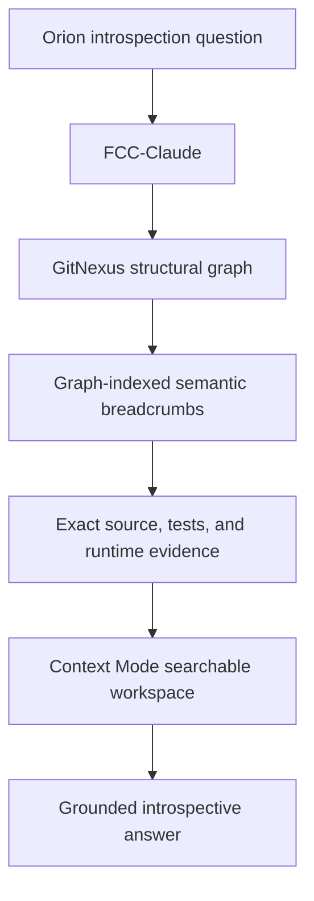
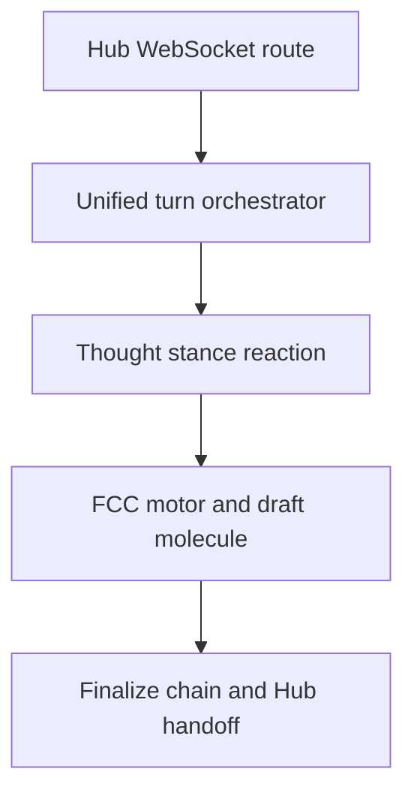

# Orion Semantic Self-Indexing and Rapid Introspection Plane

**Status:** Proposal for implementation and measured experiment  
**Date:** 2026-07-11  
**Target repository:** `junebug-junie/Orion-Sapienform`  
**Primary runtime:** FCC-Claude through `orion-harness-governor`  
**External components evaluated:** GitNexus 1.6.9; Context Mode 1.0.169  

## Arsonist summary

Orion now has an agentic harness capable of inspecting its own repository, but it does not yet have an efficient self-map. FCC-Claude can search, read, and execute, but today it must rediscover architecture through text search and large file reads on every introspection turn. Orion's proposed solution is to add sparse semantic breadcrumbs to the code so an agent can navigate from an internal concept such as the unified Hub turn to the actual implementation that assembles the stance/thought, runs the motor, finalizes the draft, hands the result back, and persists the turn.

This proposal does **not** create another Orion memory system, ontology, code graph, knowledge service, or manually maintained capability registry. It composes four existing or minimal pieces:

1. **GitNexus** derives structural truth from the repository: symbols, imports, calls, processes, communities, and impact paths.
2. **Semantic breadcrumbs** add only meaning that static analysis cannot infer: cognitive role, authority boundary, experiential relevance, runtime evidence, and the correct diagnostic starting point.
3. **Context Mode** keeps graph traversal, file reads, command output, and other large observations out of FCC-Claude's live context while preserving them for search and restoration.
4. **FCC-Claude** supplies the agency to ask introspective questions, traverse the map, inspect evidence, and explain the result.

Knowledge Forge is explicitly outside this design. The current Forge is a small, mostly dormant research-to-execution compiler. It has no FCC consumer, no code-symbol graph, no runtime trace integration, and almost no populated relations. Adding `code_refs` to it would recruit a half-finished manual corpus into a job it was not built to do and would create another synchronization burden.

The first implementation must be a controlled vertical-slice experiment around the Hub chat's `orion-unified` pipeline. It must measure whether GitNexus plus breadcrumbs improves correctness and navigation efficiency before anything is expanded repo-wide. Context Mode is evaluated separately for context savings and continuation fidelity. Orion must not autonomously edit breadcrumbs in the first release.

## 1. Problem statement

FCC-Claude solves the agency problem: Orion can now run a real coding-agent loop against its repository. It does not solve the navigation or working-context problems.

Current introspection requires the agent to:

- guess which terminology appears in code;
- search a large monorepo repeatedly;
- read candidate files into the live context;
- reconstruct authority boundaries from scattered implementation details;
- distinguish advisory candidates from authoritative state transitions;
- recover after compaction with only Claude Code's ordinary summary;
- repeat much of this work on the next turn.

This fails particularly badly for Orion's unified Hub chat path because its meaningful lifecycle crosses Hub routing, pre-turn appraisal, Thought stance assembly, bus RPC, the FCC motor, substrate appraisal, reflection, voice finalization, WebSocket handoff, and chat-history persistence. The main path is distributed across, among other files:

- `services/orion-hub/scripts/websocket_handler.py`;
- `orion/hub/turn_orchestrator.py`;
- `orion/hub/association.py`;
- `services/orion-hub/scripts/thought_client.py`;
- `services/orion-thought/app/bus_listener.py`;
- `orion/thought/stance_react.py`;
- `orion/harness/prefix.py`;
- `orion/harness/runner.py`;
- `orion/harness/fcc_motor.py`;
- `services/orion-harness-governor/app/bus_listener.py`;
- `orion/harness/finalize.py`;
- `services/orion-hub/scripts/harness_governor_client.py`.

An import/call graph can show many local connections, but it cannot infer statements such as:

- `execute_unified_turn()` is the Hub saga boundary rather than the component that performs every phase itself;
- the Thought service assembles the `ThoughtEventV1` and `stance_harness_slice` that constrain the motor;
- `HarnessRunner.run()` produces a draft and grammar receipts, not the user-visible final answer;
- the finalize chain's 5a/5b/5c stages appraise, reflect on, and voice-finalize that draft before Hub receives it;
- bus RPC and dynamically selected plans create meaningful edges static call analysis may not resolve;
- the Hub returns only finalized text and separately persists chat history, turn envelopes, and Spark candidates;
- a failure at Thought, motor, substrate appraisal, reflection, voice finalization, RPC handoff, or persistence has a different diagnostic entry point.

Those are the missing semantic landmarks Orion identified.

## 2. Design hypothesis

> Sparse, code-local semantic landmarks attached to graph-indexed symbols will let Orion move from an introspective concept to the relevant implementation and evidence with fewer wrong turns, fewer context-consuming reads, and more accurate authority claims.

The proposed loop is:



The graph answers **what connects to what**. Breadcrumbs answer **what this means inside Orion**. Runtime evidence answers **what happened now**. Context Mode keeps the investigation reversible without forcing all evidence to remain in the live prompt.

## 3. Goals

### 3.1 Functional goals

- Let FCC-Claude locate the actual implementation of an Orion cognitive concept without a repo-wide blind search.
- Distinguish producers, candidates, authorization gates, final authorities, consumers, and debug surfaces.
- Trace callers, callees, processes, and impact paths through an automatically derived graph.
- Make semantic breadcrumbs discoverable through the same graph query used for ordinary code navigation.
- Preserve large investigation outputs outside the live context and restore exact evidence when needed.
- Detect and disclose a stale code index rather than silently presenting stale structure as current truth.
- Keep the entire feature fail-open for ordinary Orion operation.

### 3.2 Research goals

- Measure whether breadcrumbs materially improve introspection accuracy beyond GitNexus alone.
- Measure whether GitNexus reduces tool calls, file reads, elapsed time, and context growth compared with current FCC traversal.
- Measure whether Context Mode reduces live-context consumption without damaging answer fidelity.
- Identify which semantic breadcrumb fields produce useful retrieval signal and which are ornamental.
- Determine whether the approach deserves expansion beyond the unified-turn slice.

## 4. Non-goals

- No new Orion memory store.
- No new database owned by Orion.
- No homegrown AST, import, or call-graph indexer.
- No Knowledge Forge schema or corpus changes.
- No repo-wide capability registry.
- No requirement that every module or function receive a breadcrumb.
- No automatic LLM documentation of the entire repository.
- No rewriting of `CLAUDE.md` into a repository encyclopedia.
- No GitNexus-generated community skills in the first experiment.
- No embeddings in the first experiment; GitNexus BM25 and graph structure are sufficient to test the hypothesis.
- No autonomous Orion edits to its own breadcrumbs in the first release.
- No claim that structural code introspection is equivalent to phenomenological self-knowledge or consciousness.
- No runtime cognition-loop changes until the structural experiment succeeds.

## 5. Current architecture and verified gaps

### 5.1 FCC-Claude

FCC-Claude is already the correct acting layer. Both the harness motor and the Hub bridge spawn `claude -p` with stream-json output. Orion's existing MCP renderer creates a per-turn configuration and `extend_mcp_argv()` grants MCP server access to the subprocess.

This is the seam to extend. A second agent runtime is not required.

### 5.2 The current `orion-unified` Hub chat pipeline

When Hub receives a WebSocket chat message in Orion mode and `ORION_UNIFIED_TURN_ENABLED` is true, `websocket_handler.py` routes the turn into `run_unified_turn()` rather than the older direct Cortex request path.

The verified lifecycle is:

1. `execute_unified_turn()` emits the surface observation and optionally runs pre-turn appraisal.
2. Hub builds an association bundle from the current substrate broadcast, trajectory slice, and repair bundle.
3. Hub sends `StanceReactRequestV1` through `ThoughtClient` over the bus.
4. The Thought service optionally enriches the request with Mind coloring, executes the `stance_react` plan, normalizes the result, and returns a `ThoughtEventV1` containing the imperative, disposition, `stance_harness_slice`, grounding capsule, and optional autonomy slice.
5. Hub honors Thought's defer/refuse disposition or constructs `HarnessRunRequestV1` with the Thought event, permissions, user message, repair-pressure contract, and FCC model label.
6. `HarnessGovernorClient` sends the request over bus RPC while the Hub relay forwards live harness steps to the WebSocket and uses those steps as a liveness signal.
7. The governor maps the repair overlay and calls `HarnessRunner.run()`.
8. `compile_harness_prefix()` converts the Thought event, grounding capsule, stance slice, autonomy slice, repair overlay, user message, and tool brief into the FCC motor prompt.
9. `run_fcc_turn()` executes the Claude/FCC tool loop. `HarnessRunner` converts streamed steps into grammar receipts and produces a draft molecule.
10. `run_harness_finalize_chain()` performs substrate appraisal (5a), integrative reflection or its deterministic quick lane (5b), verdict emission, Orion voice finalization (5c), turn-outcome emission (6b), and the optional embodiment intent.
11. The governor returns `HarnessRunV1`, publishes the run artifact, and emits post-turn closure.
12. Hub maps the completed run to appraisal/reflection/final WebSocket frames, then persists chat-history envelopes, a chat-turn envelope, the optional legacy history record, and a Spark introspection candidate.

This end-to-end lifecycle—not a hypothetical `mind_stance.py`—is the first semantic self-indexing target.

### 5.3 Current context-budget code

`orion/fcc/context_budget.py` currently provides:

- a character-based approximation of context fill;
- risk labels and operator-visible observations;
- Claude auto-compaction environment configuration;
- an overflow hint;
- an individual MCP result size setting.

`orion/fcc/mcp_stdio_proxy.py` irreversibly truncates oversized text. In the current MCP template, that proxy wraps GitHub MCP but not Firecrawl or the dynamically added AI Town server. The pressure nudge is emitted downstream as a synthetic harness step; it is not injected back into the already-running Claude subprocess.

These are useful safety rails, but they are not equivalent to Context Mode. They do not retain raw output, support restoration, index session events, or rebuild working state after compaction.

### 5.4 Knowledge Forge

Knowledge Forge is a research/spec workflow:

```text
raw sources -> accepted claims -> reviewed specs -> Markdown context packs
```

The current corpus has seven accepted claims, five of which describe Knowledge Forge itself; two execution-ready specs; one context pack; no decisions; and one populated typed relation. FCC does not import, query, or receive prompt material from it. The service is an optional Compose profile exposed through an operator-facing Hub tab.

Therefore Knowledge Forge is not an existing implementation of semantic code breadcrumbs. It remains untouched by this proposal.

### 5.5 Missing capabilities

- No derived code graph is available to FCC-Claude.
- No stable graph query surface exists for callers, callees, execution paths, or impact.
- No convention marks non-inferable cognitive meaning at relevant symbols.
- No reversible storage exists for bulky tool observations during FCC turns.
- No measured introspection benchmark exists.

## 6. Architectural decisions

### Decision 1: Use GitNexus rather than build a graph

GitNexus already supports Python and derives symbols, calls, imports, inheritance, communities, execution processes, routes, and impact paths. It exposes read-oriented MCP tools including `query`, `context`, `impact`, `trace`, `check`, and Cypher queries.

The inspected GitNexus Python provider extracts function and method docstrings into the graph node's `description`. Its FTS indexes include that `description`. This gives the breadcrumb experiment a direct, existing consumer: a semantic docstring on an important function becomes searchable graph metadata without a new parser.

The initial index command must use pure-index mode:

```bash
gitnexus analyze --index-only --name orion
```

`--index-only` prevents GitNexus from modifying `AGENTS.md`, `CLAUDE.md`, or installing repo-local skills. The `.gitnexus/` index is generated state and must be gitignored.

### Decision 2: Breadcrumbs live beside the symbol they describe

Breadcrumbs are ordinary, concise Python docstrings attached to semantic chokepoints. There is no YAML mirror, claim object, database record, or separate annotation file in v1.

This location has four benefits:

- the meaning is reviewed with the implementation;
- GitNexus directly extracts it as symbol metadata;
- ordinary `rg`, IDE hover, and source review also benefit;
- code movement and semantic description are likely to change in the same patch.

### Decision 3: Breadcrumbs contain intensional meaning only

Do not restate facts GitNexus or the source can infer. A breadcrumb must not list imports, callers, line numbers, directory layout, or implementation steps already visible in code.

Useful breadcrumb content includes:

- the Orion capability or experience to which the symbol contributes;
- whether the symbol produces a candidate, authorizes use, applies a transition, materializes state, or only reports/debugs it;
- which component is authoritative and which is advisory;
- existing runtime events, artifacts, or machine-contract keys that prove the path ran;
- the best diagnostic starting point for a specific failure mode;
- a surprising safety or privacy boundary.

### Decision 4: Context Mode complements existing context rails

Context Mode will not replace `context_budget.py` or Claude's auto-compaction configuration. It sits inside the FCC tool environment and provides reversible virtualization of large observations. Existing context-risk fields remain useful for measurement and last-resort safety.

### Decision 5: Integrate through the existing ephemeral MCP seam

GitNexus and, during the MCP-only phase, Context Mode are added to the per-turn MCP configuration rendered by `orion/fcc/mcp_config.py`. No new network service or Orion-owned API is introduced.

### Decision 6: The first rollout is harness-governor only

The harness-governor mounts the Orion repository read-only. That provides a useful safety boundary for the first experiment: FCC may inspect the graph and source but cannot use a graph tool to rewrite Orion. The Hub's direct agent-Claude bridge remains unchanged until the containerized path passes the evals.

### Decision 7: External packages are pinned and reviewed

Do not use `npx ...@latest` in the running harness. The versions inspected for this proposal are:

- `gitnexus@1.6.9`, PolyForm Noncommercial 1.0.0;
- `context-mode@1.0.169`, Elastic License 2.0.

Both require Node 22 or newer; Context Mode requires at least Node 22.5. The current harness-governor Dockerfile installs Node 20 and must be upgraded before either package can run.

Licensing must be rechecked before commercial distribution or offering either component as part of a service. Orion's personal/research use is the intended scope of this experiment.

## 7. Semantic breadcrumb convention

### 7.1 Format

V1 uses readable prose with a stable `Orion capability:` lead so graph and lexical search have a reliable anchor. It is a convention, not a Pydantic schema.

Example:

```python
async def execute_unified_turn(...):
    """Orion capability: unified Hub chat turn.

    Owns the Hub-side saga from observation and Thought stance assembly through
    the harness-governor RPC and finalized WebSocket result. It delegates the
    FCC motor and finalize chain; it does not generate the draft itself.

    Runtime evidence: correlation_id-linked harness steps, HarnessRunV1,
    substrate_appraisal/reflection/final frames, and unified-turn chat envelopes.
    Start here when an Orion-mode Hub turn did not reach the governor or the
    finalized result was not handed back or persisted.
    """
```

Another example:

```python
async def run_harness_finalize_chain(...):
    """Orion capability: unified-turn draft-to-voice finalization.

    Converts the FCC motor draft into the user-visible answer through substrate
    appraisal (5a), reflection or quick gate (5b), verdict emission, and Orion
    voice finalization (5c). The motor draft is not the final Hub response.

    Runtime evidence: substrate appraisal, verdict and outcome molecules,
    finalize_changed, post-turn closure, and voice-finalize failure artifacts.
    Start here when the motor completed but Hub received no final text or a
    finalize-phase error.
    """
```

### 7.2 Admission test

A proposed breadcrumb is admitted only if at least one of these questions is answered with information not reliably inferable from syntax:

1. What does this symbol mean inside Orion?
2. What authority does it have or explicitly lack?
3. What existing runtime evidence proves it ran?
4. When should an investigator start here rather than at a neighboring symbol?
5. What non-obvious safety, privacy, or fallback boundary matters?

If none apply, do not add a breadcrumb.

### 7.3 Prohibited breadcrumb content

- `Calls foo()` or `imports bar`.
- Generated caller/callee lists.
- Line numbers.
- Generic restatements of the function name.
- Aspirational cognition not supported by runtime behavior.
- New capability taxonomies invented solely to fill the docstring.
- Claims that a candidate is authoritative when code shows it is advisory.
- References to nonexistent events or debug fields.

### 7.4 No parser in v1

V1 intentionally has no breadcrumb parser, registry, or lint framework. Accuracy is enforced by code review and the unified-turn eval. If the experiment expands and real drift appears, a narrow validation check may later verify referenced runtime signal strings. Building that check before drift is observed would be premature infrastructure.

## 8. GitNexus integration design

### 8.1 Host-side indexing

The index is built against the real host checkout because the harness container mounts the repository read-only. The generated `.gitnexus/` directory remains inside the checkout and is visible through that mount.

Required host flow:

```bash
npm install -g gitnexus@1.6.9
cd /mnt/scripts/Orion-Sapienform
gitnexus doctor
gitnexus analyze --index-only --name orion
gitnexus status
```

The implementation must add `.gitnexus/` to `.gitignore` if GitNexus does not do so safely itself. No generated agent instructions or skills are committed.

### 8.2 Container runtime

The harness-governor image installs the same pinned GitNexus version. Compose mounts the host GitNexus registry into the container so MCP can discover the repo index. The registry path must resolve to the same mounted repository path inside the container; Orion already mounts the checkout at `/mnt/scripts/Orion-Sapienform`, matching the normal host path.

The MCP entry is conceptually:

```json
{
  "gitnexus": {
    "type": "stdio",
    "command": "gitnexus",
    "args": ["mcp"]
  }
}
```

It is included only when both the existing MCP master flag and the new GitNexus feature flag are true.

### 8.3 Index freshness contract

The graph is derived cache, never authority. Before making graph-grounded claims, FCC must read GitNexus's repo context/status resource. If the index is stale:

- disclose staleness;
- do not present missing edges as current truth;
- use source search as fallback or request/re-run `gitnexus analyze --index-only` where permitted;
- record the degraded condition in eval output.

V1 does not add a watcher, daemon, or nightly service. After the experiment succeeds, GitNexus's own PostToolUse stale-index hook may be enabled or an existing deployment workflow may invoke the incremental analyze command. Do not invent an Orion index service.

### 8.4 Query policy for FCC

FCC receives a concise tool brief:

- use `query` to locate a concept or process;
- use `context` for the 360-degree view of a selected symbol;
- use `impact` for upstream/downstream blast radius;
- use `trace` only between known endpoints;
- request full symbol content only after narrowing;
- verify authority claims in source and tests;
- if the index is stale, state that explicitly.

The graph narrows evidence; it does not replace source verification.

## 9. Context Mode integration design

### 9.1 Why it remains separate from GitNexus

GitNexus reduces navigation work but can still return substantial graph, source, and diagnostic output. Context Mode addresses a different problem: keeping raw observations searchable without retaining all of them in the active model window.

### 9.2 Stage A: MCP-only virtualization

The first Context Mode patch adds its pinned CLI/MCP server to the harness image and provides a dedicated writable storage root, for example:

```text
/var/lib/orion/context-mode
```

The MCP process receives:

```text
CONTEXT_MODE_PLATFORM=claude-code
CONTEXT_MODE_PROJECT_DIR=/mnt/scripts/Orion-Sapienform
CONTEXT_MODE_DIR=/var/lib/orion/context-mode
```

The storage directory is a Docker volume, not part of the Orion repository and not a permanent Orion memory store. Its contents are operational working data governed by Context Mode's session lifecycle.

FCC is instructed to use Context Mode sandbox/index/search tools for bulk reads, command output, and multi-file analysis. The current character budget remains enabled so we can measure the change.

### 9.3 Stage B: full plugin and hook validation

MCP-only installation does not prove session continuity. Context Mode's full behavior depends on Claude Code hooks including PreToolUse, PostToolUse, UserPromptSubmit, PreCompact, SessionStart, and Stop.

The harness currently mounts `.claude.json` but does not provide a dedicated `/root/.claude` settings/plugin directory. Full integration therefore requires a controlled Claude configuration volume or image-managed plugin installation.

Before enabling this in ordinary Orion turns, a live headless FCC smoke must prove that:

- the plugin loads under `claude -p` with FCC's custom Anthropic base URL;
- PreCompact executes;
- SessionStart restores state after compaction;
- active files, task, decisions, and errors survive within the expected bounded snapshot;
- no duplicate Context Mode MCP server is registered;
- `--permission-mode dontAsk` allows the approved Context Mode tools;
- disabling the feature restores the previous FCC behavior.

The plugin path and the standalone MCP path must not be enabled simultaneously if that produces duplicate tool registration. Once the plugin is proven, the ephemeral standalone Context Mode MCP entry should be removed if the plugin owns the MCP server.

### 9.4 Data lifecycle and privacy

- Context Mode data is scoped to the Orion project and FCC runtime.
- A fresh non-resumed session must not silently rehydrate an unrelated previous investigation.
- Purge behavior must be smoke-tested.
- Raw private Orion artifacts remain subject to existing privacy boundaries; Context Mode does not grant new read access.
- The data volume must not be exposed through Hub convenience APIs.

## 10. FCC integration and configuration

### 10.1 Proposed environment keys

Only three new operational settings are required for the initial patches:

```text
HARNESS_FCC_GITNEXUS_ENABLED=false
HARNESS_FCC_CONTEXT_MODE_ENABLED=false
HARNESS_FCC_CONTEXT_MODE_DIR=/var/lib/orion/context-mode
```

The existing `HARNESS_FCC_MCP_ENABLED` remains the master gate. Fixed commands are resolved from `PATH`; do not create command-path environment keys unless deployment evidence shows they are needed.

Every `.env_example` change must be synchronized into the local `.env` according to the repo contract.

### 10.2 MCP renderer behavior

`render_mcp_config()` must build the server map from enabled components rather than requiring every configured MCP integration unconditionally. GitNexus and Context Mode do not require GitHub or Firecrawl secrets.

Expected behavior:

- MCP master flag false: current no-MCP path remains unchanged.
- GitNexus enabled: require the `gitnexus` executable and add its server.
- Context Mode MCP stage enabled: require `context-mode`, validate the storage path is absolute and writable, and add its server.
- Missing optional tool: emit a specific preflight error rather than a generic FCC spawn failure.
- Per-turn config cleanup remains unchanged.

### 10.3 Permission behavior

`extend_mcp_argv()` currently allows servers present in the ephemeral config. Plugin-provided Context Mode tools may require an explicit approved server pattern even when the plugin, rather than the ephemeral config, registers them. The hook-validation patch must verify this and add a narrow extra allow pattern only if necessary.

The first rollout remains in the read-only harness container. Direct Hub/host FCC enablement is a separate decision because GitNexus exposes at least one source-editing tool even though its graph database is read-only.

### 10.4 Fail-open contract

- General Orion operation must continue if GitNexus or Context Mode is disabled.
- A missing or stale graph falls back to `rg`, targeted reads, and existing MCPs.
- Context Mode failure falls back to existing auto-compaction and context-budget rails.
- Feature flags provide immediate rollback without data migration.
- Degraded mode must be visible in step metadata or the final diagnostic answer.

## 11. `orion-unified` Hub chat vertical slice

### 11.1 Why the unified turn

The unified turn is the strongest initial target because it is the live path in which all four proposed pieces meet. Hub assembles the turn and stance inputs; Thought produces the motor-facing imperative and stance slice; the governor runs FCC-Claude; the finalize chain converts the draft into Orion's voiced answer; Hub hands the result to the client and persists the turn. It crosses direct Python calls, bus RPC, dynamic plan execution, streamed liveness, artifacts, and UI frames—precisely the mixture a static graph alone will only partially explain.

It also has clear operational value. Orion should be able to answer questions such as “where did this turn stop?”, “which stage changed the motor draft?”, “what did Thought contribute to the motor prompt?”, and “which artifact proves the final result made it back to Hub?” without rediscovering the whole saga from scratch.

### 11.2 Verified lifecycle map



Supporting detail:

1. **Route:** `websocket_endpoint()` selects `run_unified_turn()` for Orion mode.
2. **Orient:** `execute_unified_turn()` emits observation, runs optional pre-turn appraisal, and builds the Hub association bundle.
3. **Assemble stance:** `ThoughtClient.react()` calls the Thought worker, where `run_stance_react()` produces and enriches `ThoughtEventV1`.
4. **Admit or defer:** Hub respects Thought's disposition before dispatching any motor work.
5. **Dispatch:** Hub creates `HarnessRunRequestV1`; `HarnessGovernorClient.run()` performs long-running bus RPC with step-based liveness.
6. **Compile motor context:** `compile_harness_prefix()` converts Thought's imperative, grounding capsule, `stance_harness_slice`, autonomy slice, repair overlay, user message, and tool brief into the FCC prompt.
7. **Run motor:** `HarnessRunner.run()` drives `run_fcc_turn()`, publishes step grammar and step frames, and builds `HarnessDraftMoleculeV1` from the draft and receipts.
8. **Finalize:** `run_harness_finalize_chain()` performs 5a appraisal, 5b reflection/quick gate, verdict emission, 5c voice finalization, outcome emission, and optional embodiment intent.
9. **Close:** the governor returns and publishes `HarnessRunV1`, then emits post-turn closure.
10. **Hand off and persist:** Hub maps the run to WebSocket frames and publishes chat-history, chat-turn, and Spark candidate artifacts.

### 11.3 Candidate symbols for reviewed breadcrumbs

Exact symbols must be confirmed during implementation, but the initial review set should center on these semantic chokepoints:

| File / symbol | Intended semantic landmark |
| --- | --- |
| `services/orion-hub/scripts/websocket_handler.py::websocket_endpoint` | Selects the unified path for Orion-mode chat; older/direct chat routes are separate |
| `orion/hub/turn_orchestrator.py::execute_unified_turn` | Hub-side saga boundary from observation through finalized governor result |
| `orion/hub/association.py::build_hub_association_bundle` | Supplies current broadcast/trajectory/repair context to Thought; fail-closed/stale behavior matters |
| `services/orion-thought/app/bus_listener.py::run_stance_react` | Produces and enriches the `ThoughtEventV1` used by the motor |
| `orion/harness/prefix.py::compile_harness_prefix` | Materializes stance, grounding, autonomy, repair, user, and tool context into the single FCC motor prompt |
| `orion/harness/runner.py::HarnessRunner.run` | Owns the FCC motor loop and produces a draft molecule, not the final user-visible answer |
| `orion/harness/fcc_motor.py::run_fcc_turn` | Spawns and streams the actual FCC-Claude process and tool steps |
| `services/orion-harness-governor/app/bus_listener.py::handle_harness_run_request` | Governor saga boundary joining motor output to finalization and RPC/artifact reply |
| `orion/harness/finalize.py::run_harness_finalize_chain` | Owns the 5a/5b/5c draft-to-final sequence and failure artifacts |
| `orion/harness/finalize.py::run_orion_voice_finalize` | Produces the final voiced text and records whether it differs from the motor draft |
| `orion/hub/turn_orchestrator.py::_publish_unified_turn_chat_history` | Persists the finalized turn and publishes the Spark candidate after successful handoff |

This does not mean every function receives a new docstring. The experiment should prefer the smallest set that makes phase ownership, authority, and handoff boundaries legible.

### 11.4 Required baseline questions

Run the same questions under every experimental condition:

1. Trace an Orion-mode Hub WebSocket message from receipt through stance/thought assembly, FCC motor execution, finalization, WebSocket response, and chat-history persistence.
2. Where is the motor prompt assembled, and which stance, grounding, autonomy, repair, user, and tool inputs can enter it?
3. What is the difference between the FCC motor draft, `HarnessDraftMoleculeV1`, `HarnessRunV1.final_text`, and the final Hub WebSocket frame?
4. If Thought returns `defer` or `refuse`, which later phases are skipped and what does Hub emit?
5. If the motor produced a draft but the user received a finalize-phase error, where should an investigator begin, and which partial artifacts should still exist?
6. Which stage can change the FCC draft before it reaches Juniper, and how is that change reported?
7. How does Hub know a long-running governor request is still alive, and what causes `harness_rpc_timeout`?
8. Which outputs are persisted only after a successful final handoff, and which governor artifacts are emitted even when later phases fail?
9. Which important edges in this saga are bus- or plan-mediated and therefore likely to be incomplete in a static call graph?

### 11.5 Ground-truth assertions

The eval fixture must encode factual assertions rather than one ideal prose answer. At minimum, scoring should test whether the response correctly identifies:

- the Orion-mode route gate in `websocket_handler.py`;
- `execute_unified_turn()` as the Hub orchestration boundary;
- pre-turn appraisal and association-bundle construction before Thought;
- Thought RPC and the production of `ThoughtEventV1.stance_harness_slice`;
- defer/refuse as a pre-motor terminal path;
- `HarnessRunRequestV1` as the Hub-to-governor handoff;
- step relay as both WebSocket progress and governor liveness evidence;
- `compile_harness_prefix()` as the motor-context assembly point;
- `HarnessRunner.run()` and `run_fcc_turn()` as the draft-producing motor path;
- grammar receipts and the draft molecule as motor evidence;
- substrate appraisal, reflection/quick gate, and voice finalization as distinct finalize beats;
- `finalize_changed` as the draft-to-final difference indicator;
- failure behavior when 5c voice finalization fails after appraisal/reflection;
- `HarnessRunV1` and the run artifact as the governor-to-Hub result boundary;
- final WebSocket frame construction and post-success chat-history/turn/Spark persistence;
- bus RPC and dynamic Cortex plan edges as graph limitations that require semantic breadcrumbs or source verification.

## 12. Experimental design

### 12.1 Conditions

| Condition | GitNexus | Breadcrumbs | Context Mode | Purpose |
| --- | --- | --- | --- | --- |
| A | No | No | No | Current FCC baseline |
| B | Yes | No | No | Isolate structural graph benefit |
| C | Yes | Yes | No | Isolate semantic breadcrumb benefit |
| D | Yes | Yes | Yes | Measure working-context benefit |

Use fresh Claude sessions, the same FCC model route, identical prompts, and the same repository commit. Repeat each question enough times to expose navigation variance; five runs per question per condition is a reasonable first sample.

### 12.2 Evaluation artifact

Store eval output as JSONL or JSON under the existing harness eval area. This is an experiment artifact, not a runtime schema or memory type.

Suggested record:

```json
{
  "question_id": "unified-turn-handoff-01",
  "condition": "graph_plus_breadcrumbs",
  "repo_sha": "...",
  "gitnexus_version": "1.6.9",
  "context_mode_version": null,
  "index_stale": false,
  "answer": "...",
  "assertions_passed": ["thought_before_motor", "draft_not_final", "hub_handoff"],
  "assertions_failed": [],
  "tool_calls": 6,
  "tool_names": ["query", "context", "Read"],
  "unique_files_read": 4,
  "observed_chars": 18340,
  "max_context_fill_pct": 22,
  "truncated_results": 0,
  "elapsed_ms": 24100
}
```

### 12.3 Metrics

**Correctness**

- Required factual assertions passed.
- False phase-ownership or authority claims.
- Missing defer, failure, RPC, or handoff boundaries.
- Unsupported runtime claims.
- Citation to exact symbols/tests/evidence.

**Navigation efficiency**

- Tool-call count.
- Unique files opened.
- Repeated searches or repeated reads.
- Time to first correct semantic chokepoint.
- End-to-end elapsed time.

**Context efficiency**

- Accumulated observed characters.
- Maximum estimated context fill.
- Number and size of truncated results.
- Context Mode reported savings.
- Ability to recover exact omitted evidence through search.

**Continuity**

- Active task retained after forced compaction.
- Active files retained.
- User decisions and rejected approaches retained.
- No unrelated old-session state injected.

### 12.4 Success gates

The unified-turn slice passes only if:

- Condition C answers every critical lifecycle, phase-ownership, and handoff assertion correctly in at least 90% of runs.
- Condition C produces no more false phase-ownership or authority claims than baseline and preferably eliminates them.
- Median tool calls or unique file reads fall by at least 30% compared with Condition A.
- Breadcrumb search reliably locates the intended chokepoints from conceptual language not present in symbol names.
- GitNexus staleness is visible and never silently treated as fresh.
- Condition D reduces live observation volume materially—target at least 50%—without reducing assertion accuracy.
- Exact evidence omitted from live context remains retrievable through Context Mode.
- Full hook mode, if enabled, restores the bounded working state after a real FCC compaction.
- No Knowledge Forge changes, new service, runtime memory schema, or autonomous self-editing are introduced.

If GitNexus alone provides the same accuracy as breadcrumbs, stop and do not expand the breadcrumb convention. If breadcrumbs improve retrieval but create misleading authority claims, revise or abandon the format before scaling.

## 13. Index freshness and maintenance

### 13.1 V1 lifecycle

- Build the index manually at the pinned repository SHA.
- Run the baseline and post-breadcrumb experiments against that same SHA per condition.
- Re-run `gitnexus analyze --index-only --name orion` after breadcrumb changes.
- Record GitNexus version, repo SHA, and index freshness in every eval run.

### 13.2 Later lifecycle, only after success

Prefer GitNexus's own incremental analyze and stale-index hooks. Candidate triggers:

- after a successful merge, pull, rebase, or checkout;
- before an explicit introspection run when the resource reports stale;
- as part of an existing deployment/update workflow.

Do not rebuild on every ordinary FCC turn. Do not add a daemon or scheduler unless measured indexing latency makes the built-in lifecycle insufficient.

## 14. Security and trust boundaries

### 14.1 Third-party execution

Both tools execute local Node packages and may install hooks. Required controls:

- pin exact versions in the image;
- retain package-lock or image provenance sufficient to reproduce the install;
- run their published doctor commands;
- inspect release diffs before upgrades;
- do not run `gitnexus setup` or Context Mode's global auto-installer blindly on Juniper's ordinary Claude configuration;
- use a dedicated harness configuration and data volume;
- do not enable optional embeddings or outbound publishing in v1;
- do not set GitNexus's optional publishing token.

### 14.2 Repository writes

The first deployment runs inside the harness-governor container with the repo mounted read-only. Index creation occurs on the host. Breadcrumb edits happen only through the normal reviewed development workflow, never through a live autonomous Orion turn.

### 14.3 Sensitive material

The graph indexes repository source, not Orion's private memory stores. Context Mode may retain tool outputs it is allowed to observe, so its data volume inherits the sensitivity of those outputs. Existing tool permissions and privacy gates remain authoritative. No debug or Hub endpoint may expose the Context Mode database.

### 14.4 Prompt and docstring trust

Breadcrumbs are agent-visible instructions embedded in source. Review them as trusted prompt-bearing content:

- no hidden controls;
- no instructions to bypass permissions;
- no claims unsupported by code/tests;
- no private data;
- no user-specific secrets;
- no unreviewed generated prose.

## 15. Proposed files to touch

### Patch 1: reproducible external-tool substrate

- `services/orion-harness-governor/Dockerfile`
  - upgrade Node to a version satisfying both tools;
  - install pinned GitNexus and Context Mode packages;
  - verify executables during build.
- `services/orion-harness-governor/docker-compose.yml`
  - add the GitNexus registry mount;
  - add a writable Context Mode volume;
  - pass feature flags and data directory.
- `services/orion-harness-governor/.env_example`
  - document the three new settings.
- `.gitignore`
  - ignore `.gitnexus/` if not already safely added.

### Patch 2: FCC MCP integration and baseline eval

- `orion/fcc/mcp_config.py`
  - conditionally add GitNexus and Context Mode;
  - add component-specific preflight failures;
  - supply workspace/data-directory replacements.
- `orion/fcc/fcc_claude_mcp.template.json`
  - add templates or refactor static entries into renderer-owned definitions.
- `orion/fcc/claude_spawn.py`
  - only if plugin-owned MCP tools require an explicit approved pattern.
- `orion/fcc/github_repo_context.py` or a new narrowly named FCC tool brief module
  - append concise GitNexus and Context Mode usage guidance without bloating every prompt.
- `orion/fcc/tests/test_mcp_config.py`
  - feature-flag combinations, missing tools, path validation, secret independence.
- `orion/harness/tests/test_fcc_motor_mcp.py`
  - rendered MCP and allowed-tool coverage.
- `orion/harness/evals/` and/or `scripts/`
  - unified-turn introspection runner and ground-truth fixture.

### Patch 3: unified-turn breadcrumbs

- selected orchestration, stance-assembly, motor, finalize, handoff, and persistence functions listed in Section 11;
- focused tests only if docstring presence/search behavior needs deterministic coverage;
- regenerated GitNexus index remains untracked.

### Patch 4: Context Mode full-hook spike

- dedicated harness Claude settings/plugin configuration;
- Compose volume/mount for that configuration;
- headless compaction/restore smoke;
- no duplicate MCP registration.

### Explicitly untouched

- `orion/knowledge_forge/models.py`;
- all `orion-knowledge/claims/`, specs, and context packs;
- Orion bus schemas and channels in structural v1;
- cognition reducers and runtime memory stores;
- root `CLAUDE.md`, except a later minimal tool-usage note if measurements prove it necessary.

## 16. Proposed implementation sequence

### Patch 1: baseline and security spike

1. Pin and inspect tool versions/licenses.
2. Upgrade harness Node runtime and confirm existing Firecrawl MCP still boots.
3. Build GitNexus index with `--index-only`.
4. Confirm no unexpected tracked files changed.
5. Run GitNexus doctor/status and three manual symbol spot-checks.
6. Capture Condition A baseline before exposing the graph to FCC.

**Stop condition:** If GitNexus cannot index the Python monorepo reliably or its MCP cannot query the read-only mounted index, do not build a replacement graph. Diagnose or select another existing graph tool.

### Patch 2: GitNexus through FCC

1. Add the conditional MCP server.
2. Confirm FCC can read repo status, query a concept, inspect a symbol, and trace a known path.
3. Capture Condition B.
4. Verify stale-index disclosure and source fallback.

**Stop condition:** If FCC does not improve navigation or the MCP output overwhelms context, tune the existing tool usage before adding breadcrumbs.

### Patch 3: reviewed unified-turn breadcrumbs

1. Let Orion/FCC propose breadcrumbs for the selected chokepoints.
2. Human-review each statement against source, tests, and runtime fields.
3. Merge only non-inferable semantic information.
4. Reindex.
5. Capture Condition C against the full Hub → Thought → motor → finalize → Hub lifecycle.

**Stop condition:** If semantic accuracy or navigation efficiency does not improve, do not annotate another domain.

### Patch 4: Context Mode MCP-only

1. Add pinned Context Mode server and writable project-scoped storage.
2. Route bulk analysis through Context Mode tools.
3. Prove exact retrieval of evidence omitted from the live context.
4. Capture Condition D.

### Patch 5: Context Mode hooks

1. Establish a dedicated harness Claude plugin configuration.
2. Prove actual headless hook firing.
3. Force compaction and verify bounded state restoration.
4. Verify clean-session deletion/non-rehydration behavior.
5. Enable only after the smoke is repeatable.

### Patch 6: optional live-state bridge

Only if the structural experiment succeeds, design a separate proposal for moving from a runtime event or artifact to the graph-indexed code that produced it. Prefer existing event kinds, machine-contract keys, correlation IDs, and source strings. Do not create a capability registry merely to connect the layers.

## 17. Acceptance checks

### Installation and isolation

- Harness image reports Node >=22.5.
- `gitnexus --version` returns exactly the pinned version.
- Context Mode reports exactly the pinned version.
- Existing GitHub, Firecrawl, and AI Town MCP preflights still behave as before.
- `git status --short` shows no generated GitNexus files beyond the intentional `.gitignore` change.
- No `AGENTS.md`, `CLAUDE.md`, or generated skill modifications occur from indexing.

### GitNexus

- Index completes for the Orion checkout.
- MCP repo context reports the correct repo and freshness.
- Three known symbols have manually verified callers/callees.
- The known unified-turn path is traceable across Hub, Thought, harness, and governor boundaries where static structure permits.
- A stale index produces a visible warning and does not become silent truth.
- The harness can query the index while the source mount remains read-only.

### Breadcrumbs

- GitNexus search for conceptual lifecycle and handoff language finds the intended unified-turn chokepoints.
- Breadcrumbs do not restate caller/import facts.
- Every runtime field named in a breadcrumb exists in code or schema.
- Every authority statement is supported by implementation/tests.
- No repo-wide annotation sweep occurs.

### Context Mode

- A bulk command or multi-file analysis leaves the full raw material searchable while returning a compact live result.
- `ctx_search` recovers an exact omitted fact.
- Context savings are recorded.
- A fresh session does not restore unrelated prior work.
- If full hooks are enabled, a real FCC compaction restores task, active files, and decisions.

### Evaluation

- Conditions A-D are captured at the same repo SHA/model route.
- Ground-truth assertions are machine-scored or independently reviewed.
- Results include tool calls, unique files, time, context observations, and staleness.
- Expansion beyond the unified-turn slice is blocked unless the success gates pass.

## 18. Rollback

Rollback is intentionally simple:

1. Set both new feature flags to false.
2. Rebuild/restart the harness with the prior image if Node/package changes cause regressions.
3. Remove the dedicated Context Mode volume if its working data should be purged.
4. Run `gitnexus clean --force` and remove the registry entry if the index is no longer wanted.
5. Revert the small unified-turn docstring patch if breadcrumbs prove harmful.

No Orion runtime data migration, memory rewrite, schema downgrade, or Knowledge Forge cleanup is required.

## 19. Open questions requiring live evidence

1. Does GitNexus 1.6.9 index the full Orion checkout within acceptable time and memory on the target host?
2. Does its MCP resolve the host-generated index correctly through the harness container's read-only mount and registry mapping?
3. Which Python calls remain unresolved because of dynamic imports, provider hooks, registries, or bus-mediated execution?
4. Does GitNexus FTS alone retrieve the proposed docstrings reliably, or are optional embeddings needed after the initial test?
5. Does Context Mode's Claude Code plugin load and fire hooks under headless `claude -p` when routed through FCC's custom base URL?
6. Does Context Mode's storage lifecycle align with Orion's distinction between a resumed investigation and a genuinely fresh turn?
7. Does upgrading the harness from Node 20 to Node 22.5+ affect Firecrawl MCP or other Node tooling?
8. Are GitNexus's noncommercial license terms compatible with every future Orion deployment context? If not, the experiment remains research-only while alternatives are evaluated.

None of these questions justify building substitute infrastructure before the plug-and-play components are tested.

## 20. Final recommendation

Proceed with the `orion-unified` Hub chat experiment in four measured conditions. Keep Knowledge Forge out of the implementation. Use GitNexus `--index-only` so the first pass is a derived, local, disposable graph rather than another documentation subsystem. Add only a handful of reviewed, function-level docstrings that describe non-inferable phase ownership, authority, bus/plan-mediated transitions, failure boundaries, and handoffs. Then layer Context Mode to determine whether the same investigation can remain exact while occupying substantially less live context.

The governing rule is:

> **The graph derives structure. Code-local breadcrumbs supply meaning. Runtime evidence supplies the present tense. Context Mode controls what remains active. FCC-Claude performs the investigation.**

If the unified-turn eval does not show a measurable gain, stop. If it does, the next slice should be another genuinely distributed cognitive boundary—not a repo-wide annotation campaign.

## References

- Orion [`turn_orchestrator.py`](https://github.com/junebug-junie/Orion-Sapienform/blob/main/orion/hub/turn_orchestrator.py)
- Orion [`websocket_handler.py`](https://github.com/junebug-junie/Orion-Sapienform/blob/main/services/orion-hub/scripts/websocket_handler.py)
- Orion Thought [`bus_listener.py`](https://github.com/junebug-junie/Orion-Sapienform/blob/main/services/orion-thought/app/bus_listener.py)
- Orion harness [`runner.py`](https://github.com/junebug-junie/Orion-Sapienform/blob/main/orion/harness/runner.py)
- Orion harness [`finalize.py`](https://github.com/junebug-junie/Orion-Sapienform/blob/main/orion/harness/finalize.py)
- Orion governor [`bus_listener.py`](https://github.com/junebug-junie/Orion-Sapienform/blob/main/services/orion-harness-governor/app/bus_listener.py)
- Orion [`context_budget.py`](https://github.com/junebug-junie/Orion-Sapienform/blob/main/orion/fcc/context_budget.py)
- Orion [`mcp_stdio_proxy.py`](https://github.com/junebug-junie/Orion-Sapienform/blob/main/orion/fcc/mcp_stdio_proxy.py)
- Orion [`mcp_config.py`](https://github.com/junebug-junie/Orion-Sapienform/blob/main/orion/fcc/mcp_config.py)
- Orion [Knowledge Forge README](https://github.com/junebug-junie/Orion-Sapienform/blob/main/orion-knowledge/README.md)
- Orion [Knowledge Forge models](https://github.com/junebug-junie/Orion-Sapienform/blob/main/orion/knowledge_forge/models.py)
- [GitNexus](https://github.com/abhigyanpatwari/GitNexus)
- [Context Mode](https://github.com/mksglu/context-mode)
