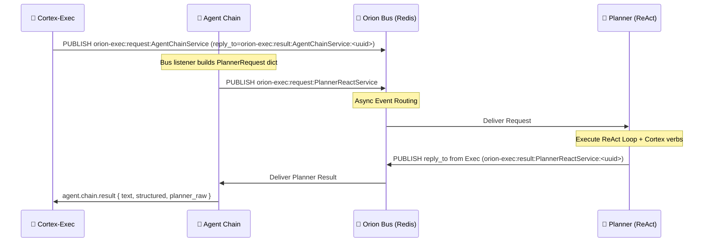

# 🔗 Orion Agent Chain Service
**Version:** 0.1.0  
**Stack:** Python 3.12 · FastAPI · Pydantic · Orion Bus (Redis)

---

## 📖 Overview
The **Agent Chain Service** is the lightweight orchestration gateway for the Orion cognitive stack.

Its primary job is to translate **Exec-triggered agentic requests** into the **asynchronous ReAct Planner workflow** that operates over the Orion Redis Bus. HTTP remains available for debugging, but the canonical entrypoint is the bus (`orion-exec:request:AgentChainService` with an Exec-provided `reply_to`).

### Bus Channels (defaults)

- **Intake:** `AGENT_CHAIN_REQUEST_CHANNEL=orion-exec:request:AgentChainService`
- **Replies:** Exec supplies `reply_to` (pattern: `orion-exec:result:AgentChainService:<uuid>`)
- **Planner RPC:** `PLANNER_REQUEST_CHANNEL=orion-exec:request:PlannerReactService`, `PLANNER_RESULT_PREFIX=orion-exec:result:PlannerReactService:<uuid>`

### Why this service exists
- **Simplification** – Clients (Hub/UI) send simple JSON (`text + tools/packs`) and don’t need to understand complex Planner envelopes.
- **Decoupling** – The UI avoids needing direct Redis access; Agent-Chain handles all routing.
- **Dynamic Tooling** – Tools (verbs) can be injected at runtime or resolved from packs without restarting any service.

---

## 🏗 Architecture
The service uses a **Bus‑Driven RPC pattern**, acting as a sync/await-style wrapper over a fully async event bus.



---

## ⚡ API Reference
### `POST /chain/run`
Executes a **single‑turn planning request** and returns the normalized agentic answer.

**Endpoint:**
```text
http://localhost:8092/chain/run
```

### Request Payload
| Field    | Type                | Description |
|----------|---------------------|-------------|
| `text`   | `string`            | **Required.** The user prompt/query for the agent. |
| `mode`   | `string`            | Cognitive mode (e.g. `chat`, `agentic`, `council`). Default: `chat`. |
| `messages` | `List[Message]`   | Optional prior conversation history (role/content) for context. |
| `goal_description` | `string`  | Optional explicit goal override; otherwise derived from `mode` + `text`. |
| `tools`  | `List[ToolDef]`     | Optional. Dynamically injected tools (full tool definitions from caller). |
| `packs`  | `List[string]`      | Optional. Names of cognition packs to resolve into tools (e.g. `executive_pack`). |

> **Note:** If `tools` is provided, it wins. Otherwise, tools are resolved from `packs` (or default packs).

### Dynamic Tool Injection Example
This defines a tool **on the fly** and asks the agent to use it.

```bash
curl -X POST http://localhost:8092/chain/run \
  -H "Content-Type: application/json" \
  -d '{
    "text": "Alice lives in Paris, works at Acme Corp, and her manager is Bob.",
    "mode": "single",
    "tools": [
      {
        "tool_id": "extract_facts",
        "description": "Extract structured subject/predicate/object facts from text.",
        "input_schema": {
          "type": "object",
          "properties": { "text": { "type": "string" } },
          "required": ["text"]
        },
        "output_schema": {
          "type": "object",
          "properties": {
            "facts": {
              "type": "array",
              "items": {"type": "object"}
            }
          }
        }
      }
    ]
  }'
```

### Response Example
```json
{
  "mode": "single",
  "text": "Alice lives in Paris and works at Acme Corp...",
  "structured": {
    "facts": [
      {
        "subject": "Alice",
        "predicate": "lives_in",
        "object": "Paris"
      },
      {
        "subject": "Alice",
        "predicate": "works_at",
        "object": "Acme Corp"
      }
    ]
  },
  "planner_raw": { "...full trace log...": true }
}
```

---

## 🧠 Packs & Verbs (Tool Resolution)
Agent-Chain can **derive tools automatically** from Orion's semantic layer.

- Packs live under `orion/cognition/packs/*.yaml` (e.g. `executive_pack`, `memory_pack`, `emergent_pack`).
- Verbs live under `orion/cognition/verbs/*.yaml` (e.g. `plan_action`, `introspect`, `extract_facts`).
- `ToolRegistry` bridges packs → verbs → `ToolDef` objects that Planner can see.

At runtime:
- You can pass `packs: ["executive_pack"]` and Agent-Chain will load the corresponding verbs (`triage`, `plan_action`, `assess_risk`, etc.) as tools.
- These tools, when selected by Planner, are executed via **Cortex Orchestrator** and **LLM Gateway**.

This is how **Agentic mode** in Hub turns real Orion verbs into **ReAct tools** without the UI knowing anything about the bus.

---

## ⚙️ Configuration
Configuration is supplied through **.env** and handled internally by `settings.py`.

| Variable | Default | Description |
|----------|---------|-------------|
| `SERVICE_NAME` | `agent-chain` | Service identity |
| `SERVICE_VERSION` | `0.1.0` | Version tag |
| `AGENT_CHAIN_PORT` | `8092` | HTTP API port |
| `ORION_BUS_ENABLED` | `true` | Master switch for Redis connectivity |
| `ORION_BUS_URL` | `redis://…` | Orion Bus connection URL |
| `PLANNER_REQUEST_CHANNEL` | `orion-exec:request:PlannerReactService` | Channel Planner listens on |
| `PLANNER_RESULT_PREFIX` | `orion-exec:result:PlannerReactService` | Result channel prefix |
| `AGENT_CHAIN_MAX_STEPS` | `6` | Safety limit for ReAct loops |
| `AGENT_CHAIN_TIMEOUT_SECONDS` | `90` | RPC timeout for Planner RPC |
| `AGENT_CHAIN_REQUEST_CHANNEL` | `orion-exec:request:AgentChainService` | Upstream bus channel Exec publishes to |
| `AGENT_CHAIN_RESULT_PREFIX` | `orion-exec:result:AgentChainService` | Upstream reply prefix for bus RPC |

---

## 🛠️ Development
### Running the Service
This service is managed by the top‑level `docker-compose`.

```bash
docker compose up -d --build --force-recreate agent-chain
```

### View Logs
```bash
docker logs -f orion-athena-agent-chain
```

---

## 📂 Code Structure
| File | Purpose |
|------|---------|
| `main.py` | FastAPI app entrypoint (startup + router mount) |
| `api.py` | Agent-Chain models + core logic + HTTP handler |
| `planner_rpc.py` | Implements Bus‑RPC request/response pattern to planner-react |
| `tool_registry.py` | Bridges Orion packs/verbs into `ToolDef` objects for Planner |
| `settings.py` | Pydantic settings loader for env config |
| `bus_listener.py` | Background thread that listens on `orion-exec:request:AgentChainService` and replies on `orion-exec:result:AgentChainService:<trace_id>` |

---

## 🩺 Troubleshooting
### **Planner timed out / 504‑style behavior**
If Agent-Chain logs show `Planner timed out: planner-react timed out`, usually it means:
- `orion-planner-react` is not running, or
- it cannot reach LLM Gateway / Cortex, or
- the request exceeded `AGENT_CHAIN_TIMEOUT_SECONDS`.

Check:
```bash
docker logs -f orion-athena-planner-react
```

### **ImportError / AttributeError**
Agent-Chain *must not import* models directly from other microservices.
Models should be **vendored (copied)** into this service so schemas remain stable even as other services evolve.

### **No tools / packs resolving**
If Agentic mode appears to do nothing special:
- Verify pack YAMLs exist under `orion/cognition/packs/`.
- Confirm `ToolRegistry` is pointed at the correct base dir (e.g. `/app/orion/cognition`).
- Confirm `packs` is being sent from Hub in Agentic mode.

---

## ✅ Summary
The **Orion Agent Chain Service** provides:
- synchronous HTTP → asynchronous Planner bridging
- dynamic tool orchestration via packs or explicit tools
- event‑bus isolation
- a uniform interface for Hub, CLI tools, and other Orion clients

It is small, but it’s the critical connective tissue that lets **Hub talk to ReAct + Cortex + real verbs** without ever touching the Redis bus directly.
