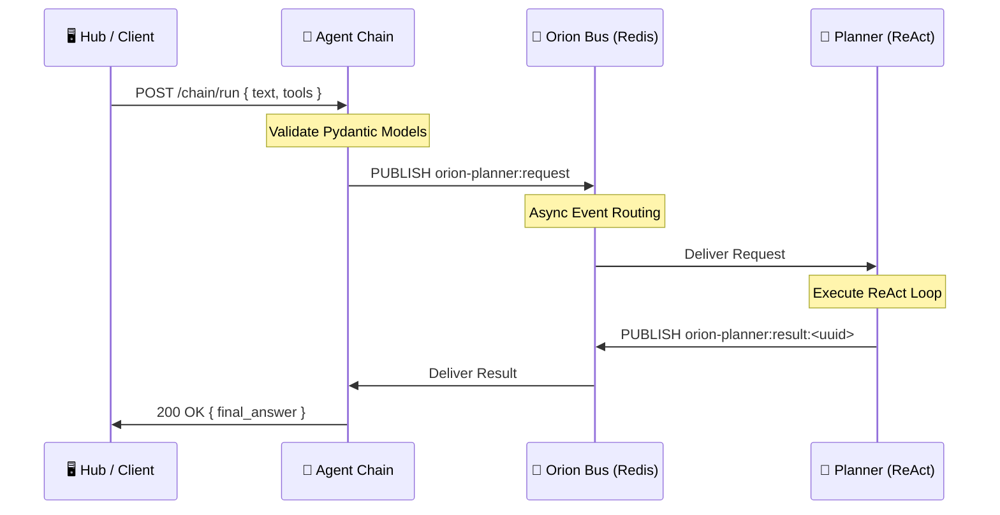

# 🔗 Orion Agent Chain Service
**Version:** 0.1.0  
**Stack:** Python 3.12 · FastAPI · Pydantic · Orion Bus (Redis)

---

## 📖 Overview
The **Agent Chain Service** is the lightweight orchestration gateway for the Orion cognitive stack.

Its primary job is to translate **simple HTTP client intents** into the **asynchronous ReAct Planner workflow** that operates over the Orion Redis Bus.

### Why this service exists
- **Simplification** – Clients (Hub/UI) send simple JSON (`text + tools`) and don’t need to understand complex Planner envelopes.
- **Decoupling** – The UI avoids needing direct Redis access; Agent-Chain handles all routing.
- **Dynamic Tooling** – Tools (verbs) can be injected at runtime without restarting any service.

---

## 🏗 Architecture
The service uses a **Bus‑Driven RPC pattern**, acting as a sync/await-style wrapper over a fully async event bus.



---

## ⚡ API Reference
### `POST /chain/run`
Executes a **single‑turn planning request**.

**Endpoint:**
```
http://localhost:8092/chain/run
```

### Request Payload
| Field | Type | Description |
|-------|--------|-------------|
| `text` | `string` | **Required.** The prompt/query for the agent. |
| `mode` | `string` | Cognitive mode (default: `chat`). |
| `tools` | `List[ToolDef]` | Optional. Dynamically injected tools. |

---

### Example – Dynamic Tool Injection
This defines a tool **on the fly** and asks the agent to use it.

```bash
curl -X POST http://localhost:8092/chain/run \
  -H "Content-Type: application/json" \
  -d '{
    "text": "Alice lives in Paris, works at Acme Corp, and her manager is Bob.",
    "mode": "single",
    "tools": [
      {
        "tool_id": "extract_facts",
        "description": "Extract structured subject/predicate/object facts from text.",
        "input_schema": {
          "type": "object",
          "properties": { "text": { "type": "string" } },
          "required": ["text"]
        }
      }
    ]
  }'
```

### Response Example
```json
{
  "mode": "single",
  "text": "Alice lives in Paris and works at Acme Corp...",
  "structured": {
    "Alice": ["lives in Paris", "works at Acme Corp"]
  },
  "planner_raw": { "...full trace log...": true }
}
```

---

## ⚙️ Configuration
Configuration is supplied through **.env** and handled internally by `settings.py`.

| Variable | Default | Description |
|----------|----------|-------------|
| `AGENT_CHAIN_PORT` | `8092` | HTTP API port |
| `ORION_BUS_ENABLED` | `true` | Master switch for Redis connectivity |
| `ORION_BUS_URL` | `redis://…` | Orion Bus connection URL |
| `PLANNER_REQUEST_CHANNEL` | `orion-planner:request` | Channel Planner listens on |
| `PLANNER_RESULT_PREFIX` | `orion-planner:result` | Result channel prefix |
| `AGENT_CHAIN_MAX_STEPS` | `6` | Safety limit for ReAct loops |
| `AGENT_CHAIN_TIMEOUT_SECONDS` | `90` | RPC timeout |

---

## 🛠️ Development
### Running the Service
This service is managed by the top‑level `docker-compose`.

```bash
docker compose up -d --build --force-recreate agent-chain
```

### View Logs
```bash
docker logs -f orion-athena-agent-chain
```

---

## 📂 Code Structure
| File | Purpose |
|------|---------|
| `api.py` | Main logic + vendored Planner models for isolation |
| `planner_rpc.py` | Implements Bus‑RPC request/response pattern |
| `settings.py` | Pydantic settings loader |
| `main.py` | FastAPI app entrypoint |

---

## 🩺 Troubleshooting
### **504 Gateway Timeout**
Usually means planner-react:
- isn’t running
- or its bus listener failed to start.

Check:
```bash
docker logs -f orion-athena-planner-react
```

### **ImportError / AttributeError**
Agent-Chain *must not import* models directly from other microservices.
Models should be **vendored (copied)** into this service so schemas remain stable.

### **422 Unprocessable Entity (missing goal)**
This means the request accidentally hit **planner-react** instead of **agent-chain**.
Check your port and path.

---

## ✅ Summary
The **Orion Agent Chain Service** provides:
- synchronous HTTP → asynchronous Planner bridging
- dynamic tool orchestration
- event‑bus isolation
- a uniform interface for Hub and other clients

It is the smallest but most critical connective tissue in the Orion cognitive mesh.
