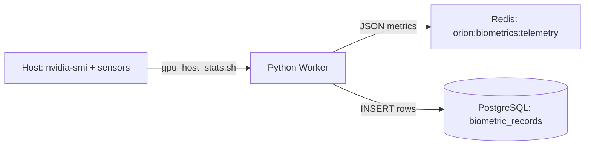

# 🧬 Orion Biometrics Service

**orion-biometrics** is the hardware telemetry agent for the Orion Sapienform mesh. It continuously monitors the host system’s vital signs—GPU and CPU—then publishes metrics to the **Orion Bus** (Redis) for real‑time dashboards and to **PostgreSQL** for historical analysis.

**Core purpose:** give orchestration services (e.g., Brain) live visibility into available compute so they can make smarter scheduling decisions.

---

## ⚙️ How It Works
A lightweight Python worker runs a continuous telemetry loop:

1. **Collection** – Triggers `gpu_host_stats.sh`, which queries `nvidia-smi` (GPU) and `sensors` (CPU/board).
2. **Parsing** – Converts the script’s CSV output into structured JSON.
3. **Publication**
   - **Live stream** → Redis channel **`orion:biometrics:telemetry`**
   - **Persistence** → Inserts records into PostgreSQL table **`biometric_records`**



---

## 🚀 Quick Start

### 1) Prerequisites
Because this service interfaces with GPUs:
- **NVIDIA Drivers** installed and working on the host (`nvidia-smi` must succeed).
- **NVIDIA Container Toolkit** installed so Docker containers can access the GPU.

### 2) Configure the Service
Create/update `.env` in `services/orion-biometrics/`:

```ini
SERVICE_NAME=biometrics
ORION_BUS_URL=redis://${PROJECT}-bus-core:6379/0
POSTGRES_URI=postgresql+psycopg2://postgres:postgres@${PROJECT}-sql-db:5432/conjourney
TELEMETRY_INTERVAL=30
# Optional overrides
# TELEMETRY_PUBLISH_CHANNEL=orion:biometrics:telemetry
# TABLE_NAME=biometric_records
# LOG_LEVEL=INFO
```

### 3) Launch
From the project root:

```bash
docker compose \
  --env-file .env \
  --env-file services/orion-biometrics/.env \
  -f services/orion-biometrics/docker-compose.yml \
  up -d --build
```

---

## 🔧 Configuration Variables

| Variable | Description | Default |
|---|---|---|
| `TELEMETRY_INTERVAL` | Seconds between collection cycles | `30` |
| `TELEMETRY_PUBLISH_CHANNEL` | Redis channel for live stream | `orion:biometrics:telemetry` |
| `TABLE_NAME` | PostgreSQL table for historical rows | `biometric_records` |
| `LOG_LEVEL` | Logging verbosity (`DEBUG`\|`INFO`\|`WARNING`\|`ERROR`) | `INFO` |
| `SERVICE_NAME` | Service identifier | `biometrics` |
| `ORION_BUS_URL` | Redis connection string | — |
| `POSTGRES_URI` | PostgreSQL SQLAlchemy URI | — |

> **Note:** `ORION_BUS_URL` and `POSTGRES_URI` are typically templated using your `PROJECT` namespace (e.g., `orion-athena`).

---

## 🛑 Troubleshooting GPU Access
If you see **`Failed to initialize NVML: Unknown Error`**, the container can’t access the host NVIDIA driver.

### Solution 1: Compose GPU reservation
Ensure `services/orion-biometrics/docker-compose.yml` reserves GPU resources (note the **utility** capability for `nvidia-smi`):

```yaml
deploy:
  resources:
    reservations:
      devices:
        - driver: nvidia
          count: all
          capabilities: [gpu, utility]
```

### Solution 2: Verify host drivers
Run on the **host** (outside Docker):

```bash
nvidia-smi
```

If this fails, fix drivers before retrying the container.

### Solution 3: Force recreate
After changing Compose hardware reservations, recreate:

```bash
docker compose -f services/orion-biometrics/docker-compose.yml up -d --force-recreate
```

---

## 🧭 Observability
Follow logs in real time:

```bash
docker compose logs -f orion-biometrics
```

Dashboards can subscribe directly to **`orion:biometrics:telemetry`** for live charts.

---

## 📂 Key Files
- `services/orion-biometrics/app/biometrics.py` — Worker loop and publishing logic
- `services/orion-biometrics/scripts/gpu_host_stats.sh` — Shell collector for GPU/CPU sensors
- `services/orion-biometrics/app/bus.py` — Redis client wrapper
- `services/orion-biometrics/app/db.py` — PostgreSQL insert helpers
- `services/orion-biometrics/docker-compose.yml` — Runtime definition & GPU reservation

---

## ✅ Tips
- Keep `TELEMETRY_INTERVAL` ≥ 5–10s to avoid unnecessary bus load.
- Ensure `sensors` (lm-sensors) is configured on the host so CPU temps populate.
- For multi‑GPU hosts, confirm that `nvidia-smi --query-gpu=name,index,utilization.gpu` exposes per‑GPU rows the parser expects.
