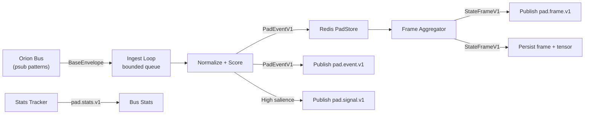
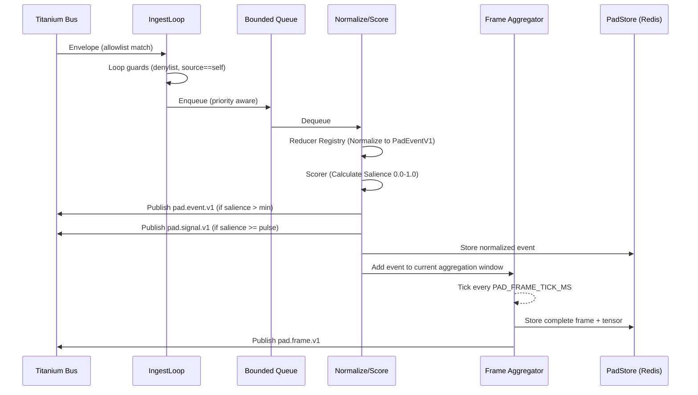

# 🛰️ Orion Landing Pad

The Landing Pad acts as the **high-speed sensory gateway and ephemeral working memory** for the Orion cognitive architecture. Functionally, it serves as the system's **Reticular Activating System (RAS)**—the biological filter that decides which sensory inputs are important enough to reach the conscious mind.

It sits at the very edge of the system, acting as a crucial buffer between the chaotic, high-volume world of raw telemetry (thousands of events per second) and the slower, more deliberative cognitive processes of the *brain* (cortex). Without the Landing Pad, the cognitive agents would be overwhelmed by noise.

---

## 🌟 Primary Responsibilities

### Sense-Making (Ingest & Normalize)
Consuming raw streams of heterogeneous data—ranging from server biometrics and system logs to cognitive thought traces—and normalizing them into a coherent, unified format (`PadEventV1`).

### Attention Filtering (Salience)
Assigning an importance score (`0.0` to `1.0`) to every event. It filters out noise (boring logs) and highlights signals (anomalies, user inputs), ensuring downstream agents focus only on what matters.

### Temporal Binding (Framing)
Bundling significant moments into time-based **Frames** (the *Specious Present*). This converts a continuous stream of data into discrete “moments” that the AI can reason about.

### Short-Term Memory
Providing a *live*, rolling view of the system’s current context. It answers the question:

> **“What is happening right now?”**

---

## ⚡ Quick Start

### 1. Configure Environment

Create your environment file by copying the example.  
The default settings are pre-tuned for a standard local development environment using Docker.

```bash
cp .env_example .env
# Edit .env if needed (e.g., if running Redis on a non-standard port or host)
```

### 2. Launch Service

Start the service using Docker Compose.  
This will build the container and attach it to the `orion_network`.

```bash
docker compose up --build -d
```

### 3. Verify Health

Ensure the service is up, running, and successfully connected to the Orion Bus (Redis).

```bash
curl http://localhost:8370/health
```

Expected output:

```json
{
  "status": "ok",
  "uptime": 12.5,
  "redis_connected": true,
  "stats": { "ingested": 150, "dropped": 0 }
}
```

---

## 🔍 Core Capabilities

The Landing Pad is designed around **four critical stages of processing**:

### 1. Ingest & Normalize (The Universal Translator)

The service subscribes to high-volume Redis channels (configured via `PAD_INPUT_ALLOWLIST_PATTERNS`, typically `orion:telemetry:*` and `orion:cortex:*`). This stream contains heterogeneous data types—JSON logs from Python services, binary sensor readings, and text traces from LLMs.

The Landing Pad uses a registry of **Reducers** to transform these diverse payloads into a single, strict, type-safe schema: **`PadEventV1`**.

This decoupling is vital: it ensures that downstream consumers (like the Dream module or Executive Function) never have to parse raw, messy data or know the implementation details of a sensor.

### 2. Salience Scoring & Attention Filtering

In a cognitive system, attention is a scarce resource. You cannot process every fan speed change or debug log with a Large Language Model. Every normalized event passes through a configurable **Scorer**, which assigns a scalar importance value (`0.0` to `1.0`) based on event type, novelty, and content.

- **Noise (< 0.05):** Low-value events are discarded immediately. This “sensory gating” preserves bandwidth and cognitive load.
- **Normal Context (0.05 – 0.8):** Standard events are aggregated into state frames. They provide the “background texture” of the current moment (e.g., “System load is nominal”, “User is present”).
- **Critical Interrupts (> 0.8):** High-salience events trigger an immediate “Pulse” signal (`orion.pad.signal.v1`). This bypasses the standard aggregation loop to interrupt the cognitive cycle for urgent reactions (e.g., “System Overheating”, “User Yelling”, “Security Breach”).

### 3. Temporal Aggregation (State Frames)

Cognition requires a sense of time. Instead of feeding agents a continuous, unmanageable stream of events, the Landing Pad bundles events into discrete windows called **State Frames** (default: 5 seconds, configurable via `PAD_FRAME_TICK_MS`).

Each frame represents a specific “moment” in time, containing all salient events, summary statistics, and active system states during that window. This allows the AI to reason about “the last 5 seconds” as a single unit of experience, rather than a blurred stream of data points.

### 4. Semantic Encoding (TensorBlob)

For every generated frame, the Landing Pad calculates a **TensorBlob**. Currently implemented as a lightweight hash projection, this is a vector representation of the state frame.

This vector allows the frame to be embedded in vector databases, enabling the system to mathematically compare the current moment against past memories. This is how Orion implements **Associative Recall**: “Have I felt this way before?” or “This pattern of high CPU + User Silence matches the crash from last Tuesday.”

### 5. Debug RPC Interface

To support introspection, the service exposes a Remote Procedure Call (RPC) endpoint (`orion.pad.rpc.request.v1`) on the message bus. This allows other internal services to programmatically query the working memory—asking for the latest frame, specific high-salience events, or the current tensor state—without needing direct database access.

---

## 🛠️ Debug APIs

The service exposes a lightweight HTTP server on port **8370** meant for manual inspection, dashboarding, and debugging during development.

| Method | Endpoint | Description |
|---|---|---|
| GET | `/health` | Returns service status, uptime, and connectivity checks for Redis/Bus. |
| GET | `/frame/latest` | Returns the JSON of the most recently completed 5-second State Frame. |
| GET | `/frames?limit=10` | Returns a list of historical frames. Useful for visualizing how the state has evolved over the last minute. |
| GET | `/events/salient?limit=20` | Returns the last 20 events that exceeded the salience threshold. Helpful for tuning your scorers. |
| GET | `/tensor/latest` | Returns the vector representation of the current state, useful for debugging embedding logic. |

### Example Usage

Get the latest “Moment”:

```bash
curl -s http://localhost:8370/frame/latest | jq
```

Output preview:

```json
{
  "frame_id": "frame-1704500005",
  "ts_ms": 1704500005000,
  "summary": {
    "top_signals": ["high_cpu_load", "user_voice_detected"],
    "active_tasks": ["chat_response"]
  },
  "salient_event_ids": ["evt-123", "evt-456"]
}
```

Check for high-priority events:

```bash
curl -s "http://localhost:8370/events/salient?limit=5" | jq
```

---

## 📚 Documentation

- **Guide:** Consult the comprehensive guide if you need to:
  - Add support for a new data source by creating a custom Reducer.
  - Customize the AI’s attention mechanism by modifying the Scorer logic.
  - Deeply understand the internal pipeline architecture.

- **Contracts:** See `orion/schemas/pad/v1.py` for the authoritative Pydantic models used for validation across the system.

---

## 📐 Architecture Flow

### High-Level Data Flow

Data flows from left to right: Raw signals enter from the bus, get normalized and scored, stored in a short-term Redis buffer, aggregated into frames, and finally published back to the bus as high-level cognitive objects.



### Processing Sequence

The sequence diagram below illustrates the lifecycle of a single message as it traverses the Landing Pad’s internal pipeline.


