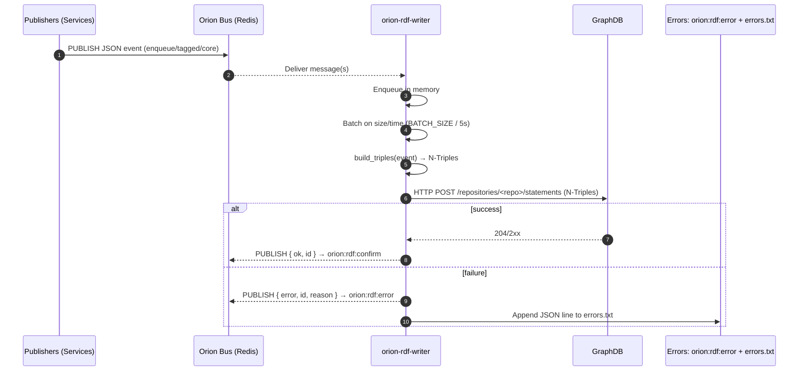

# 🧩 Orion RDF Writer Service

**orion-rdf-writer** is a microservice that bridges the **Orion Bus** (Redis Pub/Sub) and an **Ontotext GraphDB** repository. It listens for JSON events, transforms them into RDF **N-Triples**, and persists them to a target repository. It’s built for resilience: in‑memory queueing, batch processing, retries, and structured error reporting.

---

## 🧠 TL;DR
- Subscribe to Redis channels → enqueue events → batch → transform with `build_triples()` → POST N‑Triples to GraphDB.
- On failure: publish a structured error to `orion:rdf:error` **and** append a durable JSON line to `errors.txt`.

---

## 🏗 Architecture & Data Flow
Event-driven pipeline with batching and backoff.



> **Transformation rule**: An event is eligible if it contains **`mentions`** or **`relatesTo`** lists (strings). The `build_triples()` function maps these into N‑Triples. Invalid events produce no triples and are reported.

---

## ⚙️ Configuration
Environment-driven (commonly via `.env`).

### GraphDB
| Variable        | Default              | Description                                     |
|-----------------|----------------------|-------------------------------------------------|
| `GRAPHDB_URL`   | `http://graphdb:7200`| Base URL for GraphDB                            |
| `GRAPHDB_REPO`  | `collapse`           | Target repository name                          |
| `GRAPHDB_USER`  | _(none)_             | Username (optional)                             |
| `GRAPHDB_PASS`  | _(none)_             | Password (optional)                             |

### Redis (Orion Bus)
| Variable                 | Default                 | Description                                        |
|--------------------------|-------------------------|----------------------------------------------------|
| `ORION_BUS_URL`          | `redis://orion-redis:6379/0` | Redis connection URL                           |
| `CHANNEL_EVENTS_TAGGED`  | `orion:events:tagged`   | Source of tagged events                            |
| `CHANNEL_RDF_ENQUEUE`    | `orion:rdf:enqueue`     | Primary channel for direct RDF enqueue requests     |
| `CHANNEL_CORE_EVENTS`    | `orion:core:events`     | Core system events that may include RDF targets     |
| `CHANNEL_RDF_CONFIRM`    | `orion:rdf:confirm`     | Success confirmations                              |
| `CHANNEL_RDF_ERROR`      | `orion:rdf:error`       | Processing failures                                 |

### Service Behavior
| Variable       | Default            | Description                                                     |
|----------------|--------------------|-----------------------------------------------------------------|
| `SERVICE_NAME` | `orion-rdf-writer` | Service identifier                                              |
| `LOG_LEVEL`    | `INFO`             | `DEBUG` \| `INFO` \| `WARNING` \| `ERROR`                     |
| `BATCH_SIZE`   | `10`               | Items per batch before flush (also flushes every **5s**)        |
| `RETRY_LIMIT`  | `3`                | Max retry attempts to POST to GraphDB                           |
| `RETRY_INTERVAL` | `2`             | Seconds between retries                                         |

---

## 🚀 Running
Designed for Docker / Docker Compose.

**Build**
```bash
docker-compose build orion-rdf-writer
```

**Run (detached)**
```bash
docker-compose up -d orion-rdf-writer
```

**Follow logs**
```bash
docker-compose logs -f orion-rdf-writer
```

---

## 🧪 Usage & Testing
Publish test events to a subscribed channel using `redis-cli` from the Redis container.

**Valid message** (contains `mentions` and/or `relatesTo`):
```bash
# Replace container name with your Redis service/container
docker exec orion-bus-orion-redis-1 \
  redis-cli PUBLISH orion:rdf:enqueue \
  '{"id":"event-xyz-789","mentions":["entity-A","entity-B"],"relatesTo":["topic-X"]}'
```
**Expected**: Service logs a ✅ insertion and publishes a confirmation to `orion:rdf:confirm`. Triples appear in GraphDB.

**Invalid message** (missing required keys):
```bash
docker exec orion-bus-orion-redis-1 \
  redis-cli PUBLISH orion:rdf:enqueue \
  '{"id":"bad-event-123","some_other_data":"value"}'
```
**Expected**: Service warns `No triples generated for event`, publishes a structured error to `orion:rdf:error`, and appends to `errors.txt`.

---

## 🧯 Error Handling & Observability
Two durable paths on failure:

1. **Redis error channel** — `orion:rdf:error`
   - Emits structured JSON for real-time monitoring by other services.
2. **Persistent log file** — JSON Lines at `/mnt/storage/rdf_logs/errors.txt`
   - Mounted via Docker volume; durable across restarts.

**Example error entry**
```json
{
  "timestamp": "2025-10-06T00:30:00.123Z",
  "service": "orion-rdf-writer",
  "error": "No triples generated for event bad-event-123. Check event structure.",
  "failed_event": { "id": "bad-event-123", "some_other_data": "value" }
}
```

**What to check**
- GraphDB reachable: `GRAPHDB_URL`, repo exists, credentials valid.
- Bus connectivity: `ORION_BUS_URL` resolves; channels match producer expectations.
- Batch flushes: increase `LOG_LEVEL=DEBUG` to see batch timings and sizes.
- Retries: confirm backoff via logs when GraphDB is temporarily unavailable.

---

## 📂 Key Files
- `app/main.py` — Service entrypoint / worker loop & subscriptions.
- `app/build_triples.py` — Transformation rules → N‑Triples.
- `app/bus.py` — Redis client wrapper and channel definitions.
- `docker-compose.yml` — Volumes, env, and dependencies.

---

## 📦 Example `.env`
```ini
SERVICE_NAME=orion-rdf-writer
LOG_LEVEL=INFO

# Redis / Bus
ORION_BUS_URL=redis://orion-redis:6379/0
CHANNEL_EVENTS_TAGGED=orion:events:tagged
CHANNEL_RDF_ENQUEUE=orion:rdf:enqueue
CHANNEL_CORE_EVENTS=orion:core:events
CHANNEL_RDF_CONFIRM=orion:rdf:confirm
CHANNEL_RDF_ERROR=orion:rdf:error

# GraphDB
GRAPHDB_URL=http://graphdb:7200
GRAPHDB_REPO=collapse
# GRAPHDB_USER=
# GRAPHDB_PASS=

# Behavior
BATCH_SIZE=10
RETRY_LIMIT=3
RETRY_INTERVAL=2
```

---

## ✅ Tips
- Keep `BATCH_SIZE` modest in low‑traffic environments to reduce latency; rely on the 5s flush for trickle traffic.
- Prefer **explicit channels** in producers so the writer can be selectively scaled.
- Consider enabling **basic health probes** (e.g., a `/health` HTTP endpoint if you add a tiny web server) for Compose/K8s readiness.
