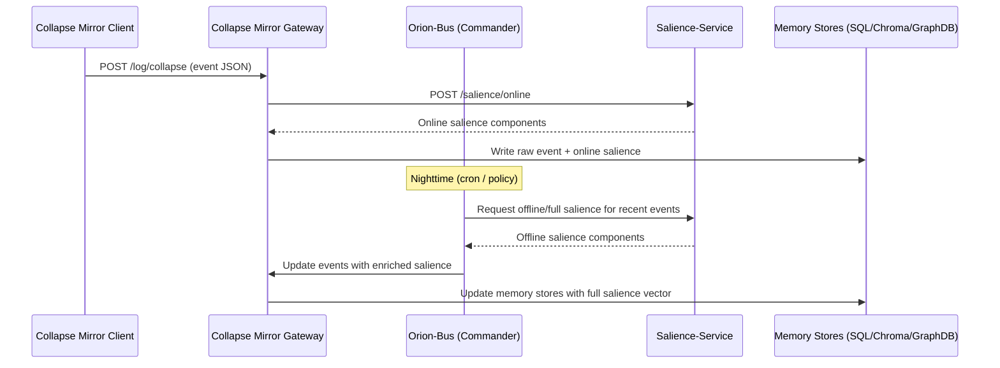

# 🌌 Orion Salience Service

The **Orion Salience Service** computes **multi-dimensional salience vectors** for Collapse Mirror events.  
It separates **daytime (online)** fast scoring from **nighttime (offline)** deep scoring, giving Orion a circadian rhythm for memory consolidation.

---

## ✨ Features

- **Online salience (`/salience/online`)**
  - Fast, cheap scoring (emotion, entity density, ritual boost).
  - Used in the hot ingest path — keeps Orion responsive.

- **Offline salience (`/salience/offline`)**
  - Heavy scoring (compression, graph centrality, embedding density, prediction error).
  - Runs at night to deepen memories.

- **Full salience (`/salience/full`)**
  - Combines both tiers in one response.

- **Cron job (night cycle)**
  - Triggers every night at `02:00 UTC`.
  - Runs offline worker in `full` mode, rescoring events.
  - Records results + last run timestamp.

- **Health endpoints**
  - `/health` → API status
  - `/health/cron` → last dream cycle (timestamp, mode, number of events processed)

---

## 🧭 Architecture



---

## 📂 Folder Layout

```
orion-salience/
├── Dockerfile
├── requirements.txt
├── service.py
├── offline_worker.py
├── crontab.txt
├── Makefile
└── docker-compose.yml
```

---

## 🚀 Usage

### Build & Run
```bash
docker compose up -d --build
```

### Health Check
```bash
make health
```

### Check Dream Cycle (last cron run)
```bash
make check-dream
```

### Trigger Dream Cycle Manually
```bash
make dream-now
```

---

## 🌞 Day vs 🌙 Night Policy

- **Daytime (online path):**
  - Gateway → `/salience/online`
  - Writes raw event + baseline salience immediately
- **Nighttime (offline path):**
  - Cron triggers `offline_worker.py full` at 2AM UTC
  - Enriched salience vectors computed
  - Orion-Bus (future) will push enriched scores back to Gateway → memory stores
