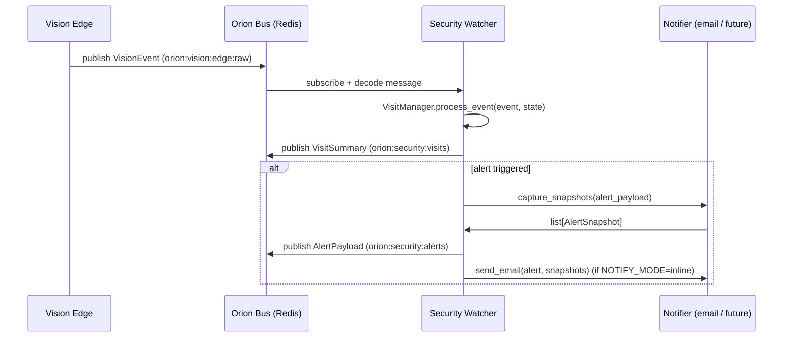

# 🛡 Orion Security Watcher

`orion-security-watcher` is a small, bus-native service that listens to **vision events** from `orion-vision-edge` and decides when something is security-relevant enough to:

- Record a **visit** (a contiguous window of humans present).
- Raise an **alert** (armed + human-ish detection + passes rate-limit).
- Capture **snapshots** and optionally send an **email** (v1 inline SMTP).

This is the piece that turns raw pixels into: _"Hey Juniper, someone is in the office right now."_

---

## Architecture

High-level flow (v1):



Key components:

- **Bus worker**
  - Subscribes to `VISION_EVENTS_SUBSCRIBE_RAW` (default `orion:vision:edge:raw`).
  - **Important:** messages may arrive as `dict`, JSON `str`, or JSON `bytes` depending on `OrionBus` decode behavior. The watcher normalizes these to a `dict` before parsing.
  - Parses messages into `VisionEvent` models.
  - Passes them to `VisitManager` along with current `SecurityState`.

- **SecurityStateStore**
  - Reads/writes current **armed state** and **mode** to disk (JSON file).
  - Keeps arming persistent across restarts.

- **VisitManager**
  - Noise resistance via gating + streak:
    - bbox area thresholds (`SECURITY_MIN_FACE_AREA`, `SECURITY_MIN_PERSON_AREA`)
    - score thresholds (`SECURITY_MIN_YOLO_SCORE`)
    - streak debounce (`SECURITY_MIN_HUMAN_STREAK`, `SECURITY_STREAK_MAX_FRAME_GAP`)
  - Applies rate limiting:
    - global cooldown (`SECURITY_GLOBAL_COOLDOWN_SEC`)
    - identity cooldown stub (`SECURITY_IDENTITY_COOLDOWN_SEC`, future)

- **Notifier**
  - Captures JPEG snapshots from `VISION_SNAPSHOT_URL` when an alert triggers.
  - Writes them to `SECURITY_SNAPSHOT_DIR`.
  - Sends email inline (SMTP) when `NOTIFY_MODE=inline`.
  - **Credential safety:** URLs are **redacted** (`user:pass@` removed) before logging/email.
  - Optionally includes a safe link `VISION_SNAPSHOT_PUBLIC_URL` in emails (recommended: credential-free).

- **UI + REST API**
  - `/` – simple status + arm/disarm UI (served over Tailscale).
  - `/security/state` – get/set armed + mode.
  - `/security/test-alert` – synthetic alert to validate snapshot+email pipeline.
  - `/debug/simulate-person` – synthetic YOLO person to test gating/streak (optionally email with `send=1`).

---

## Bus Channels

### Subscribe

- `VISION_EVENTS_SUBSCRIBE_RAW`
  - Default: `orion:vision:edge:raw`
  - Type: `VisionEvent` (raw vision events from edge)

### Publish

- `CHANNEL_SECURITY_VISITS`
  - Default: `orion:security:visits`
  - Payload: `VisitSummary`

- `CHANNEL_SECURITY_ALERTS`
  - Default: `orion:security:alerts`
  - Payload: `AlertPayload`

These channels are for downstream consumers like:

- a future **security dashboard**
- a Cortex verb ingesting events into memory/chronicle
- external notification relays

---

## Models (actual v1)

### SecurityState

```python
class SecurityState(BaseModel):
    armed: bool = False
    mode: str = "vacation_strict"  # or "off"
    updated_at: datetime | None = None
    updated_by: str | None = None
```

### VisionEvent (input)

```python
class VisionEvent(BaseModel):
    ts: datetime
    stream_id: str
    frame_index: int | None = None
    detections: list[Detection]
    note: str | None = None
    meta: dict[str, Any] = {}

class Detection(BaseModel):
    kind: str               # "face", "presence", "yolo", ...
    bbox: tuple[int,int,int,int]  # [x, y, w, h]
    score: float = 1.0
    label: str | None = None      # e.g. "person" for YOLO
    track_id: str|int|None = None
    meta: dict[str, Any] = {}
```

### VisitSummary (v1)

```python
class VisitSummary(BaseModel):
    visit_id: str
    first_ts: datetime
    last_ts: datetime
    stream_id: str
    humans_present: bool = True
    events: int = 1
```

### AlertPayload

```python
class AlertPayload(BaseModel):
    ts: datetime
    service: str
    version: str

    alert_id: str
    visit_id: str
    camera_id: str

    armed: bool
    mode: str
    humans_present: bool

    best_identity: str
    best_identity_conf: float
    identity_votes: dict[str, float]

    reason: str
    severity: Literal["low", "medium", "high"] = "high"

    snapshots: list[AlertSnapshot] = []
    rate_limit: dict[str, Any]
```

**Note:** `best_identity_conf` is **identity confidence** (future). Today it’s `0.0` because identity is stubbed as `unknown`.

---

## Configuration

Configuration is driven by environment variables via `app/settings.py`.

### Core / bus

| Env var | Type | Default | Description |
|---|---:|---|---|
| `ORION_BUS_ENABLED` | bool | `true` | Enable bus integration |
| `ORION_BUS_URL` | str | `redis://…/0` | Redis URL |
| `VISION_EVENTS_SUBSCRIBE_RAW` | str | `orion:vision:edge:raw` | Vision event channel |
| `CHANNEL_SECURITY_VISITS` | str | `orion:security:visits` | Visit summaries channel |
| `CHANNEL_SECURITY_ALERTS` | str | `orion:security:alerts` | Alerts channel |

### Security toggles

| Env var | Type | Default | Description |
|---|---:|---|---|
| `SECURITY_ENABLED` | bool | `true` | Enable watcher |
| `SECURITY_DEFAULT_ARMED` | bool | `false` | Default arming state |
| `SECURITY_MODE` | str | `vacation_strict` | Default mode |
| `SECURITY_CAMERA_IDS` | str | `` | Comma-separated stream_ids, blank=all |
| `SECURITY_STATE_PATH` | str | `/mnt/telemetry/orion-security/state.json` | Persistent state file |

### Human detection gating (recommended)

| Env var | Type | Default | Description |
|---|---:|---|---|
| `SECURITY_MIN_YOLO_SCORE` | float | `0.30` | Minimum YOLO score for label=person |
| `SECURITY_MIN_FACE_AREA` | int | `2500` | Minimum bbox area for face |
| `SECURITY_MIN_PERSON_AREA` | int | `2500` | Minimum bbox area for yolo:person |
| `SECURITY_MIN_HUMAN_STREAK` | int | `3` | Required consecutive-ish human events |
| `SECURITY_STREAK_MAX_FRAME_GAP` | int | `45` | Max frame gap to keep streak |

### Rate limiting

| Env var | Type | Default | Description |
|---|---:|---|---|
| `SECURITY_GLOBAL_COOLDOWN_SEC` | int | `60` | Minimum seconds between alerts |
| `SECURITY_IDENTITY_COOLDOWN_SEC` | int | `300` | Stub for future identity-specific cooldown |

### Snapshots

| Env var | Type | Default | Description |
|---|---:|---|---|
| `VISION_SNAPSHOT_URL` | str |  | Where to fetch `/snapshot.jpg` |
| `VISION_SNAPSHOT_PUBLIC_URL` | str |  | Optional safe link to include in emails |
| `SECURITY_SNAPSHOT_COUNT` | int | `3` | Number of snapshots per alert |
| `SECURITY_SNAPSHOT_INTERVAL_SEC` | int | `2` | Interval between snapshots (seconds) |
| `SECURITY_SNAPSHOT_DIR` | str | `/mnt/telemetry/orion-security/alerts` | Directory to store snapshot files |

### Email (optional v1)

| Env var | Type | Default | Description |
|---|---:|---|---|
| `NOTIFY_MODE` | str | `none` | `none` or `inline` |
| `NOTIFY_EMAIL_SMTP_HOST` | str |  | SMTP host |
| `NOTIFY_EMAIL_SMTP_PORT` | int | `587` | SMTP port |
| `NOTIFY_EMAIL_SMTP_USERNAME` | str |  | SMTP user |
| `NOTIFY_EMAIL_SMTP_PASSWORD` | str |  | SMTP password / app password |
| `NOTIFY_EMAIL_USE_TLS` | bool | `true` | STARTTLS |
| `NOTIFY_EMAIL_FROM` | str |  | From header |
| `NOTIFY_EMAIL_TO` | str |  | Comma-separated recipients |

---

## HTTP API

### GET `/`

Renders a tiny control panel:

- shows **armed** + **mode**
- allows arm/disarm

### GET `/health`

```json
{
  "ok": true,
  "service": "security-watcher",
  "version": "0.1.0",
  "enabled": true,
  "armed": true,
  "mode": "vacation_strict",
  "bus_enabled": true,
  "vision_channel": "orion:vision:edge:raw"
}
```

### GET `/security/state`

Returns current persistent state + last alert timestamp.

### POST `/security/state`

```json
{ "armed": true, "mode": "vacation_strict" }
```

### POST `/security/test-alert`

Creates a synthetic alert, captures snapshots, publishes alert, and sends email (if configured).

```bash
curl -X POST http://localhost:7120/security/test-alert
```

### POST `/debug/simulate-person`

Simulate a YOLO person detection to test gating/streak.

- `send=1` will also capture snapshots + publish + email.

```bash
curl -s -X POST "http://localhost:7120/debug/simulate-person?armed=1&ignore_cooldown=1&reset_streak=1&send=1" \
  -H "content-type: application/json" \
  -d '{}'
```

---

## Docker Compose

A minimal service definition (recommended: rely on `env_file` and avoid redundant interpolation in `environment:` unless you are overriding):

```yaml
services:
  security-watcher:
    build:
      context: ../..
      dockerfile: services/orion-security-watcher/Dockerfile
    container_name: ${PROJECT}-security-watcher
    restart: unless-stopped
    env_file:
      - .env
    volumes:
      - /mnt/telemetry/orion-security:/mnt/telemetry/orion-security
    ports:
      - "7120:7120"
    networks:
      - app-net

networks:
  app-net:
    external: true
```

---

## Tailscale Exposure

Example (Athena):

```bash
sudo tailscale serve reset

# Vision Edge
sudo tailscale serve --bg 7100

# Security Watcher at /security
sudo tailscale serve --bg --set-path=/security 7120

tailscale serve status
```

---

## Roadmap

- **Identity-aware alerts** (face/embedding identity service) so `best_identity_conf` becomes meaningful
- **Richer visit aggregation** (multiple visitors, longer windows)
- **Security→memory ingestion** (Collapse Mirror / Chronicle)
- **Notification expansion** (SMS/push via separate notifier service; object-store archival)

This service is intentionally small but opinionated: it’s the **guardian at the edge** that decides when pixels become a story worth reacting to.
