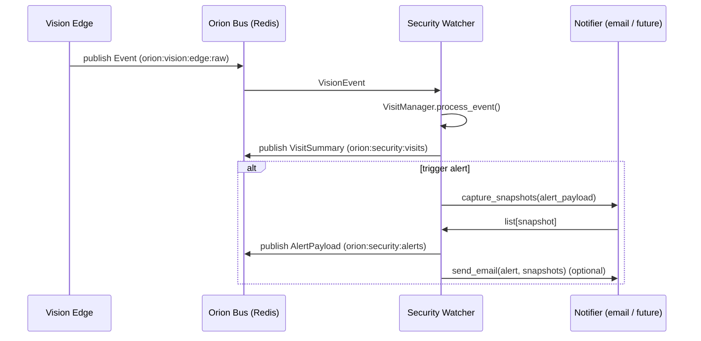

# 🛡 Orion Security Watcher

`orion-security-watcher` is a small, bus-native service that listens to
**vision events** from `orion-vision-edge` and decides **when something is
security-relevant enough** to:

- Record a **visit** (who/what entered the monitored zone, when, how long).
- Raise an **alert** (e.g. vacation mode + unknown human + motion).
- Capture and ship **snapshots** off the machine (email / future cloud hooks).

This is the piece that turns raw pixels into: _"Hey Juniper, someone is in the
office right now and it’s probably not you."_

---

## Architecture

High-level flow (v1):



Key components:

- **Bus worker**
  - Subscribes to `VISION_EVENTS_SUBSCRIBE_RAW` (e.g. `orion:vision:edge:raw`).
  - Parses messages into `VisionEvent` models.
  - Hands them to `VisitManager` along with current `SecurityState`.

- **SecurityStateStore**
  - Reads/writes current **armed state** and **mode** to disk (JSON file).
  - A tiny persistence layer so arming survives restarts.

- **VisitManager**
  - Maintains in-memory **visit windows**.
  - Aggregates multiple raw events into a single **VisitSummary**.
  - Applies **rate limiting** for alerts:
    - Global cooldown (e.g. don’t alert more than once every N seconds).
    - Identity cooldown (once we identify `juniper`, don’t scream about her).

- **Notifier**
  - Captures JPEG snapshots when an alert triggers.
  - Writes them to a local directory (e.g. `/mnt/telemetry/orion-security-watcher`).
  - Sends email inline (v1, optional, via SMTP).
  - Later: S3 / object store push, SMS, push notifications, etc.

- **UI & REST API**
  - `/` – simple status + arm/disarm UI (served over Tailscale).
  - `/security/state` – get current state as JSON.
  - `/security/state` (POST) – arm/disarm / change mode.
  - `/security/test-alert` – synthetic alert for pipeline testing.

---

## Bus Channels

### Subscribe

- `VISION_EVENTS_SUBSCRIBE_RAW`
  - Default: `orion:vision:edge:raw`
  - Type: `VisionEvent` (raw vision events from edge)

### Publish

- `CHANNEL_SECURITY_VISITS`
  - Default: `orion:security:visits`
  - Payload: `VisitSummary` (high-level info about a visit window)

- `CHANNEL_SECURITY_ALERTS`
  - Default: `orion:security:alerts`
  - Payload: `AlertPayload` (structured alert + snapshot references)

These channels are meant for **downstream consumers** like:

- A future **security dashboard** or log viewer.
- A Cortex verb that ingests security events into the narrative/memory stack.
- External notification services.

---

## Models

### SecurityState

Represents the long-lived arming state of the system.

```python
class SecurityState(BaseModel):
    armed: bool = False
    mode: str = "vacation_strict"  # or "off", future modes later
    updated_at: datetime | None = None
    updated_by: str | None = None
```

### VisionEvent (input from vision edge)

A minimal view of the `Event` coming off `orion:vision:edge:raw`:

```python
class VisionEvent(BaseModel):
    ts: datetime
    stream_id: str
    frame_index: int | None = None
    detections: list[Detection]
    meta: dict[str, Any] | None = None

class Detection(BaseModel):
    kind: str
    bbox: tuple[int, int, int, int]
    score: float = 1.0
    label: str | None = None
    meta: dict[str, Any] | None = None
```

### VisitSummary

Represents a **collapsed window** of related detections (a single visit).

```python
class VisitSummary(BaseModel):
    visit_id: str
    camera_id: str
    started_at: datetime
    last_seen_at: datetime
    duration_sec: float
    humans_present: bool
    motion_present: bool
    identities: dict[str, float]  # e.g. {"juniper": 0.8, "unknown": 0.2}
    frames: int
```

### AlertPayload

What gets shipped to the bus and (optionally) out via email.

```python
class AlertPayload(BaseModel):
    ts: datetime
    service: str
    version: str
    alert_id: str
    visit_id: str
    camera_id: str

    armed: bool
    mode: str

    humans_present: bool
    best_identity: str
    best_identity_conf: float
    identity_votes: dict[str, float]

    reason: str    # "unknown_human_vacation_mode", "test_alert", etc.
    severity: str  # "low", "medium", "high"

    snapshots: list[str] = []  # file paths or URLs

    rate_limit: dict[str, Any]
```

All datetime fields are converted to ISO strings when publishing to the bus.

---

## Configuration

Configuration is driven by environment variables via `app/settings.py`.

### Core service config

| Env var                     | Type   | Default             | Description                              |
|-----------------------------|--------|---------------------|------------------------------------------|
| `SERVICE_NAME`              | str    | `security-watcher`  | Service name                             |
| `SERVICE_VERSION`           | str    | `0.1.0`             | Version string                           |
| `SECURITY_ENABLED`          | bool   | `true`              | Turn the watcher on/off                  |
| `SECURITY_MODE`             | str    | `vacation_strict`   | Default mode                             |
| `STATE_FILE_PATH`           | str    | `/data/state.json`  | Where SecurityState is stored            |
| `SNAPSHOT_DIR`              | str    | `/data/snaps`       | Where snapshots are written              |

### Bus config

| Env var                       | Type | Default                      | Description                             |
|--------------------------------|------|------------------------------|-----------------------------------------|
| `ORION_BUS_ENABLED`            | bool | `true`                       | Enable bus integration                  |
| `ORION_BUS_URL`                | str  | `redis://orion-redis:6379/0` | Redis URL                               |
| `VISION_EVENTS_SUBSCRIBE_RAW`  | str  | `orion:vision:edge:raw`      | Subscribed vision events channel        |
| `CHANNEL_SECURITY_VISITS`      | str  | `orion:security:visits`      | Visit summaries                         |
| `CHANNEL_SECURITY_ALERTS`      | str  | `orion:security:alerts`      | Alerts                                  |

### Alerting & rate limiting

| Env var                           | Type | Default | Description                                        |
|-----------------------------------|------|---------|----------------------------------------------------|
| `SECURITY_GLOBAL_COOLDOWN_SEC`    | int  | 300     | Minimum seconds between any two alerts             |
| `SECURITY_IDENTITY_COOLDOWN_SEC`  | int  | 600     | Minimum seconds between alerts for the same person |
| `SECURITY_VISIT_IDLE_SEC`         | int  | 30      | Idle time before closing a visit window           |

### Email (optional v1)

| Env var         | Type   | Default | Description                          |
|-----------------|--------|---------|--------------------------------------|
| `NOTIFY_MODE`   | str    | `none`  | `none` or `inline` (email inside svc)|
| `SMTP_HOST`     | str    |         | SMTP server                          |
| `SMTP_PORT`     | int    | 587     | SMTP port                            |
| `SMTP_USER`     | str    |         | SMTP username                        |
| `SMTP_PASS`     | str    |         | SMTP password                        |
| `SMTP_FROM`     | str    |         | From address                         |
| `NOTIFY_TO`     | str    |         | Comma-separated recipient emails     |

If `NOTIFY_MODE` is `none`, the service still publishes alerts on the bus but
won’t send emails.

---

## HTTP API

### GET `/`

Renders a tiny HTML control panel:

- Shows whether the watcher is **armed**.
- Shows current **mode** (e.g. `vacation_strict`).
- Provides toggles/buttons to arm/disarm.

Intended to be exposed over Tailscale at a path like `/security`.

### GET `/health`

Example response:

```json
{
  "ok": true,
  "service": "security-watcher",
  "version": "0.1.0",
  "enabled": true,
  "armed": true,
  "mode": "vacation_strict",
  "bus_enabled": true,
  "vision_channel": "orion:vision:edge:raw"
}
```

### GET `/security/state`

Returns the current security state and lightweight rate-limit info:

```json
{
  "enabled": true,
  "armed": true,
  "mode": "vacation_strict",
  "updated_at": "2025-12-10T23:07:23.123456Z",
  "updated_by": "ui:tailscale",
  "last_alert": {
    "ts": "2025-12-10T23:12:00.000000Z",
    "reason": "rate_limited_or_unknown"
  }
}
```

### POST `/security/state`

Body:

```json
{ "armed": true, "mode": "vacation_strict" }
```

- `armed`: boolean, optional (if omitted, keep current armed flag).
- `mode`: optional; if invalid, falls back to `SECURITY_MODE` default.

Response mirrors the GET `/security/state` payload.

Example:

```bash
curl -X POST http://localhost:7120/security/state \
  -H 'Content-Type: application/json' \
  -d '{"armed": true, "mode": "vacation_strict"}'
```

### POST `/security/test-alert`

Creates a synthetic `AlertPayload`, captures snapshots, publishes it, and (if
configured) sends an email.

```bash
curl -X POST http://localhost:7120/security/test-alert
```

Use this to make sure the pipeline works end-to-end **without** needing a real
intruder.

---

## Docker Compose

Example service definition:

```yaml
services:
  orion-athena-security-watcher:
    build:
      context: ../..
      dockerfile: services/orion-security-watcher/Dockerfile
    container_name: orion-athena-security-watcher
    restart: unless-stopped
    environment:
      - SERVICE_NAME=${SERVICE_NAME}
      - SERVICE_VERSION=${SERVICE_VERSION}
      - SECURITY_ENABLED=${SECURITY_ENABLED}
      - SECURITY_MODE=${SECURITY_MODE}
      - STATE_FILE_PATH=${STATE_FILE_PATH}
      - SNAPSHOT_DIR=${SNAPSHOT_DIR}
      - ORION_BUS_URL=${ORION_BUS_URL}
      - ORION_BUS_ENABLED=${ORION_BUS_ENABLED}
      - VISION_EVENTS_SUBSCRIBE_RAW=${VISION_EVENTS_SUBSCRIBE_RAW}
      - CHANNEL_SECURITY_VISITS=${CHANNEL_SECURITY_VISITS}
      - CHANNEL_SECURITY_ALERTS=${CHANNEL_SECURITY_ALERTS}
      - SECURITY_GLOBAL_COOLDOWN_SEC=${SECURITY_GLOBAL_COOLDOWN_SEC}
      - SECURITY_IDENTITY_COOLDOWN_SEC=${SECURITY_IDENTITY_COOLDOWN_SEC}
      - SECURITY_VISIT_IDLE_SEC=${SECURITY_VISIT_IDLE_SEC}
      - NOTIFY_MODE=${NOTIFY_MODE}
      - SMTP_HOST=${SMTP_HOST}
      - SMTP_PORT=${SMTP_PORT}
      - SMTP_USER=${SMTP_USER}
      - SMTP_PASS=${SMTP_PASS}
      - SMTP_FROM=${SMTP_FROM}
      - NOTIFY_TO=${NOTIFY_TO}
    volumes:
      - /mnt/telemetry/orion-security-watcher:/data
    ports:
      - "7120:7120"
    networks:
      - app-net

networks:
  app-net:
    external: true
```

Then:

```bash
docker compose up -d orion-athena-security-watcher
```

---

## Tailscale Exposure

Expose both Vision and Security Watcher from Athena:

```bash
# Reset any prior config
sudo tailscale serve reset

# Vision Edge on /
sudo tailscale serve --bg 7100
# → https://athena.<tailnet>.ts.net/

# Security Watcher on /security
sudo tailscale serve --bg --set-path=/security 7120
# → https://athena.<tailnet>.ts.net/security

# Check
tailscale serve status
```

---

## Roadmap

Planned improvements:

- **Identity-aware alerts**
  - Integrate with a person-identity service (embeddings / face recog) so we can
    distinguish:
    - `juniper`, `partner`, `kid-x`, `kid-y`, `unknown`, etc.
  - Per-identity policies (e.g. alert on `unknown` in vacation mode only).

- **Smarter visit aggregation**
  - Track multiple overlapping visitors in a single window.
  - Distinguish "one robber twice" vs "two different people".

- **Richer integrations**
  - Feed alerts & visits into Collapse Mirror / Chronicle.
  - Cortex verbs like `observe_security_context` or
    `reflect_on_intrusion_risk`.

- **Notification expansion**
  - SMS / push via a dedicated notification service.
  - S3 / object-store archival of snapshots off-site.

This service is intentionally small but opinionated: it’s the **guardian at the
edge** that decides when pixels become a story worth reacting to.
