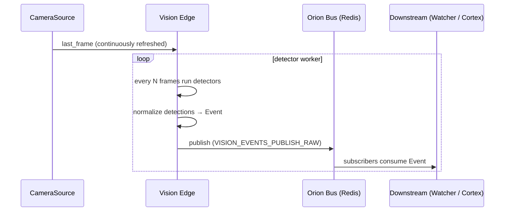
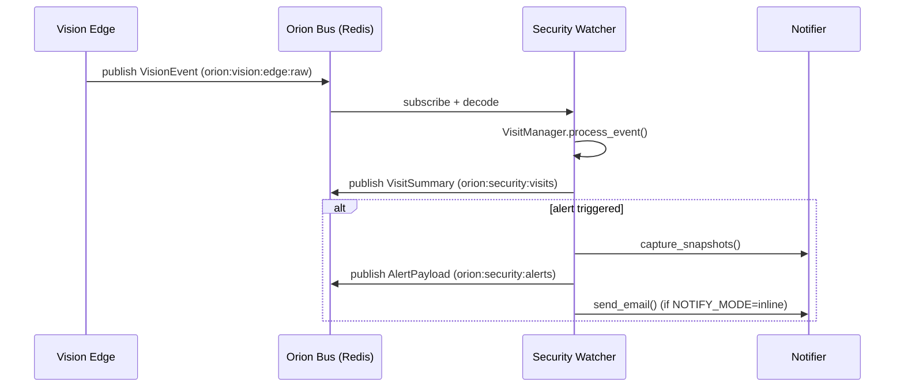

# 🛰 Orion Vision Edge (Athena)

`orion-vision-edge` is Athena’s always-on **perception node**.
It captures frames, runs lightweight detectors (motion / face / YOLO / presence), normalizes everything into a common schema, and publishes events onto the **Orion Bus** for downstream consumers.

It is intentionally **edge-first**: do just enough on Athena to be useful, then let heavier cognition happen elsewhere.

---

## What it does

- **Camera capture** (RTSP / camera devices)
- **Frame-level detectors**
  - Motion
  - Face detection (Haar cascade)
  - YOLO object detection (e.g. `person`)
- **Event-level detectors**
  - Presence (e.g. “Juniper present / absent”)
- **Debug UI + HTTP**
  - MJPEG live stream (optional overlays)
  - `snapshot.jpg`
  - SSE dev events pane (optional)
  - Image upload detection endpoint (dev)

Downstream consumers (examples):

- `orion-security-watcher` (visit + alert logic)
- future `orion-vision-identity` (who is this?)
- future `orion-vision-affect` (emotion / posture)
- Cortex Orchestrator perception verbs

---

## Important note on “face boxes”

- **`yolov8n.pt` does not detect faces.** It detects **COCO classes** like `person` (full-body/torso-ish box), not face.
- If you want face boxes, run **a face detector** (recommended) or use a **face-trained YOLO model**.

In other words:
- YOLO → `kind="yolo"`, `label="person"`
- Face detector → `kind="face"`

---

## Architecture



Core components:

1. **CameraSource**
   - Connects to `SOURCE` (RTSP URL or device index)
   - Runs in a background loop and keeps `last_frame` updated

2. **Detector worker**
   - Reads frames
   - Every `DETECT_EVERY_N_FRAMES` frames runs enabled detectors
   - Builds and publishes a structured `Event`

3. **HTTP API / UI**
   - Debug endpoints to view frames and validate detector output

---

## Bus Channels

### Publish

- `VISION_EVENTS_PUBLISH_RAW`
  - Default: `orion:vision:edge:raw`
  - Payload: normalized `Event`

### Subscribe

- None for v1 (producer-only)

---

## Event schema

Pydantic models typically live in `app/schemas.py` (or similar).

```python
class Detection(BaseModel):
    kind: str                     # "motion", "face", "yolo", "presence", ...
    bbox: tuple[int,int,int,int]  # x, y, w, h
    score: float = 1.0
    label: str | None = None      # e.g. "person" for YOLO
    meta: dict[str, Any] = {}

class Event(BaseModel):
    ts: datetime
    stream_id: str
    frame_index: int | None = None
    detections: list[Detection] = []
    meta: dict[str, Any] = {}
```

Example published event:

```json
{
  "ts": "2025-12-20T19:00:17.966066Z",
  "stream_id": "office-cam",
  "frame_index": 1234,
  "detections": [
    {"kind": "yolo", "label": "person", "score": 0.901, "bbox": [119, 2021, 2600, 3684]},
    {"kind": "face", "label": null, "score": 0.99, "bbox": [x, y, w, h]}
  ],
  "meta": {
    "source": "edge",
    "camera": "office-cam"
  }
}
```

---

## HTTP API

Common endpoints (v1):

- `GET /health`
- `GET /snapshot.jpg` (latest frame)
- `GET /stream.mjpg` (debug MJPEG stream)
- `GET /events` (dev SSE feed)
- `POST /detect` (upload image → run detection pipeline)

---

## Configuration

Configuration is driven by environment variables via Pydantic Settings.

### Camera

| Env var | Type | Default | Notes |
|---|---:|---|---|
| `SOURCE` | str | (required) | RTSP URL or device index |
| `WIDTH` | int | 640 | capture width |
| `HEIGHT` | int | 360 | capture height |
| `FPS` | int | 15 | capture FPS target |
| `STREAM_ID` | str | `cam0` | logical stream identifier |
| `DETECT_EVERY_N_FRAMES` | int | 10 | detector cadence |

### Detectors

| Env var | Type | Default | Notes |
|---|---:|---|---|
| `DETECTORS` | str | `motion,face,yolo,presence` | comma-separated enable list |
| `ANNOTATE` | bool | `true` | draw overlays for MJPEG / debug |
| `JPEG_QUALITY` | int | 90 | snapshot / MJPEG jpeg quality |

#### Motion

| Env var | Type | Default | Notes |
|---|---:|---|---|
| `MOTION_MIN_AREA` | int | 2000 | min contour area |

#### Face (Haar)

| Env var | Type | Default | Notes |
|---|---:|---|---|
| `FACE_CASCADE_PATH` | str | `/app/haar/...` | Haar XML path |
| `FACE_SCALE_FACTOR` | float | 1.1 | detector scaling |
| `FACE_MIN_NEIGHBORS` | int | 5 | detector neighbors |
| `FACE_MIN_SIZE` | str | `30,30` | `w,h` min face size |

#### YOLO

| Env var | Type | Default | Notes |
|---|---:|---|---|
| `ENABLE_YOLO` | bool | `true` | toggle YOLO |
| `YOLO_MODEL` | str | `yolov8n.pt` | model path |
| `YOLO_CLASSES` | str | `person` | filter class names |
| `YOLO_CONF` | float | 0.25 | minimum confidence |
| `YOLO_DEVICE` | str | `cpu` | `cpu` or CUDA device (e.g. `cuda:0` or `0`) |

#### Presence

| Env var | Type | Default | Notes |
|---|---:|---|---|
| `ENABLE_PRESENCE` | bool | `true` | toggle presence |
| `PRESENCE_TIMEOUT` | int | 60 | seconds until absent |
| `PRESENCE_LABEL` | str | `Juniper` | label for presence state |

### Bus + UI

| Env var | Type | Default | Notes |
|---|---:|---|---|
| `ENABLE_UI` | bool | `true` | enable HTML UI |
| `ORION_BUS_ENABLED` | bool | `true` | publish to bus |
| `ORION_BUS_URL` | str | `redis://…/0` | Redis URL |
| `VISION_EVENTS_PUBLISH_RAW` | str | `orion:vision:edge:raw` | publish channel |

---

## Docker Compose

Recommended: let **`.env → env_file → settings`** do the work; avoid repeating the same vars in `environment:` unless you’re overriding.

```yaml
services:
  vision-edge:
    build:
      context: ../..
      dockerfile: services/orion-vision-edge/Dockerfile
    container_name: ${PROJECT}-vision-edge
    restart: unless-stopped
    env_file:
      - .env
    runtime: nvidia
    deploy:
      resources:
        reservations:
          devices:
            - capabilities: [gpu]
    ports:
      - "7100:7100"
    networks:
      - app-net

networks:
  app-net:
    external: true
```

---

## Tailscale Exposure

On Athena:

```bash
sudo tailscale serve reset
sudo tailscale serve --bg 7100
# → https://athena.<tailnet>.ts.net/
```

---

## Debugging

- Logs:

```bash
docker logs -f ${PROJECT}-vision-edge
```

- Health:

```bash
curl http://localhost:7100/health
```

- Snapshot:

```bash
curl -o snap.jpg http://localhost:7100/snapshot.jpg
```

- Bus (raw events):

```bash
redis-cli -u "$ORION_BUS_URL" SUBSCRIBE "$VISION_EVENTS_PUBLISH_RAW"
```

---

# 🛡 Orion Security Watcher

`orion-security-watcher` sits between **Vision Edge** and notifications/cognition.
It turns raw detection events into:

- **Visit summaries** (contiguous “someone was present” windows)
- **Alerts** (armed + human-ish evidence + not rate-limited)
- **Snapshots + email** (v1 inline SMTP)

---

## Architecture



---

## Key behavior

- **Human-ish detection** (v1):
  - `presence` score >= threshold
  - `face` score + bbox area threshold
  - `yolo` label=`person` score + bbox area threshold
- **Streak debounce**: requires N consecutive-ish “human-ish” events before treating as `humans_present=True`.
- **Rate limiting**: global cooldown prevents spam.
- **Identity**: stubbed as `unknown` today.
  - `best_identity_conf=0.00` is expected until identity is implemented.

---

## Bus Channels

### Subscribe

- `VISION_EVENTS_SUBSCRIBE_RAW` (default `orion:vision:edge:raw`)

### Publish

- `CHANNEL_SECURITY_VISITS` (default `orion:security:visits`)
- `CHANNEL_SECURITY_ALERTS` (default `orion:security:alerts`)

---

## Configuration

Security Watcher is environment-driven via Pydantic settings. Common knobs:

- `SECURITY_ENABLED`, `SECURITY_DEFAULT_ARMED`, `SECURITY_MODE`
- `SECURITY_GLOBAL_COOLDOWN_SEC`, `SECURITY_IDENTITY_COOLDOWN_SEC`
- `VISION_SNAPSHOT_URL`, `VISION_SNAPSHOT_PUBLIC_URL`
- `SECURITY_SNAPSHOT_COUNT`, `SECURITY_SNAPSHOT_INTERVAL_SEC`, `SECURITY_SNAPSHOT_DIR`
- `SECURITY_MIN_YOLO_SCORE`, `SECURITY_MIN_FACE_AREA`, `SECURITY_MIN_PERSON_AREA`
- `SECURITY_MIN_HUMAN_STREAK`, `SECURITY_STREAK_MAX_FRAME_GAP`
- `NOTIFY_MODE` and `NOTIFY_EMAIL_*`

**Credential safety:** emails/logs should never include `user:pass@` URLs; redaction should be applied before emitting any text.

---

## HTTP API

- `GET /` – small UI (arm/disarm)
- `GET /health`
- `GET /security/state` and `POST /security/state`
- `POST /security/test-alert` – synthetic alert (snapshots + email)
- `POST /debug/simulate-person` – simulate YOLO person (dev)

---

## Tailscale Exposure

```bash
sudo tailscale serve reset
sudo tailscale serve --bg 7100
sudo tailscale serve --bg --set-path=/security 7120
```

- Vision: `https://athena.<tailnet>.ts.net/`
- Watcher: `https://athena.<tailnet>.ts.net/security`

---

## Roadmap

- Identity-aware alerts (face/embedding identity service)
- Smarter visit aggregation (multiple overlapping visitors)
- Security → memory ingestion (Collapse Mirror / Chronicle)
- Split notifier service (SMS/push/webhooks + object store archival)
