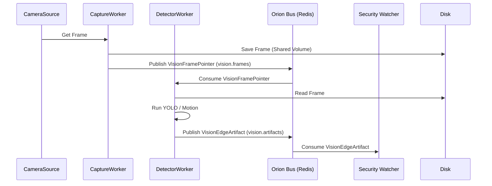

# 🛰 Orion Vision Edge (Athena)

`orion-vision-edge` is Athena’s always-on **perception node**.
It captures frames, runs lightweight detectors (YOLO, motion, etc.), and publishes typed artifacts via the **Titanium Bus**.

It adheres to the "Pointer" architecture:
1. Capture frame -> Save to shared storage -> Publish `VisionFramePointer`.
2. Consume pointer -> Run detectors -> Publish `VisionEdgeArtifact`.

---

## Architecture



---

## Configuration

### Bus Channels

| Env var | Default | Notes |
|---|---|---|
| `CHANNEL_VISION_FRAMES` | `vision.frames` | Pointers to captured frames |
| `CHANNEL_VISION_ARTIFACTS` | `vision.artifacts` | Detection results (VisionEdgeArtifact) |

### YOLO Settings

| Env var | Default | Notes |
|---|---|---|
| `YOLO_MODEL` | `yolov8n.pt` | Model path |
| `YOLO_CONF` | `0.25` | Base confidence threshold |
| `YOLO_CONF_THRES` | `0.25` | Synonym for CONF |
| `YOLO_IOU_THRES` | `0.45` | NMS IOU Threshold |
| `YOLO_IMG_SIZE` | `640` | Inference size |
| `YOLO_PERSON_RETRY_THRESHOLD` | `0.15` | Second pass threshold if no person found |

### Debug & Storage

| Env var | Default | Notes |
|---|---|---|
| `FRAME_STORAGE_DIR` | `/mnt/frames` | Shared volume path for frames |
| `EDGE_DEBUG_SAVE_FRAMES` | `False` | Save annotated debug frames |
| `EDGE_DEBUG_DIR` | `/mnt/debug` | Path for debug frames |

---

## Run & Test

Use `docker-compose up -d`.

To verify detection:
1.  Check logs: `docker logs -f orion-vision-edge`
2.  Enable debug frames: `EDGE_DEBUG_SAVE_FRAMES=True` in `.env`
3.  Check `/mnt/debug` (mapped volume) for output.

To verify bus traffic:
```bash
# Tap artifacts
redis-cli SUBSCRIBE vision.artifacts
```
