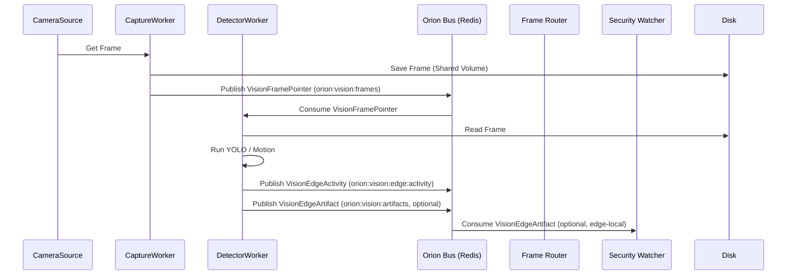

# 🛰 Orion Vision Edge (Athena)

`orion-vision-edge` is Athena’s always-on **perception node**.
It captures frames, runs lightweight detectors (YOLO, motion, etc.), and publishes typed artifacts via the **Titanium Bus**.

It adheres to the "Pointer" architecture:
1. Capture frame -> Save to shared storage -> Publish `VisionFramePointer`.
2. Consume pointer -> Run detectors -> Publish rate-limited **activity triggers** and optional slim **edge-detection artifacts** (no VLM caption).

When YOLO or motion fires on `person` / `motion`, the detector publishes compact `VisionEdgeActivityPayload` envelopes on `orion:vision:edge:activity` for **edge-local consumers** (e.g. security watcher). The host vision pipe does **not** subscribe to this channel.

---

## Architecture


```mermaid
sequenceDiagram
    participant Cam as CameraSource
    participant Capture as CaptureWorker
    participant Detect as DetectorWorker
    participant Bus as Orion Bus (Redis)
    participant Router as Frame Router
    participant Guard as Security Watcher

    Cam->>Capture: Get Frame
    Capture->>Disk: Save Frame (Shared Volume)
    Capture->>Bus: Publish VisionFramePointer (orion:vision:frames)

    Bus->>Detect: Consume VisionFramePointer
    Detect->>Disk: Read Frame
    Detect->>Detect: Run YOLO / Motion
    Detect->>Bus: Publish VisionEdgeActivity (orion:vision:edge:activity)
    Detect->>Bus: Publish VisionEdgeArtifact (orion:vision:artifacts, optional)

    Bus->>Guard: Consume VisionEdgeArtifact (optional, edge-local)
```

Edge activity on `orion:vision:edge:activity` is for edge-local subscribers only; the host pipe (frame router → host → window → council) is independent.

---

## Configuration

### Bus Channels

| Env var | Default | Notes |
|---|---|---|
| `CHANNEL_VISION_FRAMES` | `orion:vision:frames` | Pointers to captured frames |
| `CHANNEL_VISION_EDGE_ACTIVITY` | `orion:vision:edge:activity` | Rate-limited person/motion trigger signals (`vision.edge.activity.v1`) |
| `CHANNEL_VISION_ARTIFACTS` | `orion:vision:artifacts` | Slim detection artifacts when `EDGE_PUBLISH_ARTIFACTS=true` (`task_type=edge_detection`, objects only) |

### Activity & artifacts

| Env var | Default | Notes |
|---|---|---|
| `EDGE_ACTIVITY_MIN_INTERVAL_S` | `1.0` | Per `(stream_id, label)` rate limit for activity publish |
| `EDGE_PUBLISH_ARTIFACTS` | `false` | When true, publish slim `edge_detection` artifacts (no caption); host pipe ignores these for evidence |

Activity is published on every frame where YOLO/motion yields trigger labels, independent of `EDGE_PUBLISH_ARTIFACTS`.

### YOLO Settings

| Env var | Default | Notes |
|---|---|---|
| `YOLO_MODEL` | `yolov8n.pt` | Model path |
| `YOLO_CONF` | `0.25` | Base confidence threshold |
| `YOLO_CONF_THRES` | `0.25` | Synonym for CONF |
| `YOLO_IOU_THRES` | `0.45` | NMS IOU Threshold |
| `YOLO_IMG_SIZE` | `640` | Inference size |
| `YOLO_PERSON_RETRY_THRESHOLD` | `0.15` | Second pass threshold if no person found |

### Debug & Storage

| Env var | Default | Notes |
|---|---|---|
| `FRAME_STORAGE_DIR` | `/mnt/frames` | Shared volume path for frames |
| `EDGE_DEBUG_SAVE_FRAMES` | `False` | Save annotated debug frames |
| `EDGE_DEBUG_DIR` | `/mnt/debug` | Path for debug frames |

---

## Run & Test

Use `docker-compose up -d`.

To verify detection:
1.  Check logs: `docker logs -f orion-vision-edge`
2.  Enable debug frames: `EDGE_DEBUG_SAVE_FRAMES=True` in `.env`
3.  Check `/mnt/debug` (mapped volume) for output.

To verify bus traffic:
```bash
# Activity triggers (person/motion)
redis-cli -u "$ORION_BUS_URL" SUBSCRIBE orion:vision:edge:activity

# Slim edge artifacts (when EDGE_PUBLISH_ARTIFACTS=true)
redis-cli -u "$ORION_BUS_URL" SUBSCRIBE orion:vision:artifacts
```

Walk-by acceptance: after a person detection, edge logs should show `Found: ['person']` and activity envelopes on `orion:vision:edge:activity`.
